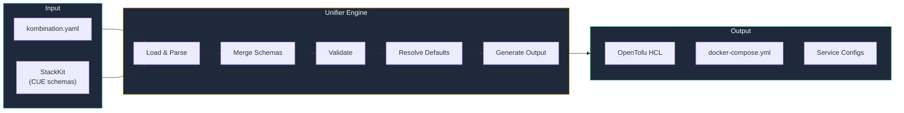

The Unifier is Stack's configuration engine. It validates your `kombination.yaml` against StackKit schemas and generates deployment artifacts.

## How It Works



## The Unification Process

<Steps>
  <Step title="Load Configuration">
    Reads your `kombination.yaml` and identifies the StackKit to use.
  </Step>
  
  <Step title="Merge Schemas">
    Combines your configuration with the StackKit's CUE schemas.
  </Step>
  
  <Step title="Validate">
    CUE validates that your configuration satisfies all constraints.
  </Step>
  
  <Step title="Resolve Defaults">
    Fills in default values for anything you didn't specify.
  </Step>
  
  <Step title="Generate Output">
    Produces OpenTofu HCL, docker-compose, and service configurations.
  </Step>
</Steps>

## Example

**Input:**
```yaml
# kombination.yaml
stackkit: base-homelab
domain: homelab.local
services:
  traefik:
    enabled: true
```

**After Unification:**
```yaml
# Resolved configuration (internal)
stackkit: base-homelab
domain: homelab.local
ssl:
  provider: selfsigned  # Default added
  email: ""
services:
  traefik:
    enabled: true
    dashboard: true      # Default added
    ports:
      http: 80           # Default added
      https: 443         # Default added
    log_level: INFO      # Default added
```

## Validation Errors

When validation fails:

```bash
$ kombify validate

Error: services.kubernetes not defined in base-homelab
  
  At: kombination.yaml:5:3
  
    5 |   kubernetes:
        ^
        
  Hint: Kubernetes is only available in modern-homelab StackKit.
  Consider: stackkit: modern-homelab
```

## CUE Under the Hood

The Unifier uses CUE for type-safe validation:

```cue
// StackKit schema (simplified)
#Config: {
    stackkit: "base-homelab"
    domain:   string
    
    services: {
        traefik?: {
            enabled:   bool | *true
            dashboard: bool | *true
            ports: {
                http:  int | *80
                https: int | *443
            }
        }
    }
    
    // Constraint: traefik required if any service is enabled
    if len([for k, v in services if v.enabled]) > 0 {
        services: traefik: enabled: true
    }
}
```

## Debugging

Enable verbose output to see the unification process:

```bash
kombify validate --verbose

# Output:
# [1/5] Loading kombination.yaml
# [2/5] Loading StackKit: base-homelab
# [3/5] Merging schemas
# [4/5] Validating configuration
# [5/5] Resolving defaults
# 
# Resolved 12 defaults:
#   - ssl.provider: selfsigned
#   - services.traefik.dashboard: true
#   - ...
```

## Next Steps

<CardGroup cols={2}>
  <Card title="CUE Basics" icon="code" href="/stackkits/cue-basics">
    Learn the CUE language
  </Card>
  <Card title="Create Custom StackKits" icon="hammer" href="/stackkits/creating-custom">
    Build your own StackKits
  </Card>
</CardGroup>
