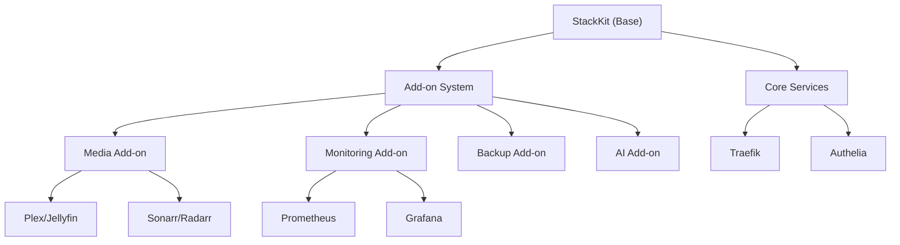

Add-ons are modular service packages that extend a StackKit with additional capabilities. They are composable — you can mix and match add-ons freely.

## Architecture



## Available add-ons

| Add-on | Services included | Resources needed |
|--------|-------------------|-----------------|
| `media` | Plex/Jellyfin, Sonarr, Radarr, Prowlarr | 2 GB RAM, 2 CPU |
| `monitoring` | Prometheus, Grafana, Uptime Kuma | 1 GB RAM, 1 CPU |
| `backup` | Restic, Borgmatic, scheduled snapshots | 512 MB RAM |
| `ai` | Ollama, Open WebUI | 4 GB RAM, GPU recommended |
| `security` | CrowdSec, Fail2ban, Vaultwarden | 512 MB RAM |
| `dev` | Gitea, Drone CI, Registry | 2 GB RAM, 2 CPU |

## Using add-ons

### In kombination.yaml

```yaml
stackkit: base-homelab
addons:
  - media
  - monitoring
```

### Via the wizard

In the Stack wizard, the **Add-ons** step shows all compatible add-ons for your chosen StackKit. Check the ones you want and the wizard handles the rest.

## Add-on dependencies

Some add-ons depend on core services:

| Add-on | Requires |
|--------|----------|
| All add-ons | `traefik` (reverse proxy) |
| `media` | Storage volume configured |
| `ai` | GPU passthrough (optional, for acceleration) |
| `monitoring` | None beyond core |

The validator checks dependencies automatically and warns you if something is missing.

## Creating custom add-ons

Custom add-ons are defined using CUE schemas:

```cue
package addons

#MyAddon: {
    name: "my-custom-addon"
    services: [...#Service]
    requires: [...string]
}
```

See [Creating custom StackKits](/stackkits/customization/creating-custom) for the full guide.

<Note>
  Custom add-ons can be contributed back to the community. See the [contributing guide](/stackkits/customization/contributing).
</Note>
