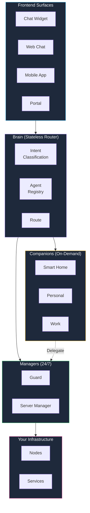
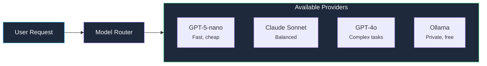

kombify AI is not a single monolithic assistant. It is an orchestrated system of specialized agents coordinated by a central Brain router.

## System overview

## The Brain

The Brain is **not** an AI agent. It is a stateless routing and coordination service that:

- Classifies user intent via rule-based and LLM-hybrid classification
- Discovers available agents via an AgentCard registry
- Routes work to the appropriate Companion or Manager
- Collects observability data across all agents
- Never holds user memory or executes tools directly

## Companions vs Managers

| Property | Companions | Managers |
|----------|-----------|----------|
| **Activation** | On-demand (user-initiated) | 24/7 background |
| **Memory** | 4-layer persistent memory | No conversation memory |
| **Interaction** | Conversational | Event-driven, task-oriented |
| **Autonomy** | User-directed | Graduated (trust progression) |
| **Examples** | Smart Home, Personal, Work | Guard, Server Manager |

## Technology stack

| Component | Technology |
|-----------|-----------|
| **AI Framework** | Google Genkit Go 1.4 |
| **Agent Framework** | Google ADK Go 1.0 |
| **Backend** | Go 1.25+, Chi v5 |
| **Messaging** | NATS (multi-node coordination) |
| **Database (SaaS)** | PostgreSQL 17 + pgvector |
| **Database (Self-hosted)** | SQLite (pure Go) |
| **Observability** | OpenTelemetry |

## Multi-provider model routing

kombify AI intelligently routes requests to the optimal model based on task complexity, cost, and user preferences.

## Further reading

<CardGroup cols={2}>
  <Card title="Trust model" icon="shield" href="/ai/explanations/trust-model">
    How Managers gain autonomy gradually
  </Card>
  <Card title="Memory system" icon="brain" href="/ai/explanations/memory-system">
    The 4-layer Companion memory architecture
  </Card>
</CardGroup>
