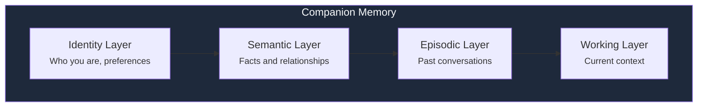

Companions use a 4-layer persistent memory system that enables them to remember your preferences, past conversations, and infrastructure context across sessions.

## Four memory layers

### Identity layer

Stores your personality preferences, goals, and how you prefer the Companion to communicate.

### Semantic layer

Extracted facts and relationships from your conversations. For example, "User runs a 3-node homelab with Immich and Traefik."

### Episodic layer

Past conversations and events, enabling the Companion to reference previous interactions.

### Working layer

Current conversation context, including the active topic, recent messages, and any infrastructure data being discussed.

## Privacy and storage

| Mode | Storage | Encryption |
|------|---------|-----------|
| **SaaS** | PostgreSQL (isolated per user) | AES-256-GCM at rest |
| **Self-hosted** | SQLite (local) | User-controlled |

<Note>
  Memory is never shared between users or used for model training. In self-hosted mode, all memory stays on your server.
</Note>

## Further reading

<CardGroup cols={2}>
  <Card title="Configuring Companions" icon="users" href="/ai/how-to/companions">
    Customize memory preferences per Companion
  </Card>
  <Card title="Architecture" icon="sitemap" href="/ai/explanations/architecture">
    How memory fits into the overall system
  </Card>
</CardGroup>
