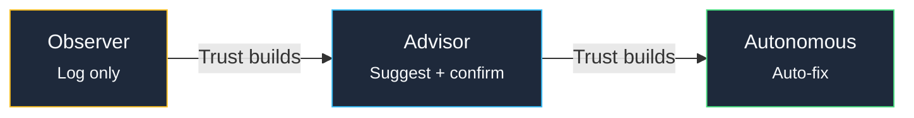

Guard is kombify AI's autonomous watchdog. It monitors your infrastructure around the clock and can detect, report, and fix issues automatically.

## How Guard works

Guard runs three processing loops at different intervals:

| Loop | Interval | Purpose |
|------|----------|---------|
| **Fast** | Every 10 seconds | Critical health checks, service availability |
| **Heartbeat** | Every 60 seconds | Node metrics, resource usage trends |
| **Deep scan** | Every 6 hours | Security audit, configuration drift, updates |

## Enabling Guard

<Steps>
  <Step title="Navigate to AI settings">
    Open **AI Settings > Managers > Guard** in your kombify dashboard.
  </Step>
  <Step title="Configure trust level">
    Choose Guard's initial autonomy level:
    - **Observer** — Monitor and log only (recommended to start)
    - **Advisor** — Suggest fixes, require your confirmation
    - **Autonomous** — Execute fixes automatically
  </Step>
  <Step title="Select monitoring targets">
    Choose which nodes and services Guard should monitor. You can start with a subset and expand later.
  </Step>
  <Step title="Set up notifications">
    Configure how Guard reports issues: email, push notification, or chat message.
  </Step>
</Steps>

## Trust progression

Guard uses a graduated trust model. Start with Observer to build confidence:

<Warning>
  Only enable Autonomous mode after Guard has been running in Advisor mode for a period and you are comfortable with its suggestions.
</Warning>

## What Guard monitors

- Service availability and response times
- Node resource usage (CPU, RAM, disk)
- Security events and suspicious activity
- Configuration drift from desired state
- Available system and package updates

## Further reading

<CardGroup cols={2}>
  <Card title="Trust model explained" icon="shield" href="/ai/explanations/trust-model">
    Deep dive into the Observer-Advisor-Autonomous model
  </Card>
  <Card title="Architecture" icon="sitemap" href="/ai/explanations/architecture">
    How Guard fits into the kombify AI architecture
  </Card>
</CardGroup>
