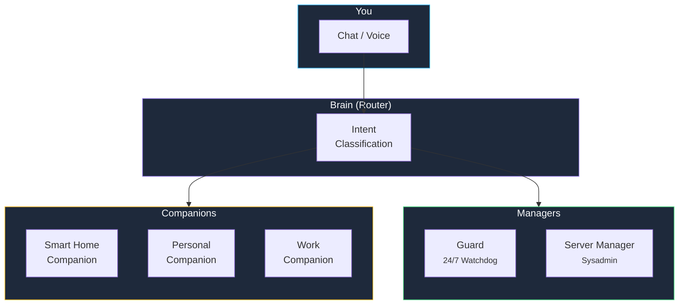

**kombify AI** brings intelligent automation to your homelab. From conversational assistants that help you configure and troubleshoot, to autonomous agents that monitor and maintain your infrastructure 24/7.

## The simple version

<Card title="What is kombify AI?" icon="lightbulb">
  Imagine having a knowledgeable assistant that understands your homelab setup, answers questions about Docker and Linux, monitors your servers around the clock, and can even fix issues automatically. That is kombify AI.
</Card>

## Two types of intelligence

kombify AI is built around two distinct agent types that work together:

### Companions — Your conversational assistants

Companions are on-demand AI assistants with distinct personalities and persistent memory. They remember your preferences, understand your infrastructure, and help you get things done.

<CardGroup cols={3}>
  <Card title="Smart Home" icon="house-signal">
    IoT control and Home Assistant integration
  </Card>
  <Card title="Personal" icon="user">
    Daily life, reminders, and context-aware assistance
  </Card>
  <Card title="Work" icon="briefcase">
    Productivity, projects, and team context
  </Card>
</CardGroup>

**Key features:**
- Persistent memory across conversations
- Voice interaction (text-to-speech and speech-to-text)
- Aware of your current infrastructure state
- Delegate infrastructure tasks to Managers

### Managers — Your autonomous operators

Managers run 24/7 in the background, handling infrastructure operations without requiring your input.

<CardGroup cols={2}>
  <Card title="Guard" icon="shield-check">
    **Autonomous watchdog** — Monitors security and reliability across your infrastructure with three processing loops: fast (10s), heartbeat (60s), and deep scan (6h).
  </Card>
  <Card title="Server Manager" icon="server">
    **AI-powered sysadmin** — Handles package management, user management, file operations, cron scheduling, and network configuration.
  </Card>
</CardGroup>

**Key features:**
- Run autonomously, no manual interaction needed
- Trust progression model (Observer → Advisor → Autonomous)
- Event-driven, task-oriented operation
- Approval workflows for critical actions

## How it works

<Steps>
  <Step title="You ask a question or issue arises" icon="comment">
    Either you start a conversation, or a Manager detects an event (e.g., a service goes down).
  </Step>
  <Step title="The Brain routes the request" icon="brain">
    The Brain classifies your intent and routes it to the right Companion or Manager. It is a stateless router, not an AI agent itself.
  </Step>
  <Step title="The agent acts" icon="bolt">
    Companions respond conversationally with context from your infrastructure. Managers execute operations with appropriate approval.
  </Step>
  <Step title="You stay in control" icon="shield-check">
    The trust progression model ensures Managers start as observers and only gain autonomy as they prove reliable.
  </Step>
</Steps>

## Deployment options

<Tabs>
  <Tab title="SaaS (Managed)">
    Use kombify AI through kombify Cloud. Models are included — no API keys needed.

    - Available at `chat.kombify.io` and embedded in the Cloud dashboard
    - Included in Cloud subscription plans
    - No setup required

    <Card title="Get started with Cloud" icon="cloud" href="/cloud/overview" horizontal />
  </Tab>
  <Tab title="Self-Hosted (BYOK)">
    Run kombify AI on your own infrastructure with your own API keys (Bring Your Own Keys).

    - Full control over your data
    - Choose your preferred AI providers
    - Keys encrypted with AES-256-GCM

    <Card title="BYOK setup guide" icon="key" href="/ai/how-to/byok" horizontal />
  </Tab>
</Tabs>

## Supported AI providers

kombify AI supports multiple model providers with intelligent routing:

| Tier | Providers | Examples |
|------|-----------|---------|
| **Direct API** | OpenAI, Anthropic, Google AI | GPT-4o, Claude Sonnet, Gemini |
| **Cloud Platforms** | Azure AI Foundry | Hosted model endpoints |
| **Routers/Local** | OpenRouter, Ollama | Any model, self-hosted LLMs |

<Tip>
  kombify AI defaults to cost-efficient models for simple tasks and routes complex requests to more capable models automatically.
</Tip>

## Five frontend surfaces

<CardGroup cols={2}>
  <Card title="Chat Widget" icon="comment-dots">
    Embeddable floating bubble integrated into kombify Cloud
  </Card>
  <Card title="Web Chat" icon="browser">
    Full-featured chat at `chat.kombify.io` with sidebar, sessions, and model picker
  </Card>
  <Card title="Mobile App" icon="mobile">
    Android-first with voice interaction and push notifications
  </Card>
  <Card title="Portal" icon="gear">
    Settings hub at `ai.kombify.io` for companion configuration and key management
  </Card>
</CardGroup>

## Context-aware intelligence

kombify AI knows your infrastructure. When you ask "Why is my NAS slow?", it can check:

- Your active `kombination.yaml` specification
- Current node status (CPU, RAM, disk usage)
- Recent error logs and service health
- Running containers and their resource consumption

This context is injected automatically — you do not need to explain your setup each time.

## Next steps

<CardGroup cols={2}>
  <Card title="Quick start" icon="rocket" href="/ai/quickstart">
    Get started with kombify AI in 5 minutes
  </Card>
  <Card title="Set up Guard" icon="shield-check" href="/ai/how-to/guard">
    Enable 24/7 autonomous monitoring
  </Card>
  <Card title="Architecture deep dive" icon="sitemap" href="/ai/explanations/architecture">
    Understand Brain, Companions, and Managers
  </Card>
  <Card title="Supported models" icon="microchip" href="/ai/reference/models">
    Browse supported AI providers and models
  </Card>
</CardGroup>
