# kombify APIs

kombify provides RESTful APIs for all platform components, enabling you to automate deployments, run simulations programmatically, and integrate with your existing tooling.

## API overview

```mermaid
graph LR
    subgraph "Your Systems"
        CI[CI/CD Pipeline]
        Script[Custom Scripts]
        App[Your Application]
    end
    
    subgraph "kombify APIs"
        Stack[🔧 Stack API]
        Sim[🧪 Sim API]
        Sphere[☁️ Sphere API]
    end
    
    CI --> Stack
    Script --> Sim
    App --> Sphere
    
    Stack --> Deploy[Deploy to Homelab]
    Sim --> Test[Test in Sandbox]
    Sphere --> Manage[Manage SaaS]
```



## Available APIs

<CardGroup cols={3}>
  <Card title="Stack API" icon="server" href="/api/kombistack/overview">
    Manage stacks, workers, and deployments on your homelab infrastructure.
  </Card>
  <Card title="Sim API" icon="flask" href="/api/kombisim/overview">
    Create and control simulation environments for testing.
  </Card>
  <Card title="Sphere API" icon="cloud" href="/api/kombisphere/overview">
    Access the managed SaaS platform features.
  </Card>
</CardGroup>

## Quick comparison

| API | Use case | Auth method | Base URL |
|-----|----------|-------------|----------|
| **Stack** | Orchestrate your homelab | API key / mTLS | `http://localhost:5260/api/v1` (local) or `https://stack.kombify.io` |
| **Sim** | Test configurations | None (local) | `http://localhost:5270/api/v1` |
| **Sphere** | Managed SaaS platform | JWT / API key | `https://api.kombify.io/v1` (via Kong Gateway) |

## Common request format

All APIs accept JSON and return JSON:

```bash
curl -X POST https://api.kombify.io/v1/resource \
  -H "Content-Type: application/json" \
  -H "Authorization: Bearer $TOKEN" \
  -d '{"key": "value"}'
```

## Response format

### Success response

```json
{
  "id": "resource_abc123",
  "status": "created",
  "created_at": "2026-01-26T10:00:00Z"
}
```

### Error response

```json
{
  "error": {
    "code": "VALIDATION_ERROR",
    "message": "Field 'name' is required",
    "details": {
      "field": "name",
      "constraint": "required"
    }
  }
}
```

## HTTP status codes

| Status | Meaning |
|--------|---------|
| `200` | Success |
| `201` | Created |
| `400` | Bad request (validation error) |
| `401` | Unauthorized (missing/invalid auth) |
| `403` | Forbidden (insufficient permissions) |
| `404` | Not found |
| `409` | Conflict (resource already exists) |
| `429` | Rate limited |
| `500` | Server error |

## Versioning

All APIs are versioned via the URL path:

```
/api/v1/resource
```

Breaking changes are introduced in new major versions (`v2`, `v3`). Non-breaking additions may appear in the current version.

## Rate limiting

Rate limits vary by plan and API:

| Plan | Stack API | Sim API | Sphere API |
|------|-----------|---------|------------|
| Free | 60/min | Unlimited | 30/min |
| Hobby | 300/min | Unlimited | 100/min |
| Pro | 1000/min | Unlimited | 500/min |

Rate limit headers are included in responses:

```
X-RateLimit-Limit: 60
X-RateLimit-Remaining: 45
X-RateLimit-Reset: 1706270400
```

## SDK libraries

<Accordion title="Official SDKs" icon="code">

<CardGroup cols={3}>
  <Card title="TypeScript" icon="js">
    ```bash
    npm i @kombify/sdk
    ```
  </Card>
  <Card title="Python" icon="python">
    ```bash
    pip install kombify
    ```
  </Card>
  <Card title="Go" icon="golang">
    ```bash
    go get kombify.io/sdk
    ```
  </Card>
</CardGroup>

**TypeScript example:**

```typescript
import { KombifyClient } from '@kombify/sdk';

const client = new KombifyClient({
  apiKey: process.env.KOMBIFY_API_KEY
});

const stacks = await client.stacks.list();
console.log(stacks);
```

</Accordion>

## Next steps

<CardGroup cols={2}>
  <Card title="Authentication" icon="lock" href="/api/authentication">
    Learn about API authentication methods
  </Card>
  <Card title="Stack API" icon="server" href="/api/kombistack/overview">
    Start with the Stack API
  </Card>
</CardGroup>
