**kombify Cloud** is the easiest way to manage your homelab. Sign up, connect your servers, and you're done — we handle the rest.

## The simple version

<Card title="What is Cloud?" icon="lightbulb">
  Cloud is like having a professional IT team for your homelab. It provides a web dashboard where you can manage all your servers, deploy services, and invite team members — without setting up any infrastructure yourself.
</Card>

## Self-hosted vs. managed

<Tabs>
  <Tab title="Self-hosted (Stack only)">
    **You manage everything:**
    - ✅ Complete control
    - ✅ No subscription costs
    - ❌ You handle updates and security patches
    - ❌ You configure backups
    - ❌ You set up user management
    - ❌ One homelab at a time
  </Tab>
  <Tab title="Managed (Cloud)">
    **We handle the complexity:**
    - ✅ Automatic updates and security
    - ✅ Built-in backups
    - ✅ User management and SSO
    - ✅ Manage multiple homelabs from one place
    - ✅ Team collaboration built-in
    - ✅ Support when you need it
  </Tab>
</Tabs>

<Accordion title="🔧 Technical details" icon="code">
  Cloud is a multi-tenant SaaS platform built with:
  - **Frontend:** SvelteKit with real-time updates
  - **Backend:** Go API with PocketBase for state
  - **Identity:** Zitadel for OIDC/SAML/passkey authentication
  - **Billing:** Stripe for subscriptions
  - **Agent:** Lightweight Go binary with mTLS for secure homelab connectivity
  
  Your data stays on your servers — Cloud only stores configuration and metadata.
</Accordion>

## How it works

```mermaid
flowchart TB
    subgraph You["👤 You & Your Team"]
        Admin["Admin"]
        Dev["Developer"]
        Viewer["Viewer"]
    end
    
    subgraph Cloud["☁️ kombify Cloud"]
        Dashboard["🖥️ Dashboard"]
        Auth["🔐 Login<br/><small>Passkeys, SSO</small>"]
        API["🔌 API"]
        Billing["💳 Billing"]
    end
    
    subgraph Homelabs["🏠 Your Homelabs"]
        HL1["<b>Production</b><br/>3 nodes"]
        HL2["<b>Development</b><br/>1 node"]
        HL3["<b>Testing</b><br/>2 nodes"]
    end
    
    You -->|"Secure login"| Auth
    Auth --> Dashboard
    Dashboard --> API
    API --> Billing
    API <-->|"Encrypted tunnel"| Homelabs
    
    style You fill:#1e293b,stroke:#38bdf8,color:#f8fafc
    style Cloud fill:#1e293b,stroke:#fbbf24,color:#f8fafc
    style Homelabs fill:#1e293b,stroke:#4ade80,color:#f8fafc
```



### What stays where?

| Data | Location | Why |
|------|----------|-----|
| **Your files & databases** | Your servers | Your data never leaves your infrastructure |
| **Configuration** | Cloud cloud | So you can access it from anywhere |
| **User accounts** | Cloud cloud | Managed securely by Zitadel |
| **Deployment history** | Cloud cloud | Track who changed what, when |

## Key features

<CardGroup cols={3}>
  <Card title="Multi-homelab" icon="server">
    Manage production, development, and testing environments from one dashboard
  </Card>
  <Card title="Team access" icon="users">
    Invite team members with role-based permissions
  </Card>
  <Card title="Passwordless login" icon="fingerprint">
    Passkeys and SSO — no passwords to remember
  </Card>
  <Card title="Automatic backups" icon="cloud-arrow-up">
    Configuration backed up automatically
  </Card>
  <Card title="Usage insights" icon="chart-line">
    See how your infrastructure is performing
  </Card>
  <Card title="Priority support" icon="headset">
    Get help when you need it
  </Card>
</CardGroup>

## Architecture

```mermaid
graph TB
    subgraph Cloud["☁️ Cloud Cloud"]
        subgraph Frontend["Frontend"]
            SvelteKit["🖥️ Dashboard<br/><small>SvelteKit</small>"]
        end
        
        subgraph Backend["Backend"]
            API["🔌 API<br/><small>Go</small>"]
            Auth["🔐 Identity<br/><small>Zitadel</small>"]
            PB["💾 State<br/><small>PocketBase</small>"]
        end
        
        subgraph Integrations["Integrations"]
            Stripe["💳 Payments<br/><small>Stripe</small>"]
            SMTP["📧 Email"]
        end
    end
    
    subgraph OnPrem["🏠 Your Premises"]
        Agent1["🤖 Agent<br/><small>Homelab 1</small>"]
        Agent2["🤖 Agent<br/><small>Homelab 2</small>"]
    end
    
    SvelteKit --> API
    API --> Auth
    API --> PB
    API --> Stripe
    API --> SMTP
    
    API <-->|"mTLS encrypted"| Agent1
    API <-->|"mTLS encrypted"| Agent2
    
    style Cloud fill:#1e293b,stroke:#38bdf8,color:#f8fafc
    style OnPrem fill:#1e293b,stroke:#4ade80,color:#f8fafc
```



<Accordion title="🔧 How the agent connection works" icon="link">


**Key points:**
- Agent connects **outbound** — no inbound ports needed on your network
- All communication is **mTLS encrypted** — both sides verify each other
- Agent is a **lightweight Go binary** (~15MB) that runs as a systemd service

</Accordion>
    Agent->>Homelab: Execute deployment
    Agent->>Cloud: Report status
```

### Agent Installation

<Steps>
  <Step title="Get pairing token">
    In Cloud dashboard, go to **Homelabs → Add Homelab** and copy your pairing token.
  </Step>
  
  <Step title="Install agent">
    ```bash
    curl -fsSL https://get.kombify.dev/Cloud-agent | bash
    ```
  </Step>
  
  <Step title="Configure agent">
    ```bash
    Cloud-agent init --token YOUR_PAIRING_TOKEN
    ```
  </Step>
  
  <Step title="Start agent">
    ```bash
    sudo systemctl enable --now Cloud-agent
    ```
  </Step>
</Steps>

## Team & Access Control

### Role-Based Access

| Role | View | Deploy | Configure | Billing | Admin |
|------|:----:|:------:|:---------:|:-------:|:-----:|
| Viewer | ✅ | ❌ | ❌ | ❌ | ❌ |
| Operator | ✅ | ✅ | ❌ | ❌ | ❌ |
| Developer | ✅ | ✅ | ✅ | ❌ | ❌ |
| Admin | ✅ | ✅ | ✅ | ✅ | ✅ |
| Owner | ✅ | ✅ | ✅ | ✅ | ✅ |

### SSO Configuration

Cloud uses Zitadel for enterprise-grade authentication:


Supported identity providers:
- **OIDC**: Any OIDC-compliant provider
- **SAML**: Okta, Azure AD, OneLogin, etc.
- **LDAP**: Active Directory, OpenLDAP
- **Social**: GitHub, Google, Microsoft

## Pricing Plans

<CardGroup cols={3}>
  <Card title="Starter" icon="seedling">
    **Free**
    
    - 1 homelab
    - 5 nodes max
    - Community support
    - 7-day backup retention
  </Card>
  
  <Card title="Pro" icon="rocket">
    **$19/month**
    
    - 3 homelabs
    - Unlimited nodes
    - Priority support
    - 30-day backup retention
    - Custom domain
  </Card>
  
  <Card title="Team" icon="building">
    **$49/month**
    
    - 10 homelabs
    - Unlimited nodes
    - 5 team members
    - SSO integration
    - 90-day backup retention
    - SLA guarantee
  </Card>
</CardGroup>

<Note>
  All plans include a 14-day free trial. No credit card required.
</Note>

## Dashboard Features

### Homelab Overview

View all your homelabs at a glance:
- Node health status
- Resource utilization
- Recent deployments
- Active alerts

### Deployment History

Track all changes:
- Who deployed what
- When it was deployed
- Rollback capability
- Diff viewer

### Monitoring & Alerts

Built-in monitoring:
- Node availability
- Resource usage
- Service health
- Custom alert rules

## Security

<AccordionGroup>
  <Accordion title="Data Encryption" icon="lock">
    - All data encrypted at rest (AES-256)
    - All traffic encrypted in transit (TLS 1.3)
    - mTLS for agent communication
  </Accordion>
  
  <Accordion title="Access Control" icon="shield">
    - Role-based access control
    - Audit logging for all actions
    - IP allowlist support (Team plan)
  </Accordion>
  
  <Accordion title="Compliance" icon="clipboard-check">
    - SOC 2 Type II (in progress)
    - GDPR compliant
    - Data residency options (EU/US)
  </Accordion>
</AccordionGroup>

## Self-Hosted vs Cloud

| Feature | Self-Hosted (Stack) | Managed (Cloud) |
|---------|---------------------|------------------|
| **Cost** | Free | $0-49/month |
| **Setup** | ~1 hour | ~5 minutes |
| **Updates** | Manual | Automatic |
| **Multi-homelab** | No | Yes |
| **Team access** | DIY | Built-in |
| **SSO** | DIY | Included |
| **Backups** | DIY | Automatic |
| **Support** | Community | Priority |

## Getting Started

<Steps>
  <Step title="Create account">
    Sign up at [Cloud.kombify.dev](https://Cloud.kombify.dev)
  </Step>
  
  <Step title="Add your first homelab">
    Follow the guided setup to connect your infrastructure
  </Step>
  
  <Step title="Deploy your first stack">
    Choose a StackKit and deploy in minutes
  </Step>
</Steps>

## Next Steps

<CardGroup cols={2}>
  <Card title="Quickstart Guide" icon="rocket" href="/cloud/quickstart">
    Get up and running in 5 minutes
  </Card>
  <Card title="Agent Installation" icon="download" href="/cloud/agent">
    Detailed agent setup instructions
  </Card>
  <Card title="SSO Setup" icon="key" href="/cloud/sso">
    Configure enterprise authentication
  </Card>
  <Card title="API Reference" icon="code" href="/api-reference/cloud">
    Automate with the Cloud API
  </Card>
</CardGroup>
