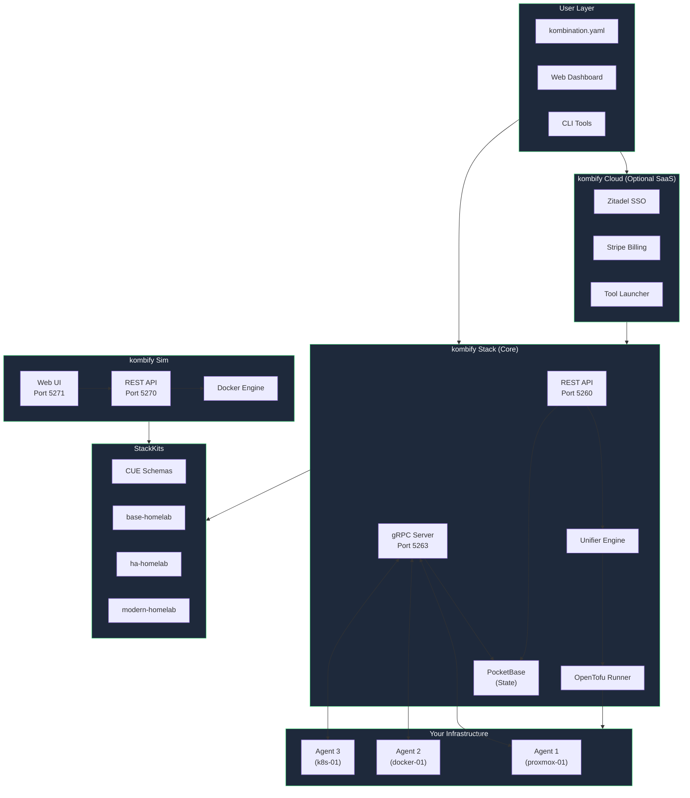
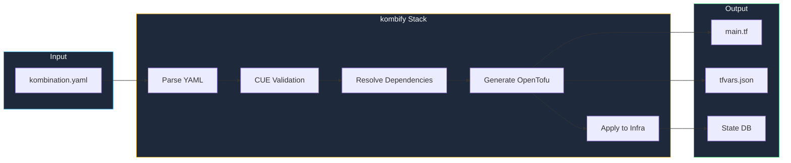
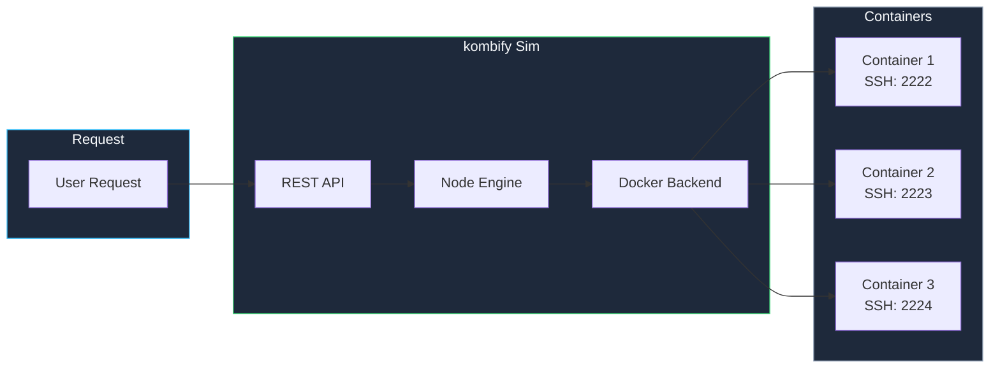
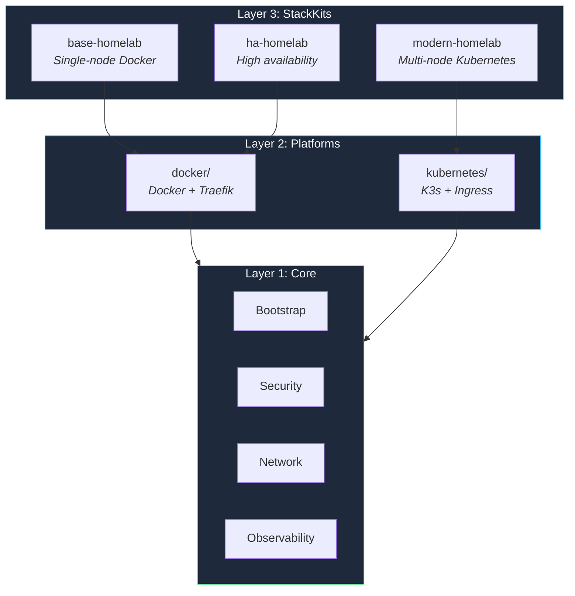
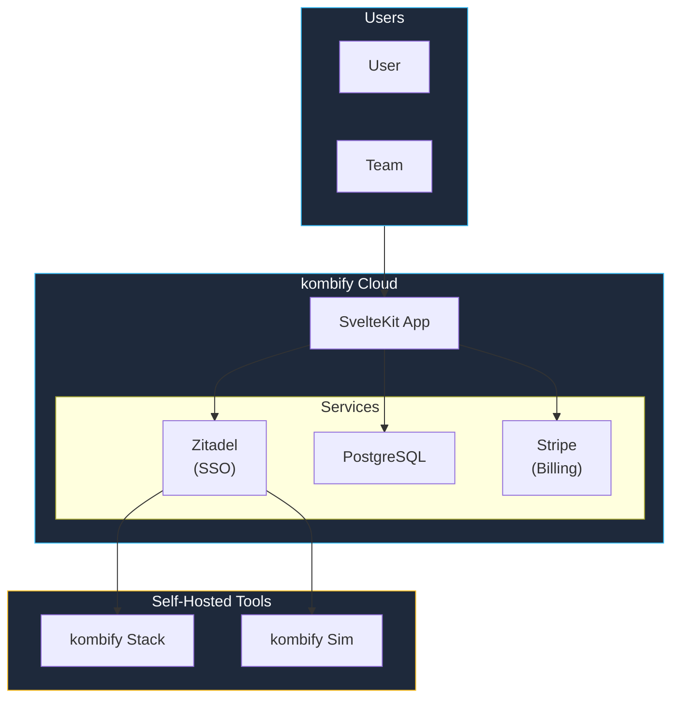
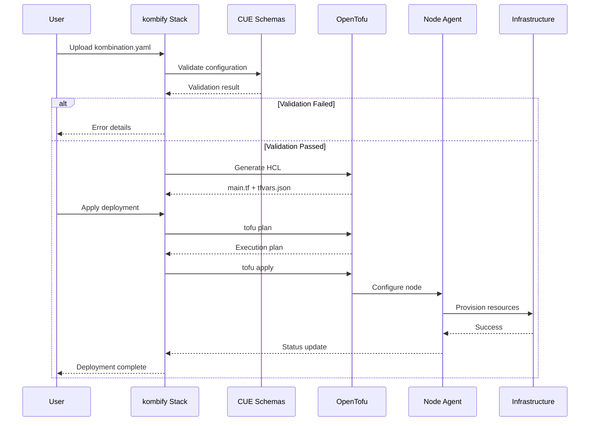
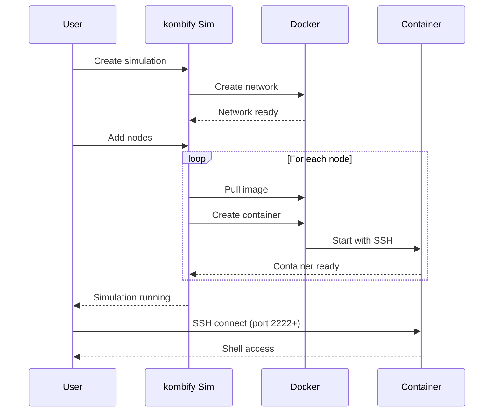
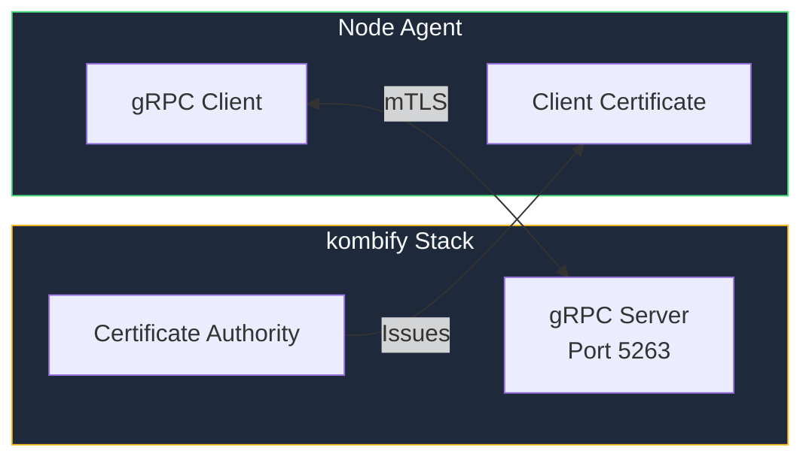
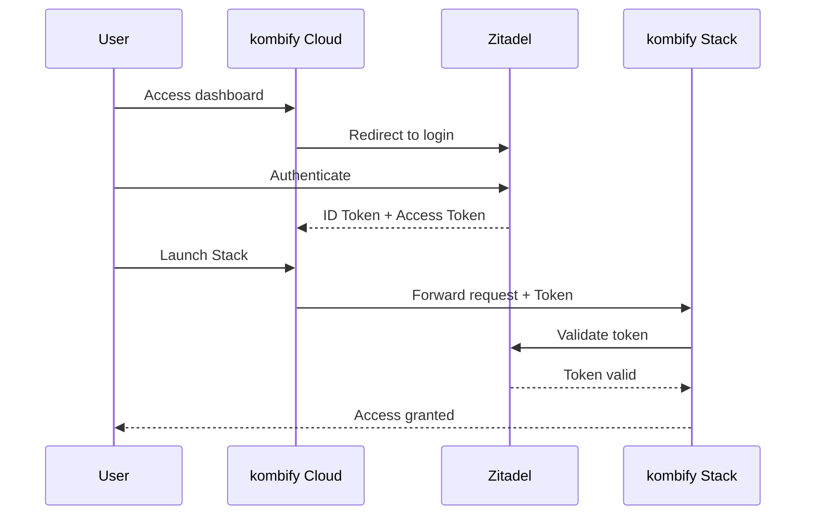

kombify is a suite of tools that work together to simplify infrastructure management through a **spec-driven approach**. This page explains how the components interact.

## System Overview



## Core Components

### kombify Stack

The orchestration engine that manages your infrastructure.



**Tech Stack:**
| Component | Technology | Purpose |
|-----------|------------|---------|
| Backend | Go 1.24+ | Core services and agents |
| Frontend | SvelteKit 2.x | Reactive dashboard UI |
| Database | PocketBase (SQLite) | Embedded state management |
| IaC Engine | OpenTofu 1.6+ | Infrastructure provisioning |
| Validation | CUE 0.15+ | Type-safe configuration |
| Networking | gRPC + mTLS | Secure agent communication |

**Service Ports:**
| Service | Port | Protocol | Description |
|---------|------|----------|-------------|
| Core API | 5260 | HTTP | REST API + PocketBase Admin |
| Frontend | 5261 | HTTP | SvelteKit Dashboard |
| gRPC | 5263 | gRPC/mTLS | Agent communication |

### kombify Sim

The simulation engine for testing before deployment.



**Service Ports:**
| Service | Port | Protocol | Description |
|---------|------|----------|-------------|
| Backend API | 5270 | HTTP | REST API |
| Frontend | 5271 | HTTP | SvelteKit Dashboard |
| SSH (Nodes) | 2222-2322 | SSH | Container SSH access |

### kombify StackKits

Pre-validated infrastructure blueprints.



### kombify Cloud

The managed SaaS platform (optional).



## Data Flow

### Deployment Pipeline



### Simulation Flow



## Security Model

### Agent Communication



All agent communication uses **mutual TLS (mTLS)**:

1. **Certificate Authority**: Stack Core generates a CA during initialization
2. **Agent Certificates**: Each agent receives a unique certificate signed by the CA
3. **Mutual Authentication**: Both sides verify certificates before communication
4. **Encrypted Channel**: All data is encrypted in transit

### Authentication Flow (Cloud)



## Deployment Models

<Columns cols={2}>
  <Card title="Self-Hosted (Stack Only)" icon="server">
    Run kombify Stack on your own infrastructure. Full control, no external dependencies.
    
    **Best for:** Privacy-focused users, air-gapped environments
    
    ```bash
    docker compose up -d
    ```
  </Card>
  <Card title="Hybrid (Stack + Cloud)" icon="cloud">
    Use kombify Cloud for SSO and billing while self-hosting Stack.
    
    **Best for:** Teams, enterprise users
    
    Connect via Cloud dashboard
  </Card>
</Columns>

## Next Steps

<Columns cols={3}>
  <Card title="Spec-Driven Concepts" icon="file-code" href="/concepts/spec-driven">
    Learn how kombify transforms YAML into infrastructure
  </Card>
  <Card title="StackKits Deep Dive" icon="boxes-stacked" href="/concepts/stackkits">
    Understand how StackKits provide validated blueprints
  </Card>
  <Card title="Security Model" icon="shield" href="/guides/self-hosting/security">
    Learn about authentication and encryption
  </Card>
</Columns>
