# Identity & security

kombify implements a **zero-trust identity architecture** that combines strong security defaults with intentional flexibility for advanced users. This page explains how identity, authentication, and authorization work across the platform.

<Note>
  **Core principle:** Strong defaults, not hard limitations. kombify ships with secure-by-default presets, but advanced users can intentionally adjust security posture if their use case requires it.
</Note>

## Design principles

<CardGroup cols={2}>
  <Card title="Passkey-first for humans" icon="fingerprint">
    Passwordless login via WebAuthn passkeys as the recommended default
  </Card>
  <Card title="Secret-free for agents" icon="robot">
    Workloads authenticate via certificates (mTLS/SPIFFE), not static passwords or API keys
  </Card>
  <Card title="Hybrid model" icon="arrows-split-up-and-left">
    Combination of cloud IdP (Zitadel) and local identity services for homelab sovereignty
  </Card>
  <Card title="User sovereignty" icon="user-shield">
    Advanced users can adjust security posture — as long as it's an explicit, conscious choice
  </Card>
</CardGroup>

## Component stack

kombify uses a layered identity stack that works across SaaS and self-hosted deployments:

| Component | Role | Technology |
|-----------|------|------------|
| **Zitadel** | Global IdP (SaaS) | OIDC, FIDO2, Multi-Tenancy |
| **tinyauth** | Identity broker & proxy | OIDC Federation, mTLS enforcement |
| **pocketid** | Local passkey IdP | WebAuthn / Passkeys |
| **lldap** | Directory service | LDAP (source of truth for groups) |
| **step-ca** | PKI & Certificate Authority | SCEP, ACME, x509 |
| **PocketBase** | App backend | OIDC consumer, RBAC via groups |


## Identity types & flows

### Human identities (owners & members)

**Primary login (recommended):** Passkeys (WebAuthn)


**Recovery strategy (recommended):**
- At least two registered passkeys (e.g., smartphone + hardware key), **or**
- Encrypted recovery codes stored outside the homelab

### Agent identities (workloads & M2M)

**Standard model (recommended):** SPIFFE-based trust

<Steps>
  <Step title="Request certificate">
    Agent requests a certificate from **step-ca**
  </Step>
  <Step title="Receive identity">
    step-ca issues a short-lived certificate with SPIFFE ID
  </Step>
  <Step title="Authenticate via mTLS">
    Access to target service is performed via mTLS using this certificate
  </Step>
</Steps>

**Benefits:**
- No static passwords or API keys in configuration files
- Short-lived certificates enable automated, rotating security
- Certificates can encode workload identity (namespace, service name)

## Zero-trust architecture

kombify implements defense in depth with multiple trust layers:

### Device trust (mTLS)

External access to the homelab requires a certificate issued via **SCEP** (step-ca). Without a valid certificate, the reverse proxy silently drops the connection.

```yaml
# Example: Device certificate request
step ca certificate "my-laptop" laptop.crt laptop.key \
  --provisioner "SCEP" \
  --not-after 24h
```

### Identity trust (OIDC)

After successful device validation, the user authenticates via passkey. OIDC tokens contain roles and group information for downstream services.

### RBAC via groups

Permissions are modeled as **lldap groups**. lldap is the source of truth for roles and groups, which are propagated as claims in OIDC tokens.


## Role model

kombify defines roles at two levels: SaaS (kombify Sphere) and homelab (kombify Stack).

### SaaS roles (kombify Sphere)

| Role | Permissions |
|------|-------------|
| **USER** | Regular tool usage, access to own homelabs/projects |
| **MANAGER** | Billing, team membership, plan selection |
| **ADMIN** | Full organization-level administration |

### Homelab roles (kombify Stack)

| Role | Permissions |
|------|-------------|
| **OWNER** | Full access to a specific kombify Stack instance |
| **OPERATOR** | Technical operations (rollouts, updates, worker management) |
| **DEVELOPER** | Creates and modifies StackKits/specs |
| **VIEWER** | Read-only access to dashboards and logs |

All roles appear as standardized claims in OIDC/JWT tokens:

```json
{
  "sub": "user-123",
  "role": "OPERATOR",
  "org_role": "MANAGER",
  "lab_role": "OWNER",
  "groups": ["homelab-operators", "billing-managers"]
}
```

## SaaS vs. self-hosted

### SaaS mode (kombify Sphere)

- **tinyauth** is registered as an OIDC client with **Zitadel**
- SaaS owners and users log in with their central kombify account
- Subscription and billing handled by Stripe

### Self-hosted mode (homelab sovereignty)

- Local members are created in **lldap** and use **pocketid** as a local passkey provider
- Biometric data and passkey keys never leave the local network
- Full control over identity lifecycle

### Automatic provisioning

During initial installation, the SaaS tool generates:
- OIDC configuration for **tinyauth** (client IDs, redirect URIs, scopes)
- Root and intermediate certificates for **step-ca**

These artifacts are distributed to local components (reverse proxy, agents, kombify Stack).

## Service accounts & automation

### Service accounts per tool

Dedicated identities for:
- kombify Stack workers
- kombify Sim orchestrator
- CI/CD pipelines (e.g., automated StackKit validation)

Authentication via **mTLS** (SPIFFE IDs) or OAuth2 client credentials against **kombify API**.

### Scopes & least privilege

Fine-grained scopes ensure each automation gets only the minimal required permissions:

| Scope | Description |
|-------|-------------|
| `stackkits:read` | Read StackKit definitions |
| `stackkits:write` | Create/modify StackKits |
| `labs:operate` | Operate homelab instances |
| `simulations:run` | Execute simulations |

### Token lifetime & rotation

- Short-lived access tokens (1 hour default)
- Long-lived refresh tokens or certificate-based mechanisms
- Policy for regular rotation of client secrets and certificates

## Disaster recovery

### Emergency admin

A dedicated local admin account in **tinyauth**, restricted to a local management VLAN (IP allow-listing / firewall rules).

### Offline mode

If the internet is down (Zitadel unreachable), **tinyauth** can fail over to local **lldap accounts**. Critical infrastructure maintenance remains possible.

### Backups & key management

Daily automated backups of:
- **lldap** database (SQLite or PostgreSQL)
- **step-ca** keys and relevant PKI metadata

Stored in an encrypted vault (offline backup or dedicated backup server).

<Warning>
  Regular restore tests are essential to ensure the emergency path actually works.
</Warning>

## Edge cases & access paths

### Cloudflare tunnels

Make homelab services reachable from the internet without router port forwarding:

```mermaid
graph LR
    Internet["🌐 Internet"]
    CF["Cloudflare<br/>Tunnel"]
    Proxy["Reverse Proxy"]
    Service["Your Service"]
    
    Internet --> CF
    CF --> Proxy
    Proxy --> Service
```



**Security guardrails:**
- Cloudflare authenticates HTTP traffic, but not the end-user identity
- Combined flow: Cloudflare Tunnel → reverse proxy → mTLS validation → OIDC login

### VPN access

VPN remains important for complex homelabs but is **no longer the only security layer**:

- **Classic VPN:** WireGuard/OpenVPN with static keys — provides IP-level access only
- **Identity-aware VPN:** OIDC-integrated VPN that maps claims to network policies

<Tip>
  Use VPN as an additional network path; keep identity checks with mTLS + OIDC.
</Tip>

## Authentication modes

While the recommended default is **passkeys + mTLS**, kombify supports classic authentication for migration and special use cases.

### Available modes

| Mode | Description | Recommendation |
|------|-------------|----------------|
| `passkeys_only` | Passkeys (WebAuthn) only | ✅ **Default** |
| `passkeys_plus_legacy` | Passkeys with password fallback | Migration path |
| `password_only` | Username + password only | ⚠️ Legacy only |

### Configuration

```yaml
# In StackKit configuration
identity:
  auth_mode: passkeys_only        # Default
  allow_password_login: false     # Recommended
  require_mfa_for_password: true  # If password enabled
```

<Warning>
  Password-only mode is supported but clearly marked as **not recommended** for production. Tenants who enable it explicitly accept the security downgrade.
</Warning>

## Next steps

<CardGroup cols={2}>
  <Card title="Zitadel setup" icon="key" href="/guides/auth/zitadel-setup">
    Configure Zitadel as your identity provider
  </Card>
  <Card title="SSO integration" icon="right-to-bracket" href="/guides/auth/sso-integration">
    Integrate kombify with your existing SSO
  </Card>
  <Card title="API authentication" icon="code" href="/guides/auth/api-keys">
    Authenticate programmatic access
  </Card>
  <Card title="Security guide" icon="shield-halved" href="/guides/self-hosting/security">
    Harden your self-hosted deployment
  </Card>
</CardGroup>
