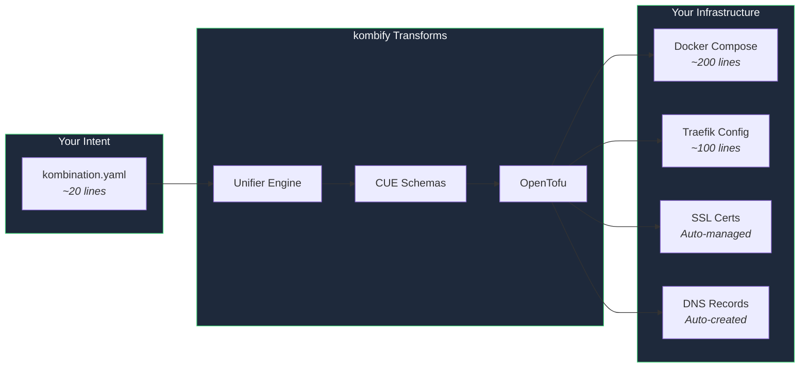
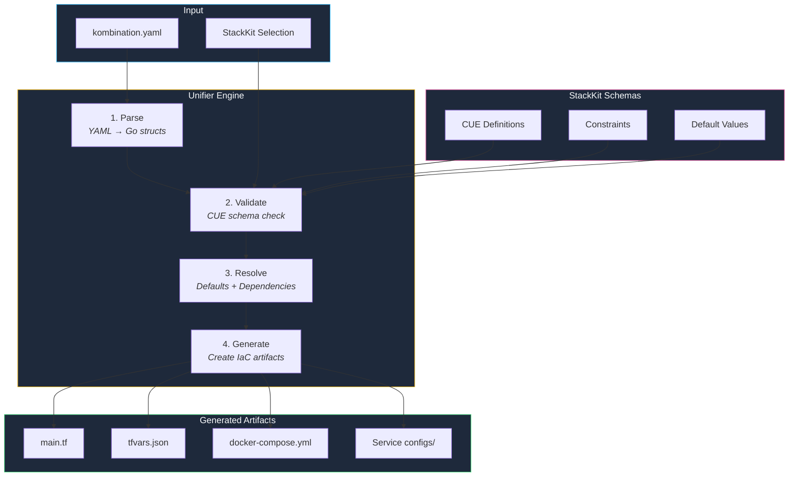
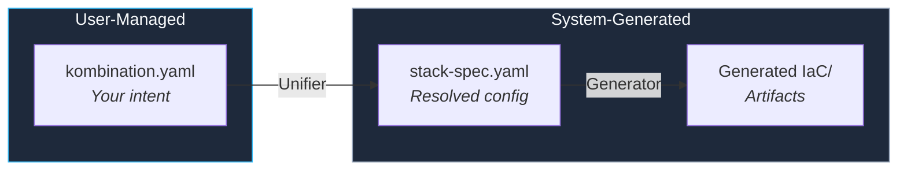
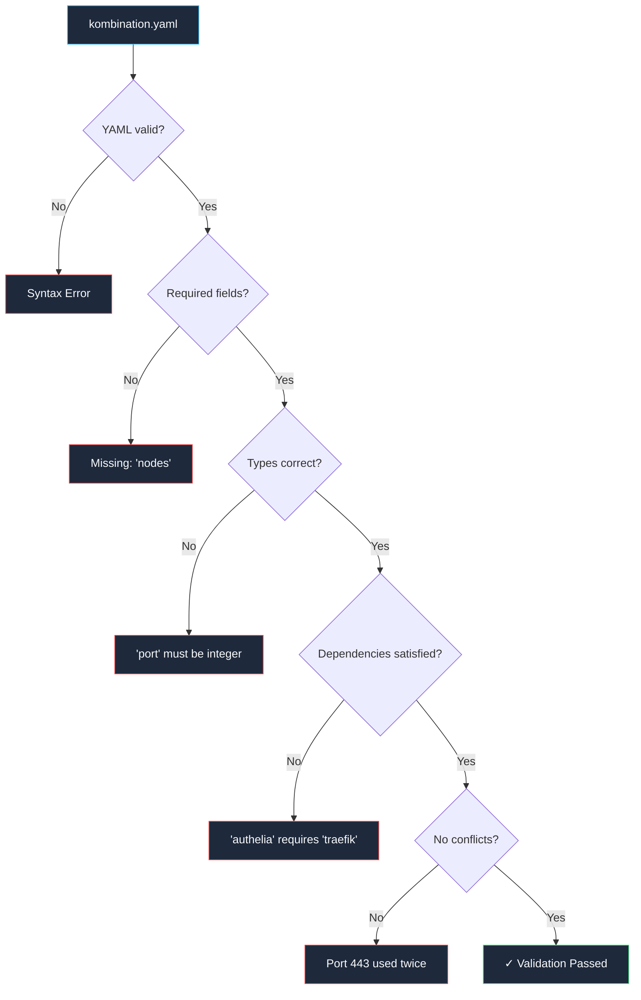

**Spec-driven infrastructure** is the core principle behind kombify — you describe *what* you want, not *how* it should be implemented.

## The Core Concept



## What You Write

```yaml kombination.yaml
# This is ALL you write
version: "1.0"
stackkit: base-homelab

meta:
  name: my-homelab
  domain: home.example.com

nodes:
  - name: proxmox-01
    type: hypervisor
    connection:
      host: 192.168.1.100

services:
  - traefik      # Reverse proxy
  - authelia     # Single sign-on
  - homepage     # Dashboard
  - immich       # Photo management
```

## What kombify Generates

<Tabs>
  <Tab title="Docker Compose">
    ```yaml docker-compose.yml
    version: "3.8"
    
    services:
      traefik:
        image: traefik:v3.0
        container_name: traefik
        restart: unless-stopped
        ports:
          - "80:80"
          - "443:443"
        volumes:
          - /var/run/docker.sock:/var/run/docker.sock:ro
          - ./traefik:/etc/traefik
          - ./letsencrypt:/letsencrypt
        networks:
          - proxy
        labels:
          - "traefik.enable=true"
          # ... 50+ more lines of configuration
      
      authelia:
        image: authelia/authelia:4.38
        container_name: authelia
        restart: unless-stopped
        depends_on:
          - traefik
        volumes:
          - ./authelia:/config
        networks:
          - proxy
        labels:
          - "traefik.enable=true"
          - "traefik.http.routers.authelia.rule=Host(`auth.home.example.com`)"
          # ... more configuration
      
      # ... more services
    
    networks:
      proxy:
        external: true
    ```
  </Tab>
  <Tab title="Traefik Config">
    ```yaml traefik/traefik.yml
    api:
      dashboard: true
      insecure: false
    
    entryPoints:
      http:
        address: ":80"
        http:
          redirections:
            entryPoint:
              to: https
              scheme: https
      https:
        address: ":443"
        http:
          tls:
            certResolver: letsencrypt
    
    certificatesResolvers:
      letsencrypt:
        acme:
          email: admin@home.example.com
          storage: /letsencrypt/acme.json
          httpChallenge:
            entryPoint: http
    
    providers:
      docker:
        endpoint: "unix:///var/run/docker.sock"
        exposedByDefault: false
        network: proxy
    ```
  </Tab>
  <Tab title="OpenTofu">
    ```hcl main.tf
    terraform {
      required_providers {
        docker = {
          source  = "kreuzwerker/docker"
          version = "~> 3.0"
        }
      }
    }
    
    resource "docker_network" "proxy" {
      name = "proxy"
    }
    
    resource "docker_container" "traefik" {
      name  = "traefik"
      image = "traefik:v3.0"
      
      ports {
        internal = 80
        external = 80
      }
      
      ports {
        internal = 443
        external = 443
      }
      
      # ... extensive configuration
    }
    ```
  </Tab>
</Tabs>

## The Unifier Engine

The Unifier is the heart of kombify's spec-driven approach. It transforms your intent into executable infrastructure.



### Pipeline Stages

<Steps>
  <Step title="Parse" icon="file-code">
    The YAML file is parsed into Go structs. Invalid YAML syntax is caught here.
    
    ```bash
    # Example error
    Error: YAML parse error at line 15
    Expected string value, got integer
    ```
  </Step>
  
  <Step title="Validate" icon="check-circle">
    Configuration is validated against CUE schemas from the selected StackKit.
    
    ```bash
    ✓ Required fields present
    ✓ Service names valid
    ✓ Port ranges valid
    ✓ Dependencies resolvable
    ```
  </Step>
  
  <Step title="Resolve" icon="wand-magic-sparkles">
    Missing values are filled with StackKit defaults. Dependencies are resolved.
    
    ```yaml
    # You wrote:
    services:
      - authelia
    
    # Resolved to:
    services:
      authelia:
        image: authelia/authelia:4.38
        depends_on: [traefik, redis]
      traefik:  # Auto-added (dependency)
        image: traefik:v3.0
      redis:    # Auto-added (dependency)
        image: redis:7
    ```
  </Step>
  
  <Step title="Generate" icon="code">
    Infrastructure as Code artifacts are generated:
    - OpenTofu HCL files
    - Docker Compose configurations
    - Service-specific configs (Traefik rules, Authelia config, etc.)
  </Step>
</Steps>

## Two-File System

kombify uses a clear separation between **user intent** and **system output**:



<Warning>
  **Never edit generated files directly.** All changes should go through `kombination.yaml`. Generated files are overwritten on each deployment.
</Warning>

| File | Owner | Purpose |
|------|-------|---------|
| `kombination.yaml` | You | Your infrastructure intent |
| `stack-spec.yaml` | Unifier | Resolved, normalized configuration |
| `generated/*` | Generator | OpenTofu, Compose, configs |

## Validation in Action



### Validation Output

```bash
$ kombify validate

Validating kombination.yaml...

✓ YAML syntax valid
✓ Version: 1.0 (supported)
✓ StackKit: base-homelab (found)
✓ Required fields present
✓ Node 'proxmox-01': configuration valid
✓ Service dependencies:
  ├─ traefik: no dependencies
  ├─ authelia: depends on [traefik] ✓
  ├─ homepage: depends on [traefik] ✓
  └─ immich: depends on [traefik, postgres] ✓
✓ Port conflicts: none detected
✓ Network configuration: valid

Validation successful! Ready to deploy.
```

## Why Spec-Driven?

<Columns cols={3}>
  <Card title="Reduced Complexity" icon="minimize">
    **Traditional:** 500+ lines across multiple files
    
    **kombify:** 20 lines in one file
    
    You describe intent, not implementation.
  </Card>
  <Card title="Consistency" icon="equals">
    Every change goes through the same pipeline:
    
    1. Validate
    2. Resolve
    3. Generate
    4. Apply
    
    No manual drift.
  </Card>
  <Card title="Reproducibility" icon="rotate">
    Your `kombination.yaml` is the single source of truth:
    
    - Version-controllable
    - Shareable
    - Disaster-recoverable
  </Card>
</Columns>

## Example: Adding a Service

<Tabs>
  <Tab title="Without kombify">
    1. Research which image to use
    2. Find compatible configuration examples
    3. Create Docker Compose entry
    4. Configure Traefik labels for routing
    5. Set up SSL certificate
    6. Configure authentication with Authelia
    7. Add to Homepage dashboard
    8. Test everything works together
    
    **Time:** 30-60 minutes
  </Tab>
  <Tab title="With kombify">
    ```yaml
    # Add one line:
    services:
      - jellyfin
    ```
    
    ```bash
    kombify apply
    ```
    
    **Time:** 30 seconds
  </Tab>
</Tabs>

## Next Steps

<Columns cols={2}>
  <Card title="Explore StackKits" icon="boxes-stacked" href="/concepts/stackkits">
    Learn about the pre-validated blueprints that power spec-driven infrastructure
  </Card>
  <Card title="Quick Start" icon="rocket" href="/quickstart">
    Deploy your first stack in 5 minutes
  </Card>
</Columns>
