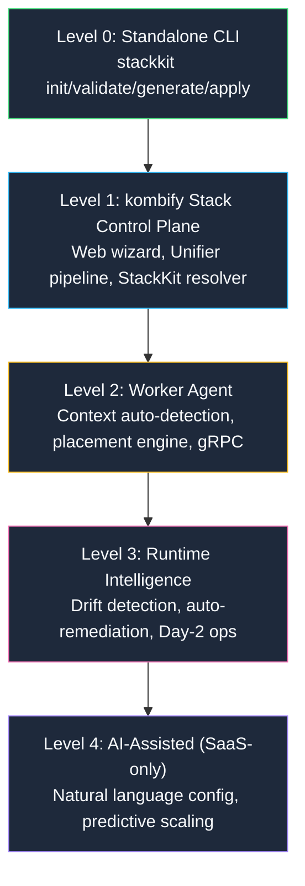

**StackKits** are architecture-pattern-based infrastructure blueprints built on three concepts: **StackKit** (pattern), **Node-Context** (environment), and **Add-Ons** (composable extensions).

<Card title="What's a StackKit?" icon="box">
  A StackKit defines an **architecture pattern** — how services relate to each other. Combined with auto-detected **Node-Context** and composable **Add-Ons**, it produces a fully validated, context-aware infrastructure configuration.
</Card>

## The problem StackKits solve

You want to set up a homelab. You've heard of:

<Columns cols={4}>
  <div>
    **Reverse Proxy**
    - Traefik?
    - Caddy?
    - nginx?
  </div>
  <div>
    **Authentication**
    - Authelia?
    - Authentik?
    - Keycloak?
  </div>
  <div>
    **Management**
    - Portainer?
    - Dockge?
    - Coolify?
  </div>
  <div>
    **Photos**
    - Immich?
    - Photoprism?
    - Nextcloud?
  </div>
</Columns>

**Questions:**
- Which tools work well together?
- How do I configure them correctly?
- What are the best practices?
- How do I avoid security mistakes?

**StackKits answer all of these.**

## The three concepts

### 1. StackKit = Architecture pattern

A StackKit defines **how infrastructure is organized**, not how many servers you need.

| StackKit | Pattern | What it means |
|----------|---------|--------------|
| **base** | Single-environment | All services in one deployment target |
| **modern** | Hybrid infrastructure | Local + cloud connected via VPN overlay |
| **ha** | High-availability cluster | Redundancy, failover, quorum consensus |

<Tip>
  A `base` StackKit can run on 3 Raspberry Pis. An `ha` StackKit can run on 1 powerful server. The StackKit defines the *pattern*, not the *scale*.
</Tip>

### 2. Node-Context = auto-detected environment

| Context | How it's detected | What it affects |
|---------|-------------------|----------------|
| **local** | Physical hardware, no cloud metadata | Self-signed TLS, Dokploy, local DNS |
| **cloud** | Cloud provider metadata detected | Let's Encrypt, Coolify, public DNS |
| **pi** | ARM + low memory or RPi detection | ARM images, reduced services, tmpfs |

### 3. Add-Ons = composable extensions

Add-Ons replace the old monolithic variant system. They stack and compose:

```yaml kombination.yaml
stackkit: base
addons:
  - monitoring    # Prometheus + Grafana
  - backup        # Restic + S3
  - media         # Jellyfin + *arr
```

## Available StackKits

<CardGroup cols={3}>
  <Card title="Base Kit" icon="house" href="/stackkits/kits/base-homelab">
    **Single-environment**
    
    - Docker Compose
    - Any node count
    - Context-aware defaults
    - Perfect first homelab
  </Card>
  <Card title="High Availability Kit" icon="shield-halved" href="/stackkits/kits/ha-homelab">
    **High-availability**
    
    - Docker Swarm cluster
    - Keepalived VIP
    - 3+ nodes recommended
    - Automatic failover
  </Card>
  <Card title="Modern Homelab Kit" icon="rocket" href="/stackkits/kits/modern-homelab">
    **Hybrid infrastructure**
    
    - Local + cloud nodes
    - VPN overlay built-in
    - Coolify PAAS
    - Public endpoints
  </Card>
</CardGroup>

## How StackKits work

### Context-driven defaults

The combination of StackKit × Context produces curated default configurations:

| | local | cloud | pi |
|---|---|---|---|
| **base** | Dokploy, self-signed TLS | Coolify, Let's Encrypt | Lean Docker, reduced services |
| **modern** | Tailscale exit node, hybrid DNS | Multi-cloud mesh | Edge relay role |
| **ha** | Swarm + Keepalived | Cloud HA + managed LB | Not recommended |

### 3-Layer architecture

StackKits use a strict 3-layer architecture for maximum reusability:

| Layer | Purpose | Managed by |
|-------|---------|------------|
| **L1: Foundation** | System, security, packages, core identity (LLDAP, Step-CA) | OpenTofu |
| **L2: Platform** | Container runtime, PAAS, ingress, platform identity | OpenTofu |
| **L3: Applications** | User services deployed by PAAS | PAAS (Dokploy/Coolify) |

### CUE schema definition

Each StackKit is defined in [CUE](https://cuelang.org/), a powerful configuration language:

```cue base-homelab/stackfile.cue
package base_homelab

import "github.com/kombihq/stackkits/base"

#BaseHomelabKit: base.#BaseStackKit & {
    metadata: {
        name: "base-homelab"
        version: "4.0.0"
    }
    
    // Services with dependency constraints
    services: {
        traefik: #TraefikService
        dokploy: #DokployService
        // ...
    }
    
    // Context-aware PAAS selection
    if _context == "cloud" {
        paas: type: "coolify"
    }
}
```

<Tip>
  CUE provides type checking, validation, and default values — catching errors before deployment, not after.
</Tip>

### Validation flow

```mermaid
flowchart LR
    subgraph Input
        YAML["kombination.yaml"]
    end

    subgraph Resolution["CUE Resolution"]
        Kit["StackKit Pattern"]
        Ctx["Context Defaults"]
        AO["Add-On Merging"]
    end

    subgraph Validation
        V1["Schema checks"]
        V2["Constraint resolution"]
        V3["Dependency validation"]
    end

    subgraph Output
        Config["Validated Config"]
    end

    YAML --> Resolution
    Resolution --> Validation
    Validation --> Config

    style Input fill:#1e293b,stroke:#38bdf8,color:#f8fafc
    style Resolution fill:#1e293b,stroke:#f472b6,color:#f8fafc
    style Validation fill:#1e293b,stroke:#4ade80,color:#f8fafc
    style Output fill:#1e293b,stroke:#fbbf24,color:#f8fafc
```



## Progressive capability model

StackKits operates at different levels depending on how you use it:



## Example: base StackKit

### Minimal configuration

```yaml kombination.yaml
version: "2.0"
stackkit: base
domain: home.example.com

nodes:
  - name: server-01
    host: 192.168.1.100

# That's it! Traefik, Dokploy, TinyAuth are auto-configured
# Context is auto-detected (local in this case)
```

### With Add-Ons

```yaml kombination.yaml
version: "2.0"
stackkit: base
domain: home.example.com

nodes:
  - name: server-01
    host: 192.168.1.100

addons:
  - monitoring       # Prometheus + Grafana
  - backup           # Restic backups
  - media            # Jellyfin + *arr stack
```

## StackKit comparison

| Feature | base | modern | ha |
|---------|------|--------|-----|
| **Pattern** | Single-environment | Hybrid infrastructure | HA cluster |
| **Container runtime** | Docker Compose | Docker + Coolify | Docker Swarm |
| **Typical nodes** | 1 (supports N) | 2+ (multi-environment) | 3+ (quorum) |
| **Complexity** | Low | Medium | High |
| **Failover** | No | No | Yes |
| **Best for** | First homelab | Hybrid setups | Production workloads |

## Customization

### Override defaults

```yaml kombination.yaml
stackkit: base

services:
  traefik:
    dashboard: true
  monitoring:
    retention: 30d
```

### Add-On ecosystem

| Add-On | Category | Compatible with |
|--------|----------|----------------|
| `monitoring` | Observability | base, modern, ha |
| `backup` | Data | base, modern, ha |
| `vpn-overlay` | Networking | modern, ha |
| `gpu-workloads` | Compute | base, modern |
| `media` | Applications | base, modern |
| `smart-home` | IoT | base |
| `ci-cd` | Development | base, modern, ha |

## Next steps

<Columns cols={3}>
  <Card title="Base Kit details" icon="house" href="/stackkits/kits/base-homelab">
    Explore services and configuration options
  </Card>
  <Card title="CUE basics" icon="code" href="/stackkits/customization/cue-basics">
    Learn the configuration language
  </Card>
  <Card title="Quick start" icon="rocket" href="/stackkits/quickstart">
    Deploy your first StackKit
  </Card>
</Columns>
