**StackKits** are pre-validated, battle-tested infrastructure blueprints that provide sane defaults for common homelab scenarios.

<Card title="What's a StackKit?" icon="box">
  A StackKit is a predefined set of services, configurations, defaults, and constraints that work together. Instead of figuring out which tools to use and how to configure them, you pick a StackKit and customize it to your needs.
</Card>

## The Problem StackKits Solve

You want to set up a homelab. You've heard of:

<Columns cols={4}>
  <div>
    **Reverse Proxy**
    - Traefik?
    - Caddy?
    - nginx?
  </div>
  <div>
    **Authentication**
    - Authelia?
    - Authentik?
    - Keycloak?
  </div>
  <div>
    **Management**
    - Portainer?
    - Dockge?
    - Coolify?
  </div>
  <div>
    **Photos**
    - Immich?
    - Photoprism?
    - Nextcloud?
  </div>
</Columns>

**Questions:**
- Which tools work well together?
- How do I configure them correctly?
- What are the best practices?
- How do I avoid security mistakes?

**StackKits answer all of these.**

## Available StackKits

```mermaid
graph TB
    subgraph Beginner["For Beginners"]
        Base["base-homelab<br/>━━━━━━━━━━━<br/>4-6 services<br/>Single node<br/>Docker only"]
    end

    subgraph Advanced["For Advanced Users"]
        HA["ha-homelab<br/>━━━━━━━━━━━<br/>8-12 services<br/>Multi-node<br/>High availability"]
    end

    subgraph Power["For Power Users"]
        Modern["modern-homelab<br/>━━━━━━━━━━━<br/>15+ services<br/>Kubernetes<br/>Full GitOps"]
    end

    style Beginner fill:#1e293b,stroke:#4ade80,color:#f8fafc
    style Advanced fill:#1e293b,stroke:#fbbf24,color:#f8fafc
    style Power fill:#1e293b,stroke:#f472b6,color:#f8fafc
```



<CardGroup cols={3}>
  <Card title="base-homelab" icon="house" href="/stackkits/kits/base-homelab">
    **For beginners**
    
    - 4-6 essential services
    - Single-node deployment
    - Simple Docker setup
    - Perfect first homelab
  </Card>
  <Card title="ha-homelab" icon="shield-halved" href="/stackkits/kits/ha-homelab">
    **For advanced users**
    
    - 8-12 services
    - Multi-node support
    - High availability
    - Database clustering
  </Card>
  <Card title="modern-homelab" icon="rocket" href="/stackkits/kits/modern-homelab">
    **For power users**
    
    - 15+ services
    - Kubernetes (k3s)
    - Full GitOps workflow
    - Enterprise patterns
  </Card>
</CardGroup>

## How StackKits Work

### 3-Layer Architecture

StackKits use a strict 3-layer architecture for maximum reusability:


| Layer | Purpose | Examples |
|-------|---------|----------|
| **Core** (Base) | Shared foundation for ALL deployments | Security hardening, SSH config, firewall |
| **Platforms** | Container orchestration | Docker + Traefik, Kubernetes + Ingress |
| **StackKits** | Use-case specific configurations | base-homelab, ha-homelab, modern-homelab |

### CUE Schema Definition

Each StackKit is defined in [CUE](https://cuelang.org/), a powerful configuration language:

```cue base-homelab/stack.cue
package base_homelab

import "kombify.dev/base"

#Stack: base.#Stack & {
    // Available services
    services: {
        traefik:  #TraefikService
        authelia: #AutheliaService
        homepage: #HomepageService
        immich?:  #ImmichService  // Optional
    }
    
    // Constraints: Dependencies enforced
    if services.authelia != _|_ {
        services.traefik: _  // Authelia requires Traefik
    }
    
    if services.immich != _|_ {
        services.postgres: _  // Immich requires PostgreSQL
    }
}

#TraefikService: base.#Service & {
    image:   "traefik:v3.0"
    ports:   [80, 443]
    volumes: ["/var/run/docker.sock:/var/run/docker.sock:ro"]
    // ... more configuration
}
```

<Tip>
  CUE provides type checking, validation, and default values — catching errors before deployment, not after.
</Tip>

### Validation Flow

```mermaid
flowchart LR
    subgraph Input
        YAML["kombination.yaml"]
    end

    subgraph StackKit
        CUE["CUE Schema"]
        Defaults["Defaults"]
        Constraints["Constraints"]
    end

    subgraph Validation
        V1["✓ YAML syntax"]
        V2["✓ Required fields"]
        V3["✓ Service dependencies"]
        V4["✓ Port conflicts: none"]
        V5["✓ Network config"]
        V6["✓ SSL config"]
    end

    subgraph Output
        Config["Validated Config"]
    end

    YAML --> StackKit
    StackKit --> Validation
    Validation --> Config

    style Input fill:#1e293b,stroke:#38bdf8,color:#f8fafc
    style StackKit fill:#1e293b,stroke:#f472b6,color:#f8fafc
    style Validation fill:#1e293b,stroke:#4ade80,color:#f8fafc
    style Output fill:#1e293b,stroke:#fbbf24,color:#f8fafc
```



## Example: base-homelab

```mermaid
graph TB
    subgraph BaseHomelab["base-homelab StackKit"]
        subgraph Services["Included Services"]
            Traefik["🔀 Traefik<br/><i>Reverse Proxy</i>"]
            Authelia["🔐 Authelia<br/><i>Authentication</i>"]
            Homepage["📊 Homepage<br/><i>Dashboard</i>"]
            Portainer["🐳 Portainer<br/><i>Docker UI</i>"]
        end

        subgraph Preconfigured["Pre-Configured"]
            Routes["• Traefik routes all services"]
            Auth["• Authelia protects admin pages"]
            Discovery["• Homepage auto-discovers"]
            SSL["• Let's Encrypt SSL"]
        end

        subgraph YouConfigure["You Configure"]
            Domain["• Your domain"]
            Email["• Your email (for SSL)"]
            Users["• Your users"]
        end
    end

    style BaseHomelab fill:#f8fafc,stroke:#e2e8f0
    style Services fill:#1e293b,stroke:#38bdf8,color:#f8fafc
    style Preconfigured fill:#1e293b,stroke:#4ade80,color:#f8fafc
    style YouConfigure fill:#1e293b,stroke:#fbbf24,color:#f8fafc
```



### Minimal Configuration

```yaml kombination.yaml
version: "1.0"
stackkit: base-homelab

meta:
  name: my-homelab
  domain: home.example.com
  email: admin@example.com

nodes:
  - name: server-01
    type: local
    connection:
      host: 192.168.1.100

# That's it! Traefik, Authelia, Homepage are auto-configured
```

### Adding Optional Services

```yaml kombination.yaml
version: "1.0"
stackkit: base-homelab

meta:
  name: my-homelab
  domain: home.example.com

nodes:
  - name: server-01
    type: local
    connection:
      host: 192.168.1.100

# Enable optional services
services:
  immich: true      # Photo management
  jellyfin: true    # Media server
  vaultwarden: true # Password manager
```

## StackKit Comparison

| Feature | base-homelab | ha-homelab | modern-homelab |
|---------|-------------|------------|----------------|
| **Target** | Beginners | Advanced | Power users |
| **Nodes** | 1 | 2-3 | 3+ |
| **Services** | 4-6 | 8-12 | 15+ |
| **Orchestration** | Docker | Docker Swarm | Kubernetes |
| **High Availability** | ❌ | ✅ | ✅ |
| **Database Clustering** | ❌ | Optional | ✅ |
| **GitOps** | ❌ | Optional | ✅ |
| **Monitoring** | Basic | Prometheus | Full stack |

## Customization

### Override Defaults

```yaml kombination.yaml
stackkit: base-homelab

services:
  traefik:
    image: traefik:v2.11  # Use older version
    
  authelia:
    config:
      default_2fa_method: webauthn  # Enable WebAuthn
```

### Add Custom Services

```yaml kombination.yaml
stackkit: base-homelab

services:
  # Standard services
  traefik: true
  authelia: true
  
  # Custom service (not in StackKit)
  custom:
    my-app:
      image: myorg/myapp:latest
      ports: [8080]
      traefik:
        host: myapp.home.example.com
```

## Creating Custom StackKits

<Note>
  Creating custom StackKits requires knowledge of CUE. Start with [CUE Basics](/stackkits/cue-basics).
</Note>


<Card title="Create Your First Custom StackKit" icon="pen" href="/stackkits/creating-custom">
  Step-by-step guide to creating custom infrastructure blueprints
</Card>

## Next Steps

<Columns cols={3}>
  <Card title="base-homelab Details" icon="house" href="/stackkits/kits/base-homelab">
    Explore services and configuration options
  </Card>
  <Card title="CUE Basics" icon="code" href="/stackkits/cue-basics">
    Learn the configuration language
  </Card>
  <Card title="Quick Start" icon="rocket" href="/quickstart">
    Deploy your first StackKit
  </Card>
</Columns>
