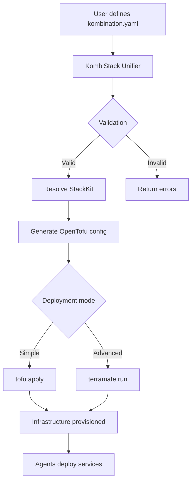
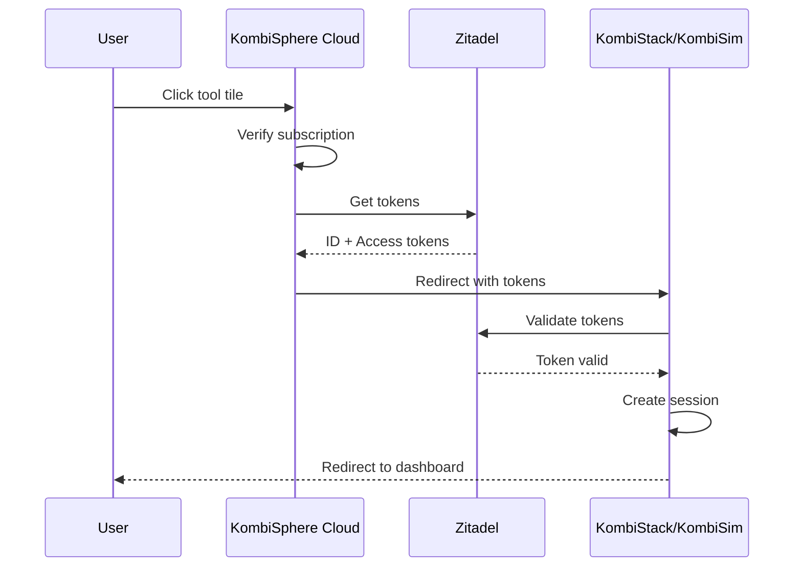

# Ecosystem overview

The KombiSphere ecosystem consists of six interconnected components organized into two layers: **Open Core Tools** and **SaaS Platform**.

## Architecture diagram

```
┌─────────────────────────────────────────────────────────────────────────────┐
│                         KOMBISPHERE PLATFORM                                 │
├─────────────────────────────────────────────────────────────────────────────┤
│                                                                              │
│  ┌────────────────────── SaaS Layer ──────────────────────────────────────┐ │
│  │                                                                         │ │
│  │  ┌─────────────────┐  ┌─────────────────┐  ┌─────────────────┐        │ │
│  │  │ KombiSphere     │  │   KombiSphere   │  │   KombiSphere   │        │ │
│  │  │     Cloud       │  │      Admin      │  │       API       │        │ │
│  │  │ (User Portal)   │  │ (Admin Center)  │  │ (Kong Gateway)  │        │ │
│  │  └─────────────────┘  └─────────────────┘  └─────────────────┘        │ │
│  │                                                                         │ │
│  └─────────────────────────────────────────────────────────────────────────┘ │
│                                      │                                       │
│                                      ▼                                       │
│  ┌────────────────────── Open Core Layer ────────────────────────────────┐  │
│  │                                                                         │ │
│  │  ┌─────────────────┐  ┌─────────────────┐  ┌─────────────────┐        │ │
│  │  │   KombiStack    │  │    KombiSim     │  │    StackKits    │        │ │
│  │  │ (Control Plane) │  │  (Simulation)   │  │ (IaC Blueprints)│        │ │
│  │  └─────────────────┘  └─────────────────┘  └─────────────────┘        │ │
│  │                                                                         │ │
│  └─────────────────────────────────────────────────────────────────────────┘ │
│                                                                              │
└─────────────────────────────────────────────────────────────────────────────┘
```

## Open core tools

### KombiStack

<Card title="Hybrid infrastructure control plane" icon="layer-group" href="/tools/kombistack/overview">
  The core orchestration engine that unifies cloud and home infrastructure. Users define their desired state in a `kombination.yaml` file, and the Unifier Engine resolves this into valid OpenTofu configurations.
  
  **Tech stack:** Go, PocketBase, SvelteKit, OpenTofu, CUE
  
  **License:** MIT + AGPL-3.0 (dual-scope)
</Card>

**Key capabilities:**
- Spec-driven architecture with YAML/CUE configuration
- CUE-based validation and unification engine
- Multi-node management via gRPC agents with mTLS
- Embedded PocketBase for zero-dependency deployment
- OpenTofu integration for IaC execution
- Headscale VPN for secure mesh networking

### KombiSim

<Card title="Infrastructure simulation engine" icon="flask" href="/tools/kombisim/overview">
  Test infrastructure configurations before deployment. KombiSim creates lightweight Docker-based "VMs" with real SSH access, allowing you to validate your setup without real hardware.
  
  **Tech stack:** Go, Docker SDK, SvelteKit
  
  **License:** MIT
</Card>

**Key capabilities:**
- Docker-based simulation nodes (ports 2222-2322 for SSH)
- Real SSH access to simulated servers
- Simulation groups with SQLite persistence
- 6 pre-built templates (homelab, hybrid, development)
- Full REST API for automation
- Web UI for managing simulations

### StackKits

<Card title="Declarative IaC blueprints" icon="boxes-stacked" href="/tools/stackkits/overview">
  Battle-tested infrastructure blueprints with CUE validation and OpenTofu execution. StackKits provide the "recipes" that KombiStack uses to provision your infrastructure.
  
  **Tech stack:** CUE, OpenTofu, Go
  
  **License:** MIT
</Card>

**Key capabilities:**
- 3-layer architecture (Core, Platforms, StackKits)
- CUE schema validation for type safety
- Multi-OS support via variants (Ubuntu, Debian)
- Simple mode (OpenTofu only) and Advanced mode (Terramate orchestration)
- Available kits: base-homelab, modern-homelab, ha-homelab

## SaaS platform

### KombiSphere Cloud

<Card title="User portal and billing" icon="globe" href="/saas/cloud/overview">
  The managed SaaS portal that provides unified access to all tools with enterprise-grade authentication and subscription management.
  
  **Tech stack:** SvelteKit, Prisma, PostgreSQL, Stripe, Zitadel
  
  **License:** Proprietary
</Card>

**Key features:**
- OIDC authentication with Zitadel
- Single sign-on across all tools
- Stripe subscription management (Free, Pro, Enterprise)
- Tool launcher with SSO token generation
- User dashboard and settings

### KombiSphere Admin

<Card title="Administration center" icon="shield-halved" href="/saas/admin/overview">
  The management platform for tool evaluation, pattern management, and StackKit configuration. Provides the "catalog" of available tools and configurations.
  
  **Tech stack:** Go, PocketBase, SvelteKit
  
  **License:** BSL-1.1 (converts to Apache 2.0 after 4 years)
</Card>

**Key features:**
- Tool and pattern evaluation
- StackKit management and configuration
- Category-based organization
- Discovery engine (GitHub, npm, PyPI crawlers)
- Version tracking and changelog monitoring

### KombiSphere API

<Card title="API gateway" icon="route" href="/saas/api/overview">
  Central API gateway built on Kong OSS. Provides unified entry point for all microservices with authentication, rate limiting, and routing.
  
  **Tech stack:** Kong OSS, Docker
  
  **License:** MIT
</Card>

**Key features:**
- JWT authentication (Zitadel OIDC)
- API key management for external consumers
- Rate limiting per endpoint
- gRPC support for worker communication
- Declarative configuration with decK

## Data flow

### Stack creation flow



### SSO flow



## Component relationships

| Component | Depends on | Provides to |
|-----------|------------|-------------|
| **StackKits** | CUE, OpenTofu | KombiStack (blueprints) |
| **KombiStack** | StackKits, PocketBase, OpenTofu | Users (orchestration), KombiSphere (core engine) |
| **KombiSim** | Docker | KombiStack (simulation), Users (testing) |
| **KombiSphere Cloud** | Zitadel, Stripe | Users (portal), Tools (SSO) |
| **KombiSphere Admin** | PocketBase | KombiSphere Cloud (tool catalog) |
| **KombiSphere API** | Kong | All services (unified API) |

## Deployment models

<Tabs>
  <Tab title="Standalone (Open core)">
    Run only the open-source tools without any SaaS components.
    
    ```yaml
    # docker-compose.yml
    services:
      kombistack:
        image: ghcr.io/kombiverselabs/kombistack:latest
        ports:
          - "5260:5260"
          - "5261:5261"
      
      kombisim:
        image: ghcr.io/kombiverselabs/kombisim:latest
        ports:
          - "5270:5270"
    ```
    
    **Use case:** Privacy-focused, full control, no subscription
  </Tab>

  <Tab title="SaaS-managed">
    Use the fully managed platform at kombisphere.io.
    
    **Components:**
    - KombiSphere Cloud (user portal)
    - KombiSphere Admin (admin center)
    - KombiSphere API (gateway)
    - Hosted KombiStack instances
    
    **Use case:** Teams, enterprise SSO, managed updates
  </Tab>

  <Tab title="Hybrid">
    Self-host core tools, connect to SaaS for management.
    
    ```yaml
    # docker-compose.yml
    services:
      kombistack:
        image: ghcr.io/kombiverselabs/kombistack:latest
        environment:
          - KOMBISPHERE_API_URL=https://api.kombisphere.io
          - KOMBISPHERE_API_KEY=${API_KEY}
    ```
    
    **Use case:** Data sovereignty + enterprise features
  </Tab>
</Tabs>

## License overview

| Component | License | Commercial use | Modifications |
|-----------|---------|----------------|---------------|
| **StackKits** | MIT | ✅ Allowed | ✅ Allowed |
| **KombiSim** | MIT | ✅ Allowed | ✅ Allowed |
| **KombiStack** | MIT + AGPL-3.0 | ✅ Allowed* | ✅ Allowed* |
| **KombiSphere Admin** | BSL-1.1 | ⚠️ Limited** | ✅ Allowed |
| **KombiSphere Cloud** | Proprietary | ❌ SaaS only | ❌ Not allowed |
| **KombiSphere API** | MIT | ✅ Allowed | ✅ Allowed |

<Info>
  \*Historical code is MIT, new server-side code is AGPL-3.0. See [licensing docs](https://github.com/KombiverseLabs/KombiStack/blob/main/docs/LICENSES.md).
  
  \*\*BSL-1.1 allows production use for organizations with less than $1M ARR. Converts to Apache 2.0 after 4 years.
</Info>

## Next steps

<CardGroup cols={3}>
  <Card
    title="KombiStack deep dive"
    icon="layer-group"
    href="/tools/kombistack/overview"
  >
    Learn about the control plane
  </Card>
  <Card
    title="Simulate infrastructure"
    icon="flask"
    href="/tools/kombisim/overview"
  >
    Test before deploying
  </Card>
  <Card
    title="Browse StackKits"
    icon="boxes-stacked"
    href="/tools/stackkits/available-kits"
  >
    Explore infrastructure blueprints
  </Card>
</CardGroup>
