The kombify platform consists of four interconnected tools, each solving a specific problem in the homelab infrastructure lifecycle.

## The Big Picture

```mermaid
graph TB
    subgraph User["Your Journey"]
        direction LR
        Q1["🤔 What should<br/>I build?"]
        Q2["🧪 Will it<br/>work?"]
        Q3["🚀 Deploy<br/>it!"]
        Q4["📊 Manage<br/>it"]
        
        Q1 --> Q2 --> Q3 --> Q4
    end
    
    subgraph Tools["kombify Tools"]
        direction LR
        SK["StackKits<br/>Blueprints"]
        Sim["kombify Sim<br/>Testing"]
        Stack["kombify Stack<br/>Deployment"]
        Platform["kombify Cloud<br/>Management"]
        
        SK --> Sim --> Stack --> Platform
    end
    
    Q1 -.-> SK
    Q2 -.-> Sim
    Q3 -.-> Stack
    Q4 -.-> Platform
    
    style User fill:#1e293b,stroke:#38bdf8,color:#f8fafc
    style Tools fill:#1e293b,stroke:#fbbf24,color:#f8fafc
```



## Tool Overview

<CardGroup cols={2}>
  <Card title="StackKits" icon="cube" href="/stackkits/overview">
    **Infrastructure Blueprints**
    
    Pre-validated CUE schemas that define homelab configurations. Choose a blueprint, customize it, and let kombify handle the rest.
    
    → *"What should I build?"*
  </Card>
  
  <Card title="Sim" icon="flask-vial" href="/sim/overview">
    **Test Before Deploy**
    
    Spin up simulated nodes in Docker to test your configuration. Full SSH access, realistic networking, zero risk.
    
    → *"Will it work?"*
  </Card>
  
  <Card title="Stack" icon="layer-group" href="/stack/overview">
    **Deploy & Orchestrate**
    
    The control plane that provisions your infrastructure using OpenTofu and manages your nodes via secure gRPC agents.
    
    → *"Deploy it!"*
  </Card>
  
  <Card title="kombify Platform" icon="globe" href="/cloud/overview">
    **Managed Platform**
    
    SaaS platform with SSO, team management, and multi-homelab support. Let us handle the complexity.
    
    → *"Manage it"*
  </Card>
</CardGroup>

## Complete Workflow


## Architecture Layers

### Layer 1: Open Core (Self-Hosted)

These tools are open-source and can run entirely on your infrastructure:


### Layer 2: SaaS Platform (Managed)

Optional managed services that add enterprise features:


## How They Connect

### The kombination.yaml File

All tools share a common configuration format:

```yaml
# kombination.yaml - The universal config
stackkit: base-homelab      # ← StackKit to use
version: "1.0.0"

domain: homelab.local
email: you@example.com

nodes:
  - name: server-1
    ip: 192.168.1.10
    role: primary

services:
  traefik:
    enabled: true
  portainer:
    enabled: true
```

This single file works with:

| Tool | Usage |
|------|-------|
| **StackKits** | Validates against CUE schemas |
| **Sim** | Creates simulated test environment |
| **Stack** | Generates & deploys infrastructure |
| **Cloud** | Stores & version-controls configs |

### Data Flow


## Deployment Options

<Tabs>
  <Tab title="Fully Self-Hosted">
    Run everything yourself:
    
    ```mermaid
    graph TB
        subgraph Your["Your Infrastructure"]
            Stack["Stack"]
            Sim["Sim"]
            HL["Homelab"]
        end
        
        You["You"] --> Stack
        Stack --> HL
        
        style Your fill:#1e293b,stroke:#4ade80,color:#f8fafc
    ```
    
    **Best for:** Privacy-focused users, air-gapped networks
  </Tab>
  
  <Tab title="Hybrid (Recommended)">
    Self-hosted tools with Cloud management:
    
    ```mermaid
    graph TB
        subgraph Cloud["Cloud (Cloud)"]
            Dashboard["Dashboard"]
            SSO["SSO"]
        end
        
        subgraph Your["Your Infrastructure"]
            Agent["Cloud Agent"]
            Stack["Stack"]
            HL["Homelab"]
        end
        
        Dashboard --> Agent
        Agent --> Stack
        Stack --> HL
        
        style Cloud fill:#1e293b,stroke:#38bdf8,color:#f8fafc
        style Your fill:#1e293b,stroke:#4ade80,color:#f8fafc
    ```
    
    **Best for:** Most users—balance of control and convenience
  </Tab>
  
  <Tab title="Fully Managed">
    Everything hosted by kombify:
    
    ```mermaid
    graph TB
        subgraph Cloud["Cloud (Cloud)"]
            Dashboard["Dashboard"]
            Stack["Hosted Stack"]
        end
        
        subgraph Your["Your Infrastructure"]
            Agent["Cloud Agent"]
            HL["Homelab"]
        end
        
        Dashboard --> Stack
        Stack --> Agent
        Agent --> HL
        
        style Cloud fill:#1e293b,stroke:#38bdf8,color:#f8fafc
        style Your fill:#1e293b,stroke:#fbbf24,color:#f8fafc
    ```
    
    **Best for:** Teams, multi-homelab setups, minimal maintenance
  </Tab>
</Tabs>

## Technology Stack

| Component | Technology | Purpose |
|-----------|------------|---------|
| **Backend** | Go 1.24+ | High-performance, single binary |
| **Frontend** | SvelteKit | Modern, reactive UI |
| **Database** | PocketBase (SQLite) | Zero-dependency persistence |
| **IaC** | OpenTofu | Infrastructure provisioning |
| **Validation** | CUE | Schema definition & validation |
| **Agent Comm** | gRPC + mTLS | Secure, efficient RPC |
| **Auth** | Zitadel (OIDC) | Enterprise SSO |
| **Billing** | Stripe | Subscription management |

## Choose Your Path

<CardGroup cols={3}>
  <Card title="Start with Sim" icon="flask-vial" href="/sim/overview">
    **Test first**
    
    Try configurations in a safe environment before committing to real hardware.
  </Card>
  
  <Card title="Start with Stack" icon="layer-group" href="/stack/overview">
    **Deploy now**
    
    Jump straight into deployment if you already know what you want.
  </Card>
  
  <Card title="Start with Cloud" icon="globe" href="/cloud/overview">
    **Managed experience**
    
    Let us handle the setup—focus on your applications.
  </Card>
</CardGroup>

## Comparison Table

| Feature | Self-Hosted | Cloud Managed |
|---------|:-----------:|:--------------:|
| **Setup Time** | ~1 hour | ~5 minutes |
| **Updates** | Manual | Automatic |
| **Multi-homelab** | DIY | Built-in |
| **Team Access** | DIY | Built-in |
| **SSO** | Optional | Included |
| **Support** | Community | Priority |
| **Cost** | Free | $0-49/month |
| **Data Location** | Your choice | Your premises* |

*Cloud only manages configuration—your data stays on your infrastructure.

## Next Steps

<Steps>
  <Step title="Try the Quickstart">
    Get running in 5 minutes with our [quickstart guide](/quickstart).
  </Step>
  
  <Step title="Explore StackKits">
    Browse available [infrastructure blueprints](/stackkits/overview).
  </Step>
  
  <Step title="Read the Concepts">
    Understand [spec-driven architecture](/concepts/spec-driven) and the [Unifier Engine](/concepts/architecture).
  </Step>
</Steps>
