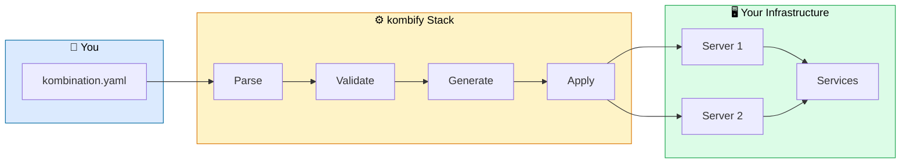
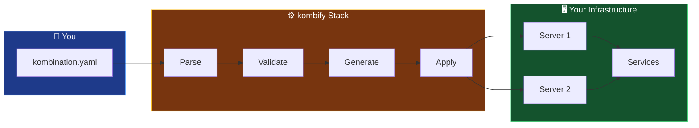
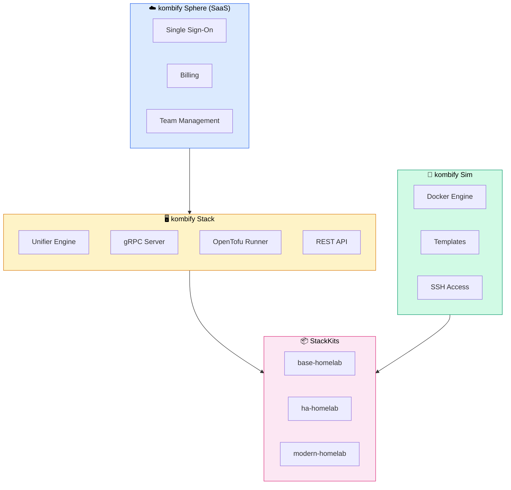
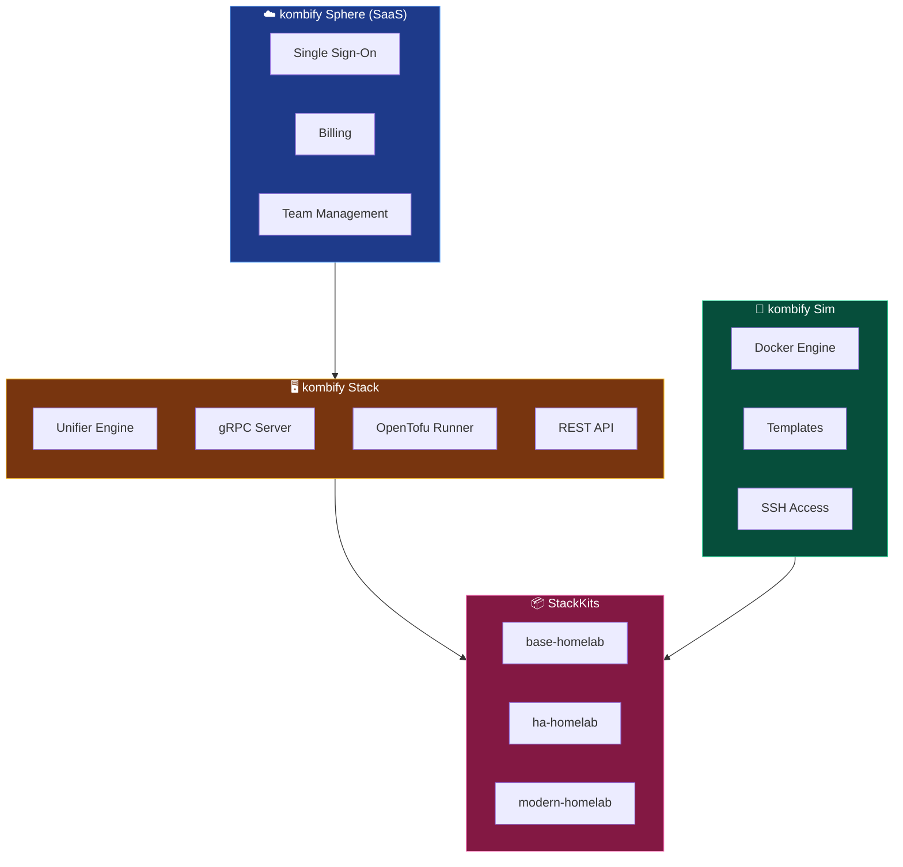

<Card title="Get Started in 3 Minutes" icon="rocket" href="/quickstart" horizontal>
  Deploy your first homelab stack with our quick start guide
</Card>

## What is kombify?

**kombify** is an open-source homelab automation platform that turns your infrastructure into code. Define your entire setup in a single YAML file, simulate it first, then deploy with confidence.

```yaml kombination.yaml
# Your entire homelab in one file
stackkit: base-homelab
nodes:
  - name: proxmox-01
    type: hypervisor
services:
  - traefik    # Reverse proxy with auto-SSL
  - authelia   # Single sign-on
  - immich     # Photo management
  - homepage   # Dashboard
```

<Tip>
  kombify validates your configuration, resolves dependencies automatically, and deploys using battle-tested Infrastructure as Code patterns.
</Tip>

## Choose Your Path

<Columns cols={2}>
  <Card title="Deploy a Homelab" icon="server" href="/stack/overview">
    Use **kombify Stack** to provision and manage real infrastructure with agents
  </Card>
  <Card title="Test Configurations" icon="flask" href="/sim/overview">
    Use **kombify Sim** to simulate your setup before deploying to real hardware
  </Card>
  <Card title="Browse Blueprints" icon="boxes-stacked" href="/stackkits/overview">
    Use **StackKits** to start from pre-validated infrastructure blueprints
  </Card>
  <Card title="Managed Platform" icon="cloud" href="/sphere/overview">
    Use **kombify Sphere** for hosted management with SSO and team features
  </Card>
</Columns>

## How It Works

<div className="dark:hidden">

</div>

<div className="hidden dark:block">

</div>

<Steps>
  <Step title="Define" icon="file-code">
    Write your desired state in `kombination.yaml` — services, nodes, networks, storage
  </Step>
  <Step title="Validate" icon="check">
    kombify validates against CUE schemas and checks dependencies
  </Step>
  <Step title="Simulate" icon="flask">
    Test your configuration in Docker containers before touching real hardware
  </Step>
  <Step title="Deploy" icon="rocket">
    Apply to your infrastructure with OpenTofu and gRPC agents
  </Step>
</Steps>

## The kombify Ecosystem

<div className="dark:hidden">

</div>

<div className="hidden dark:block">

</div>

<AccordionGroup>
  <Accordion title="kombify Stack — Infrastructure Control Plane" icon="server">
    The core orchestration engine that manages your homelab nodes. It reads your `kombination.yaml`, validates it with CUE schemas, and deploys using OpenTofu.
    
    **Key capabilities:**
    - Multi-node management via lightweight gRPC agents
    - Spec-driven infrastructure with CUE validation
    - State management with embedded PocketBase
    - OpenTofu integration for Infrastructure as Code
    
    **License:** MIT + AGPL-3.0 (Open Source)
    
    <Card title="Learn more about Stack" icon="arrow-right" href="/stack/overview" horizontal />
  </Accordion>

  <Accordion title="kombify Sim — Simulation Engine" icon="flask">
    Test your homelab configuration before deploying to real hardware. Sim creates Docker containers that behave like real servers.
    
    **Key capabilities:**
    - Docker-based lightweight "VMs"
    - Real SSH access (ports 2222-2322)
    - Pre-built templates for common setups
    - Full REST API for automation
    
    **License:** MIT (Open Source)
    
    <Card title="Learn more about Sim" icon="arrow-right" href="/sim/overview" horizontal />
  </Accordion>

  <Accordion title="kombify StackKits — Infrastructure Blueprints" icon="boxes-stacked">
    Pre-validated infrastructure blueprints with CUE schemas. Start from battle-tested configurations instead of building from scratch.
    
    **Available kits:**
    - **base-homelab** — 4-6 essential services for beginners
    - **ha-homelab** — High availability with 8-12 services
    - **modern-homelab** — 15+ cutting-edge services for power users
    
    **License:** MIT (Open Source)
    
    <Card title="Browse StackKits" icon="arrow-right" href="/stackkits/overview" horizontal />
  </Accordion>

  <Accordion title="kombify Sphere — Managed Platform" icon="cloud">
    The SaaS platform that adds enterprise features like SSO, billing, and team collaboration on top of the open-source tools.
    
    **Key capabilities:**
    - Single Sign-On with Zitadel OIDC
    - Subscription management with Stripe
    - Tool launcher with seamless authentication
    - Team collaboration and access control
    
    **License:** Proprietary (SaaS)
    
    <Card title="Try Sphere" icon="arrow-right" href="/sphere/overview" horizontal />
  </Accordion>
</AccordionGroup>

## Why kombify?

<Columns cols={3}>
  <Card title="Spec-Driven" icon="file-code">
    Your entire infrastructure in one YAML file — version-controlled, shareable, reproducible
  </Card>
  <Card title="Simulate First" icon="flask">
    Test configurations in Docker before deploying to real hardware
  </Card>
  <Card title="Battle-Tested" icon="shield-check">
    StackKits provide validated blueprints for common homelab setups
  </Card>
</Columns>

<Columns cols={3}>
  <Card title="Open Source" icon="code-branch">
    MIT licensed core tools with an active community
  </Card>
  <Card title="Self-Host or SaaS" icon="server">
    Run on your infrastructure or use the managed platform
  </Card>
  <Card title="Modern Stack" icon="rocket">
    Go, SvelteKit, CUE, OpenTofu — built with modern tools
  </Card>
</Columns>

## Next Steps

<Columns cols={2}>
  <Card title="Quick Start (SaaS)" icon="cloud" href="/quickstart">
    Get started with kombify Sphere in **5 minutes**
  </Card>
  <Card title="Quick Start (Self-Hosted)" icon="server" href="/quickstart-selfhosted">
    Deploy kombify Stack on your own infrastructure
  </Card>
</Columns>

---

## Getting Help

<Columns cols={3}>
  <Card title="Discord Community" icon="discord" href="https://discord.gg/kombify">
    Chat with the community and get real-time support
  </Card>
  <Card title="GitHub Issues" icon="github" href="https://github.com/kombify/stack/issues">
    Report bugs or request features
  </Card>
  <Card title="Documentation" icon="book" href="/guides/introduction">
    Browse guides and tutorials
  </Card>
</Columns>
