<Card title="Get started in 5 minutes" icon="rocket" href="/quickstart" horizontal>
  Deploy your first homelab stack with our quick start guide
</Card>

## What is kombify?

**kombify** is the first platform that guides you through the entire lifecycle of modern self-hosted infrastructure. We transform fragmented, organically-grown homelab setups into professional, documented, and maintainable systems.

<Note>
  **Our promise:** The path from "I want a private cloud" to a secure, running system takes weeks today. kombify shortens this to hours.
</Note>

### The kombify flow

Every deployment follows a clear, intent-driven process:

```mermaid
flowchart LR
    Intent["🎯 Intent"] --> Spec["📋 Spec"]
    Spec --> Sim["🧪 Simulation"]
    Sim --> Deploy["🚀 Rollout"]
    Deploy --> Ops["⚙️ Operation"]
    
    style Intent fill:#1e293b,stroke:#4ade80,color:#f8fafc
    style Spec fill:#1e293b,stroke:#4ade80,color:#f8fafc
    style Sim fill:#1e293b,stroke:#4ade80,color:#f8fafc
    style Deploy fill:#1e293b,stroke:#4ade80,color:#f8fafc
    style Ops fill:#1e293b,stroke:#4ade80,color:#f8fafc
```



1. **Intent capture** — You describe your goal (e.g., "Secure photo cloud for my family")
2. **Spec generation** — A wizard creates a versioned `kombination.yaml` specification file
3. **Simulation** — kombify Sim tests your configuration before touching real hardware
4. **Rollout** — Validated blueprints (StackKits) are deployed to your infrastructure
5. **Operation** — Continuous drift detection keeps your system aligned with its desired state

```yaml kombination.yaml
# Your entire homelab in one file
stackkit: base-homelab
nodes:
  - name: main-server
    type: local
    connection:
      host: 192.168.1.100
services:
  - traefik    # Reverse proxy with auto-SSL
  - authelia   # Single sign-on
  - immich     # Photo management
  - homepage   # Dashboard
```

<Tip>
  kombify validates your configuration, resolves dependencies automatically, and deploys using battle-tested Infrastructure as Code patterns.
</Tip>

## The "Glass Box" approach

kombify follows the **Glass Box** principle: maximum guidance for beginners, full transparency and root access for experts.

<Columns cols={2}>
  <Card title="For beginners" icon="wand-magic-sparkles">
    **Easy Wizard** — Answer simple questions like "What do you want to build?" and get a working configuration
  </Card>
  <Card title="For experts" icon="code">
    **Full control** — Every setting is exposed in YAML. You own your infrastructure and can take your config anywhere
  </Card>
</Columns>

## Choose your path

<Columns cols={2}>
  <Card title="I want a private cloud" icon="cloud" href="/quickstart">
    **New to homelabs?** Start with the Easy Wizard — answer a few questions and get a working setup in minutes
  </Card>
  <Card title="I have existing infrastructure" icon="server" href="/stack/overview">
    **Already running servers?** Use kombify Stack to bring structure to your existing setup without destroying it
  </Card>
  <Card title="I want to test first" icon="flask" href="/sim/overview">
    **Prefer to experiment?** Use kombify Sim to simulate configurations in Docker before committing to real hardware
  </Card>
  <Card title="I need team features" icon="users" href="/sphere/overview">
    **Working with a team?** Use kombify Sphere for SSO, billing, and collaboration features
  </Card>
</Columns>

## Core tools

<CardGroup cols={2}>
  <Card title="kombify Stack" icon="server" href="/stack/overview">
    **Orchestration engine** — The control plane for your homelab. Translates your intent into validated plans and operates your infrastructure.
  </Card>
  <Card title="kombify Sim" icon="flask" href="/sim/overview">
    **Simulation engine** — Test your configuration in realistic virtual environments before deploying to real hardware.
  </Card>
  <Card title="StackKits" icon="boxes-stacked" href="/stackkits/overview">
    **Infrastructure blueprints** — Pre-validated templates for common homelab scenarios. Start from battle-tested configurations.
  </Card>
  <Card title="kombify Sphere" icon="cloud" href="/sphere/overview">
    **SaaS platform** — Central portal with identity, billing, and multi-tenant management for teams and organizations.
  </Card>
</CardGroup>

## How it works

<Steps>
  <Step title="Describe your intent" icon="wand-magic-sparkles">
    Tell kombify what you want: "A private photo cloud for my family" or "A development environment with CI/CD"
  </Step>
  <Step title="Generate your spec" icon="file-code">
    The wizard creates a versioned `kombination.yaml` — your entire infrastructure in one file
  </Step>
  <Step title="Simulate safely" icon="flask">
    Test your configuration in Docker containers that behave like real servers
  </Step>
  <Step title="Deploy with confidence" icon="rocket">
    Apply to your infrastructure with OpenTofu and gRPC agents
  </Step>
  <Step title="Operate continuously" icon="arrows-rotate">
    kombify monitors for drift between your desired state and reality, proposing fixes automatically

```mermaid
flowchart LR
    subgraph User["👤 You"]
        YAML["kombination.yaml"]
    end
    
    subgraph Kombify["⚙️ kombify Stack"]
        direction TB
        Parse["Parse"]
        Validate["Validate"]
        Generate["Generate"]
        Apply["Apply"]
        Parse --> Validate --> Generate --> Apply
    end
    
    subgraph Infrastructure["🖥️ Your Infrastructure"]
        Node1["Server 1"]
        Node2["Server 2"]
        Services["Services"]
    end
    
    YAML --> Parse
    Apply --> Node1 & Node2
    Node1 & Node2 --> Services
    
    style User fill:#1e293b,stroke:#38bdf8,color:#f8fafc
    style Kombify fill:#1e293b,stroke:#fbbf24,color:#f8fafc
    style Infrastructure fill:#1e293b,stroke:#4ade80,color:#f8fafc
```

  </Step>
</Steps>



## The kombify ecosystem

<AccordionGroup>
  <Accordion title="kombify Stack — Infrastructure control plane" icon="server">
    The core orchestration engine that manages your homelab nodes. It reads your `kombination.yaml`, validates it with CUE schemas, and deploys using OpenTofu.
    
    **Key capabilities:**
    - **Dual wizard approach** — Easy Wizard for beginners, Technical Wizard for experts
    - **Multi-node management** via lightweight gRPC agents
    - **Spec-driven infrastructure** with CUE validation
    - **Drift detection** between desired state and reality
    - **One login = one homelab** with support for multiple workers
    
    **License:** MIT + AGPL-3.0 (Open Source)
    
    <Card title="Learn more about Stack" icon="arrow-right" href="/stack/overview" horizontal />
  </Accordion>

  <Accordion title="kombify Sim — Simulation & discovery engine" icon="flask">
    Test your homelab configuration before deploying to real hardware. Sim creates containers that behave like real servers and can discover existing devices on your network.
    
    **Key capabilities:**
    - **Network discovery** — Scan your network to find homelab-capable devices
    - **Docker-based lightweight VMs** for realistic testing
    - **Real SSH access** (ports 2222-2322)
    - **Hybrid simulations** — Mix local, cloud, and external engines
    - **Promotion path** — Move validated simulations to production
    
    **License:** MIT (Open Source)
    
    <Card title="Learn more about Sim" icon="arrow-right" href="/sim/overview" horizontal />
  </Accordion>

  <Accordion title="StackKits — Curated infrastructure blueprints" icon="boxes-stacked">
    Pre-validated infrastructure blueprints with CUE schemas. Start from battle-tested configurations instead of building from scratch.
    
    **Three-layer architecture:**
    - **OS layer** — Ubuntu baseline, networking, storage, security hardening
    - **Platform layer** — Docker or Kubernetes, standardized networks and volumes
    - **Application layer** — Modular services (photos, AI, monitoring, backup)
    
    **Available kits:**
    - **base-homelab** — Single node, 4-6 essential services
    - **ha-homelab** — 3+ nodes with Docker Swarm, high availability
    - **modern-homelab** — Cutting-edge services for power users
    
    **License:** MIT (Open Source)
    
    <Card title="Browse StackKits" icon="arrow-right" href="/stackkits/overview" horizontal />
  </Accordion>

  <Accordion title="kombify Sphere — SaaS portal & tenant management" icon="cloud">
    The central cloud portal for the kombify product family. Combines marketing site, signup, identity, billing, and a unified tool launcher.
    
    **Key capabilities:**
    - **Single Sign-On** with Zitadel (OIDC, passkeys)
    - **Multi-tenant** organization and team management
    - **Subscription management** with Stripe
    - **Tool launcher** with seamless authentication
    - **Entitlements engine** — Plans unlock features, quotas, and rate limits
    
    **License:** Proprietary (SaaS)
    
    <Card title="Try Sphere" icon="arrow-right" href="/sphere/overview" horizontal />
  </Accordion>
</AccordionGroup>

## Why kombify?

<Columns cols={3}>
  <Card title="Spec-driven" icon="file-code">
    Your entire infrastructure in one YAML file — version-controlled, shareable, reproducible
  </Card>
  <Card title="Simulate first" icon="flask">
    Test configurations in Docker before deploying to real hardware
  </Card>
  <Card title="Zero-trust security" icon="shield-check">
    Passkey-first authentication, mTLS for services, no exposed passwords by default
  </Card>
</Columns>

<Columns cols={3}>
  <Card title="Brownfield-friendly" icon="arrows-rotate">
    Respects existing setups — discover, visualize, and gradually adopt without destroying what works
  </Card>
  <Card title="Self-host or SaaS" icon="server">
    Run on your infrastructure or use the managed platform — your choice
  </Card>
  <Card title="Open source core" icon="code-branch">
    MIT licensed tools with full code access and active community
  </Card>
</Columns>

## Golden states

These are the core beliefs that guide every kombify decision:

<AccordionGroup>
  <Accordion title="Everyone deserves agency over their digital infrastructure" icon="user">
    It must not matter whether someone is a techie or not — we design paths for both. kombify exists to make self-hosted infrastructure **understandable, operable, and evolvable**.
  </Accordion>
  <Accordion title="Curation and professionalism are compatible with freedom" icon="scale-balanced">
    Our defaults are professional, opinionated, and safety-first. But we do **not** put hard walls around our curated standard. We expose escape hatches and extension points.
  </Accordion>
  <Accordion title="Intelligence in the product reconciles apparent opposites" icon="brain">
    We use intelligence (rules, models, agents) to make trade-offs transparent instead of hiding them. We look for **third ways** where others see "either/or".
  </Accordion>
  <Accordion title="Spec-first, agentic, and self-healing by design" icon="wand-magic-sparkles">
    Desired state is always explicit, versioned, and explainable. The system detects drift, proposes fixes, and converges back without manual heroics.
  </Accordion>
  <Accordion title="Respect for existing reality" icon="handshake">
    Discovery, simulation, and planning come **before** changes. Existing setups are read, understood, and translated into the Spec — not blindly overwritten.
  </Accordion>
</AccordionGroup>

## Next steps

<Columns cols={2}>
  <Card title="Quick start (SaaS)" icon="cloud" href="/quickstart">
    Get started with kombify Sphere in **5 minutes** — no installation required
  </Card>
  <Card title="Quick start (self-hosted)" icon="server" href="/quickstart-selfhosted">
    Deploy kombify Stack on your own infrastructure with full control
  </Card>
</Columns>

<Columns cols={2}>
  <Card title="Core concepts" icon="lightbulb" href="/concepts/architecture">
    Understand the spec-driven architecture and how components work together
  </Card>
  <Card title="Identity & security" icon="shield-halved" href="/concepts/identity">
    Learn about zero-trust architecture, passkeys, and mTLS
  </Card>
</Columns>

---

## Getting help

<Columns cols={3}>
  <Card title="Discord community" icon="discord" href="https://discord.gg/kombify">
    Chat with the community and get real-time support
  </Card>
  <Card title="GitHub issues" icon="github" href="https://github.com/kombify/stack/issues">
    Report bugs or request features
  </Card>
  <Card title="Documentation" icon="book" href="/guides/introduction">
    Browse guides and tutorials
  </Card>
</Columns>
