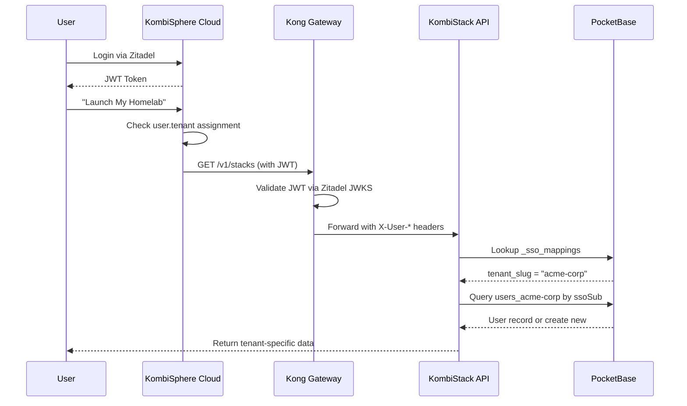

# kombify Target Architecture Design

> **Version:** 1.0.0  
> **Created:** 2026-01-28  
> **Status:** DRAFT  
> **Principles:** Namespace-based multi-tenancy, Hybrid StackKits distribution, Accelerated delivery

---

## Executive Summary

This document defines the target architecture for the kombify platform to support:
- **Multi-tenancy**: Up to 50 SaaS admins per KombiStack instance using namespace-based isolation
- **Two-layer user system**: SaaS users (Zitadel) + Homelab members (PocketBase per namespace)
- **Hybrid StackKits**: Repository cloning + Kong API for SaaS integration
- **Enterprise tier**: Dedicated flag for single-tenant deployments
- **Accelerated timeline**: Phased delivery over 8-10 weeks

---

## 1. Multi-Tenancy Architecture

### 1.1 Namespace-Based Isolation Model

```
┌─────────────────────────────────────────────────────────────────────────┐
│                    KombiStack Instance (Shared)                          │
│  ┌─────────────────────────────────────────────────────────────────┐   │
│  │                      PocketBase Database                         │   │
│  │                                                                  │   │
│  │  ┌──────────────┐  ┌──────────────┐  ┌──────────────┐          │   │
│  │  │   users      │  │   users      │  │   users      │          │   │
│  │  │  _tenant_a   │  │  _tenant_b   │  │  _tenant_c   │          │   │
│  │  │              │  │              │  │              │          │   │
│  │  │  records     │  │  records     │  │  records     │          │   │
│  │  │  - alice     │  │  - bob       │  │  - carol     │          │   │
│  │  │  - dave      │  │  - eve       │  │  - frank     │          │   │
│  │  └──────────────┘  └──────────────┘  └──────────────┘          │   │
│  │                                                                  │   │
│  │  ┌──────────────┐  ┌──────────────┐  ┌──────────────┐          │   │
│  │  │   stacks     │  │   stacks     │  │   stacks     │          │   │
│  │  │  _tenant_a   │  │  _tenant_b   │  │  _tenant_c   │          │   │
│  │  └──────────────┘  └──────────────┘  └──────────────┘          │   │
│  │                                                                  │   │
│  │  Shared Collections:                                             │   │
│  │  - _tenants (tenant metadata)                                   │   │
│  │  - _sso_mappings (Zitadel sub → tenant mappings)                │   │
│  │  - _instance_config (instance-wide settings)                    │   │
│  └─────────────────────────────────────────────────────────────────┘   │
└─────────────────────────────────────────────────────────────────────────┘
```

### 1.2 Tenant Schema Design

Each tenant gets namespaced collections following the pattern: `{collection}_{tenant_slug}`

```typescript
// Tenant registration in shared _tenants collection
interface Tenant {
  id: string;                    // UUID
  slug: string;                  // URL-safe identifier (e.g., "acme-corp")
  name: string;                  // Display name
  zitadelOrgId: string;          // Links to Zitadel organization
  plan: 'free' | 'pro' | 'enterprise';
  maxUsers: number;              // Limit based on plan
  maxNodes: number;              // Resource limits
  createdAt: string;
  updatedAt: string;
  status: 'active' | 'suspended' | 'deleted';
}

// SSO mapping collection (shared)
interface SSOMapping {
  id: string;
  zitadelSub: string;            // Zitadel user identifier
  tenantId: string;              // References _tenants.id
  pbUserId: string;              // PocketBase user ID in tenant namespace
  isAdmin: boolean;              // Homelab admin within tenant
  lastLogin: string;
}
```

### 1.3 Tenant Resolution Flow

```
┌──────────┐     ┌──────────┐     ┌──────────┐     ┌──────────┐     ┌──────────┐
│  Client  │────▶│   Kong   │────▶│  Stack   │────▶│  Lookup  │────▶│ Tenant   │
│          │     │  Gateway │     │   API    │     │   SSO    │     │ Namespace│
└──────────┘     └──────────┘     └──────────┘     └──────────┘     └──────────┘
      │                              │                   │                │
      │ 1. JWT with                  │ 2. Extract        │ 3. Find tenant │
      │    X-User-ID                 │    X-User-ID      │    by sub      │
      │                              │                   │                │
      │                              │ 4. Set X-Tenant-ID header           │
      │                              │                   │                │
      │                              │                   │ 5. Route to    │
      │                              │                   │    users_tenant│
```

---

## 2. Two-Layer User System

### 2.1 Layer 1: SaaS Users (Zitadel + PostgreSQL)

Managed by KombiSphere-Cloud and KombiSphere-Admin:

```typescript
// PostgreSQL schema (already exists)
interface SaaSUser {
  id: string;                    // Internal UUID
  zitadelSub: string;            // Zitadel subject (primary key for lookups)
  email: string;
  displayName: string;
  plan: 'free' | 'pro' | 'enterprise';
  subscriptionStatus: string;
  createdAt: Date;
  // ... existing fields
}

interface SaaSOrganization {
  id: string;
  zitadelOrgId: string;
  name: string;
  ownerId: string;               // SaaSUser.id
  members: SaaSOrgMember[];
}
```

### 2.2 Layer 2: Homelab Members (PocketBase per Tenant)

Within each KombiStack tenant namespace:

```typescript
// In PocketBase collection: users_{tenant_slug}
interface HomelabUser {
  id: string;                    // PocketBase record ID
  email: string;
  name: string;
  role: 'admin' | 'member' | 'viewer';
  // No password - auth via SSO only
  ssoProvider: 'zitadel';
  ssoSub: string;                // Links back to Zitadel
  permissions: string[];         // RBAC permissions
  created: string;
  updated: string;
}

// In collection: stacks_{tenant_slug}
interface HomelabStack {
  id: string;
  name: string;
  ownerId: string;               // References users_{tenant_slug}.id
  members: string[];             // User IDs with access
  status: 'draft' | 'active' | 'error';
  configuration: object;         // kombination.yaml content
}
```

### 2.3 User Flow: SaaS User → Homelab Access



---

## 3. SSO Forwarding via Kong

### 3.1 Kong Configuration

```yaml
# Enhanced kong-config.yaml for multi-tenancy
plugins:
  # JWT validation (existing)
  - name: jwt
    service: kombistack
    config:
      uri_param_names: []
      cookie_names: []
      key_claim_name: iss
      secret_is_base64: false
      claims_to_verify:
        - exp
        - iss
      maximum_expiration: 3600

  # Enhanced request transformer for multi-tenancy
  - name: request-transformer
    service: kombistack
    config:
      add:
        headers:
          - X-Forwarded-By:Kong
          - X-Service-Name:KombiStack
      rename:
        headers:
          - Authorization:X-Original-Authorization
      replace:
        headers:
          - X-User-ID:$(jwt_claims.sub)
          - X-User-Email:$(jwt_claims.email)
          - X-User-Name:$(jwt_claims.name)
          - X-Org-ID:$(jwt_claims."urn:zitadel:iam:org:id")
          - X-User-Roles:$(jwt_claims."urn:zitadel:iam:org:project:roles")
          - X-Subscription-Plan:$(jwt_claims.plan)
```

### 3.3 Kong OIDC Plugin Configuration

In addition to JWT validation, Kong requires the OIDC plugin for proper SSO session management with Zitadel.

```yaml
# OIDC Plugin for SSO session handling
plugins:
  - name: oidc
    service: kombistack
    config:
      # Zitadel OIDC configuration
      client_id: ${ZITADEL_CLIENT_ID}
      client_secret: ${ZITADEL_CLIENT_SECRET}
      discovery: https://auth.kombify.io/.well-known/openid-configuration
      introspection_endpoint: https://auth.kombify.io/oauth/v2/introspect
      
      # Session management
      redirect_uri: https://api.kombify.io/auth/callback
      logout_redirect_uri: https://app.kombify.io
      scope: openid email profile
      ssl_verify: true
      
      # Token handling
      bearer_only: false
      realm: kombify
      response_type: code
      token_endpoint_auth_method: client_secret_post
      
      # Session storage (Redis)
      session_secret: ${OIDC_SESSION_SECRET}
      session_redis_host: ${REDIS_HOST}
      session_redis_port: ${REDIS_PORT}
      session_redis_password: ${REDIS_PASSWORD}
      
      # Claims to forward
      filters: |
        {
          "X-User-ID": "sub",
          "X-User-Email": "email",
          "X-User-Name": "name",
          "X-Org-ID": "urn:zitadel:iam:org:id"
        }

  # OIDC plugin for other services
  - name: oidc
    service: kombisim
    config:
      # Same config, different redirect_uri
      redirect_uri: https://api.kombify.io/sim/auth/callback
      # ... other settings identical

  - name: oidc
    service: kombisphere
    config:
      redirect_uri: https://api.kombify.io/portal/auth/callback
      # ... other settings identical
```

**OIDC vs JWT Plugin Roles:**

| Plugin | Purpose | When Used |
|--------|---------|-----------|
| **OIDC** | Initial authentication, session management | Browser-based auth flows |
| **JWT** | API request validation, service-to-service | Bearer token API calls |

**Environment Variables Required:**
```bash
ZITADEL_CLIENT_ID=kong-gateway-client
ZITADEL_CLIENT_SECRET=<client-secret>
OIDC_SESSION_SECRET=<random-256-bit-key>
```

### 3.4 SSO Exchange Endpoint

```typescript
// POST /api/internal/sso/exchange
// Called by Kong with X-User-* headers

interface SSOExchangeRequest {
  // Headers from Kong:
  // X-User-ID: Zitadel sub
  // X-User-Email: user@example.com
  // X-Org-ID: Zitadel org ID
  // X-Subscription-Plan: pro|enterprise|free
}

interface SSOExchangeResponse {
  token: string;                 // PocketBase auth token
  tenantId: string;              // Tenant namespace
  user: {
    id: string;
    email: string;
    role: string;
  };
  redirectUrl: string;           // Where to send user
}

// Implementation flow:
async function ssoExchange(headers: KongHeaders): Promise<SSOExchangeResponse> {
  const zitadelSub = headers['x-user-id'];
  const email = headers['x-user-email'];
  const orgId = headers['x-org-id'];
  
  // 1. Find or create tenant
  let tenant = await findTenantByOrgId(orgId);
  if (!tenant) {
    tenant = await createTenant({
      slug: generateSlug(orgId),
      zitadelOrgId: orgId,
      plan: headers['x-subscription-plan']
    });
  }
  
  // 2. Find or create user in tenant namespace
  const userCollection = `users_${tenant.slug}`;
  let user = await pb.collection(userCollection).getFirstListItem(`ssoSub = "${zitadelSub}"`);
  
  if (!user) {
    user = await pb.collection(userCollection).create({
      email,
      name: headers['x-user-name'],
      ssoSub: zitadelSub,
      ssoProvider: 'zitadel',
      role: 'admin' // First user is admin
    });
  }
  
  // 3. Create PB auth token
  const token = await generatePBToken(user);
  
  // 4. Record SSO mapping
  await pb.collection('_sso_mappings').upsert({
    zitadelSub,
    tenantId: tenant.id,
    pbUserId: user.id,
    lastLogin: new Date().toISOString()
  });
  
  return {
    token,
    tenantId: tenant.id,
    user: { id: user.id, email: user.email, role: user.role },
    redirectUrl: `/tenant/${tenant.slug}/dashboard`
  };
}
```

---

## 4. StackKits Accessibility Model

### 4.1 Hybrid Distribution Strategy

```
┌─────────────────────────────────────────────────────────────────────────┐
│                        StackKits Distribution                            │
├─────────────────────────────────────────────────────────────────────────┤
│                                                                          │
│  ┌─────────────────────┐        ┌─────────────────────┐                 │
│  │   Self-Hosted       │        │     SaaS Users      │                 │
│  │   Users             │        │                     │                 │
│  └──────────┬──────────┘        └──────────┬──────────┘                 │
│             │                               │                            │
│             ▼                               ▼                            │
│  ┌─────────────────────┐        ┌─────────────────────┐                 │
│  │  Git Clone          │        │  Kong API           │                 │
│  │  github.com/...     │        │  /v1/stackkits/*    │                 │
│  │                     │        │                     │                 │
│  │  $ stackkit init    │        │  $ stackkit init    │                 │
│  │    --source=local   │        │    --source=api     │                 │
│  │    --stackkit=base  │        │    --token=$JWT     │                 │
│  └─────────────────────┘        └─────────────────────┘                 │
│                                                                          │
│  Common Base: Both paths use the same CUE schemas and OpenTofu templates │
└─────────────────────────────────────────────────────────────────────────┘
```

### 4.2 API Endpoints

```typescript
// GET /v1/stackkits
// List available StackKits (respects user's plan)
interface ListStackKitsResponse {
  kits: StackKitSummary[];
}

interface StackKitSummary {
  id: string;
  name: string;
  version: string;
  description: string;
  minPlan: 'free' | 'pro' | 'enterprise';
  tags: string[];
  downloadUrl: string;
}

// GET /v1/stackkits/:id/download
// Download StackKit tarball
// Auth: Required, checks plan entitlement

// POST /v1/stackkits/:id/validate
// Validate kombination.yaml against StackKit schema
interface ValidateRequest {
  kombinationYaml: string;
}

interface ValidateResponse {
  valid: boolean;
  errors?: ValidationError[];
}
```

### 4.3 Repository Structure

```
StackKits/
├── kits/                      # Public kits (mirrored in API)
│   ├── base-homelab/
│   ├── modern-homelab/
│   └── ha-homelab/
├── base/                      # CUE schemas
├── internal/                  # CLI source
│   ├── api/                   # API client for SaaS
│   ├── local/                 # Local git clone
│   └── cue/                   # Validation
└── cmd/stackkit/
```

---

## 5. Admin Center: Scaling & Health Monitoring

### 5.1 Instance Management

```typescript
// Prisma schema additions for instance tracking
model KombiStackInstance {
  id              String   @id @default(uuid())
  name            String
  region          String   // Azure region
  status          InstanceStatus @default(PROVISIONING)
  
  // Multi-tenancy limits
  maxTenants      Int      @default(50)
  currentTenants  Int      @default(0)
  
  // Resource tracking
  cpuUsage        Float?
  memoryUsage     Float?
  storageUsage    Float?
  
  // Health
  lastHealthCheck DateTime?
  healthStatus    HealthStatus @default(UNKNOWN)
  
  // Relations
  tenants         Tenant[]
  healthChecks    HealthCheck[]
  
  createdAt       DateTime @default(now())
  updatedAt       DateTime @updatedAt
}

model HealthCheck {
  id          String   @id @default(uuid())
  instanceId  String
  instance    KombiStackInstance @relation(fields: [instanceId], references: [id])
  
  timestamp   DateTime @default(now())
  status      HealthStatus
  
  // Component health
  database    ComponentHealth
  api         ComponentHealth
  agents      ComponentHealth
  
  // Metrics snapshot
  metrics     Json?
  
  @@index([instanceId, timestamp])
}
```

### 5.2 Health Monitoring Architecture

```
┌─────────────────────────────────────────────────────────────────────────┐
│                     Health Monitoring Flow                               │
├─────────────────────────────────────────────────────────────────────────┤
│                                                                          │
│   ┌──────────────┐    ┌──────────────┐    ┌──────────────┐             │
│   │  KombiStack   │    │  KombiStack  │    │  KombiStack  │             │
│   │  Instance #1  │    │  Instance #2 │    │  Instance #N │             │
│   └──────┬───────┘    └──────┬───────┘    └──────┬───────┘             │
│          │                   │                   │                       │
│          └───────────────────┼───────────────────┘                       │
│                              │                                           │
│                              ▼                                           │
│                   ┌──────────────────────┐                              │
│                   │  Azure Event Grid    │                              │
│                   │  Health Events       │                              │
│                   └──────────┬───────────┘                              │
│                              │                                           │
│                              ▼                                           │
│                   ┌──────────────────────┐                              │
│                   │  Admin Center        │                              │
│                   │  - Alerting          │                              │
│                   │  - Auto-scaling      │                              │
│                   │  - Capacity planning │                              │
│                   └──────────────────────┘                              │
│                                                                          │
└─────────────────────────────────────────────────────────────────────────┘
```

### 5.3 Admin Dashboard Views

1. **Instance Overview**: List all Stack/Sim instances with status
2. **Tenant Allocation**: Visualize tenant distribution across instances
3. **Resource Usage**: CPU/Memory/Storage per instance
4. **Health Timeline**: Historical health check data
5. **Scaling Actions**: Manual and automated scaling controls

---

## 6. Enterprise Tier: Dedicated Flag

### 6.1 Deployment Modes

```typescript
// Instance configuration
interface InstanceConfig {
  // Core settings
  id: string;
  deploymentMode: 'shared' | 'dedicated';
  
  // Shared mode: 50 tenants max
  // Dedicated mode: 1 tenant, full resources
  
  // Resource allocation
  resources: {
    cpu: number;
    memory: string;
    storage: string;
  };
  
  // Networking
  networking: {
    privateEndpoint: boolean;
    customDomain?: string;
    vpnConnection?: string;
  };
  
  // Features
  features: {
    multiTenancy: boolean;      // false for dedicated
    maxTenants: number;         // 1 for dedicated, 50 for shared
    backupRetention: number;    // days
    sla: string;                // e.g., "99.9%"
  };
}
```

### 6.2 Deployment Mode Behavioral Matrix

The `deploymentMode` configuration MUST drive behavioral differences throughout the codebase:

| Feature | Self-Hosted | SaaS Shared | SaaS Dedicated |
|---------|-------------|-------------|----------------|
| **Authentication** | Local PB auth | Kong OIDC only | Kong OIDC only |
| **Multi-tenancy** | Disabled | Enabled (50 max) | Disabled (1 tenant) |
| **User Management** | Built-in registration | Zitadel SSO only | Zitadel SSO only |
| **API Gateway** | Optional Kong | Required Kong | Required Kong |
| **Billing** | None | Stripe integrated | Stripe integrated |
| **StackKits Access** | Git clone | API + Git | API + Git |
| **Support Level** | Community | Standard | Premium |
| **Custom Domain** | User configures | Subdomain only | Supported |
| **VPN/Private Endpoint** | Self-managed | Not available | Available |
| **Updates** | Manual | Auto-managed | Scheduled maintenance |
| **Resource Guarantees** | Best effort | Shared pool | Dedicated allocation |
| **Backup Strategy** | User responsibility | Platform managed | Platform managed |

### 6.3 Code-Level Behavior Branching

```go
// pkg/config/deployment.go
package config

type DeploymentMode string

const (
    ModeSelfHosted    DeploymentMode = "self-hosted"
    ModeSaaSShared    DeploymentMode = "saas-shared"
    ModeSaaSDedicated DeploymentMode = "saas-dedicated"
)

func (m DeploymentMode) IsMultiTenant() bool {
    return m == ModeSaaSShared
}

func (m DeploymentMode) RequireKongAuth() bool {
    return m == ModeSaaSShared || m == ModeSaaSDedicated
}

func (m DeploymentMode) AllowLocalAuth() bool {
    return m == ModeSelfHosted
}

func (m DeploymentMode) MaxTenants() int {
    switch m {
    case ModeSaaSShared:
        return 50
    case ModeSaaSDedicated:
        return 1
    default:
        return 1
    }
}

func (m DeploymentMode) IsBillingEnabled() bool {
    return m == ModeSaaSShared || m == ModeSaaSDedicated
}

// pkg/auth/middleware.go
func AuthMiddleware(app *pocketbase.PocketBase) echo.MiddlewareFunc {
    return func(next echo.HandlerFunc) echo.HandlerFunc {
        return func(c echo.Context) error {
            mode := config.GetDeploymentMode()
            
            // Self-hosted: allow local PocketBase auth
            if mode.AllowLocalAuth() {
                return pbAuthMiddleware(next)(c)
            }
            
            // SaaS: require Kong headers
            if mode.RequireKongAuth() {
                userID := c.Request().Header.Get("X-User-ID")
                if userID == "" {
                    return c.JSON(401, map[string]string{
                        "error": "Authentication required via Kong",
                    })
                }
                c.Set("userID", userID)
                c.Set("tenantSlug", c.Request().Header.Get("X-Tenant-ID"))
                return next(c)
            }
            
            return next(c)
        }
    }
}
```

### 6.4 Configuration Examples

```yaml
# kombistack.yaml - Self-Hosted Mode
# Location: /opt/kombify/config/kombistack.yaml
deployment:
  mode: self-hosted
  auth:
    type: local
    allow_registration: true
    password_policy: standard
  multi_tenancy:
    enabled: false
  stackkits:
    source: git
    repository: https://github.com/kombify/stackkits
  billing:
    enabled: false

# kombistack.yaml - SaaS Shared Mode
# Set via environment: KOMBIFY_DEPLOYMENT_MODE=saas-shared
deployment:
  mode: saas-shared
  auth:
    type: kong_oidc
    allow_registration: false  # Registration via Cloud portal only
  multi_tenancy:
    enabled: true
    max_tenants: 50
    isolation: namespace
  kong:
    upstream: http://localhost:8090
    health_check: /health
    required_headers:
      - X-User-ID
      - X-User-Email
      - X-Org-ID
  billing:
    enabled: true
    provider: stripe
    
# kombistack.yaml - SaaS Dedicated Mode
deployment:
  mode: saas-dedicated
  auth:
    type: kong_oidc
  multi_tenancy:
    enabled: false
    tenant_id: "${TENANT_SLUG}"  # Single tenant
  resources:
    dedicated: true
    guarantees:
      cpu: 4
      memory: 16Gi
      storage: 100Gi
  networking:
    private_endpoint: true
    custom_domain: "${TENANT_CUSTOM_DOMAIN}"
  billing:
    enabled: true
    provider: stripe
    plan: enterprise
```

---

## 7. Architecture Decision Records

### ADR-001: Namespace-Based Multi-Tenancy

**Decision**: Use namespace-based collection naming in PocketBase for tenant isolation.

**Rationale**:
- PocketBase doesn't support native multi-tenancy
- Namespace approach is lightweight vs separate PB instances
- Simpler backup/restore than row-level security
- Easier to migrate tenants between instances

**Trade-offs**:
- Collection count grows with tenants (max 256 collections in SQLite)
- Need custom middleware for tenant routing
- Migrations must run per-tenant

### ADR-002: Hybrid StackKits Distribution

**Decision**: Support both git-clone and API access for StackKits.

**Rationale**:
- Open source ethos: users should be able to self-host entirely
- SaaS convenience: API access for managed deployments
- Same validation logic (CUE) for both paths

### ADR-003: Kong-Mediated SSO

**Decision**: Use Kong Gateway to validate Zitadel JWTs and forward identity headers to KombiStack.

**Rationale**:
- Centralizes authentication at the gateway
- Services receive pre-validated identity context
- Simplifies service implementations
- Enables centralized rate limiting by plan

**Trade-offs**:
- Additional network hop
- Kong becomes critical path
- Requires careful header trust validation

### ADR-004: Instance Scaling Strategy

**Decision**: Implement horizontal sharding with dedicated option for enterprise.

**Context**:
Need to decide how to scale Stack instances as tenant count grows beyond single instance capacity.

**Options Considered**:
1. **Vertical Scaling**: Increase container resources
   - Pros: Simple, no code changes
   - Cons: Limited by single-node maximum (e.g., 16 vCPU), no tenant isolation

2. **Horizontal Sharding**: Multiple shared instances (50 tenants each)
   - Pros: Good isolation, cost-effective, scales infinitely
   - Cons: Complex routing, tenant migration needed

3. **Dedicated Instances**: One tenant per instance (enterprise only)
   - Pros: Maximum isolation, guaranteed resources
   - Cons: Expensive for small tenants, more infrastructure to manage

**Decision**:
Implement hybrid approach:
- Default: Shared instances with 50 tenant maximum
- Enterprise: Dedicated instances (single tenant)
- Auto-provision new shared instance when existing reaches 45 tenants (90% capacity)
- Tenant migration capability for rebalancing

**Consequences**:
- Need instance selection algorithm
- Need tenant migration tooling
- Higher operational complexity
- Must maintain routing table (which tenant → which instance)

### ADR-005: Database Strategy per Tenant

**Decision**: Use namespace prefix (collection naming) for v1, plan PostgreSQL migration for v2.

**Context**:
How to isolate tenant data within PocketBase database.

**Options Considered**:
1. **Database per tenant**: Separate SQLite files per tenant
   - Pros: Complete isolation, easy backup per tenant
   - Cons: Resource overhead (file handles), backup complexity across files, connection pooling issues

2. **Schema per tenant**: PostgreSQL schemas (when migrated)
   - Pros: Good isolation, shared resources, row-level security support
   - Cons: Requires PostgreSQL migration first, more complex

3. **Namespace prefix**: Collection name prefixes (e.g., `users_tenant_a`)
   - Pros: Simple, works today with PocketBase, no migration needed
   - Cons: Shared connection pool, collection limit (256 in SQLite), no row-level security

**Decision**:
Use **namespace prefix** (Option 3) for v1:
- Collections named `{table}_{tenant_slug}`
- Shared `_tenants` and `_sso_mappings` collections
- Middleware injects tenant context
- Plan migration to PostgreSQL schemas in v2 (post-SaaS launch)

**Consequences**:
- Must update ALL queries to use namespaced collection names
- Middleware must validate X-Tenant-ID header matches user's tenant
- Backup strategy must filter by collection prefix
- SQLite collection limit (256) caps tenants at ~50 (with overhead)

---

### ADR-006: KombiStack First for Multi-Tenancy

**Decision**: Implement multi-tenancy in KombiStack before KombiSim.

**Rationale**:
- KombiStack is the core value proposition
- KombiSim can use Stack instances as simulation targets
- Simpler to add Sim multi-tenancy later using Container isolation

## 8. Integration Points Summary

| Integration | Protocol | Auth | Status |
|-------------|----------|------|--------|
| Cloud → Admin | HTTP | Service JWT | ✅ Designed |
| Kong → Stack | HTTP + Headers | Kong JWT | ✅ Designed |
| Kong → Sim | HTTP + Headers | Kong JWT | ✅ Designed |
| Stack → PB | Internal | mTLS | ✅ Existing |
| Stack → StackKits | Git/HTTP | Token/None | ✅ Designed |
| Admin → Azure | ARM API | Managed Identity | ✅ Designed |

---

*Next: See PHASED_IMPLEMENTATION_PLAN.md for delivery roadmap*
