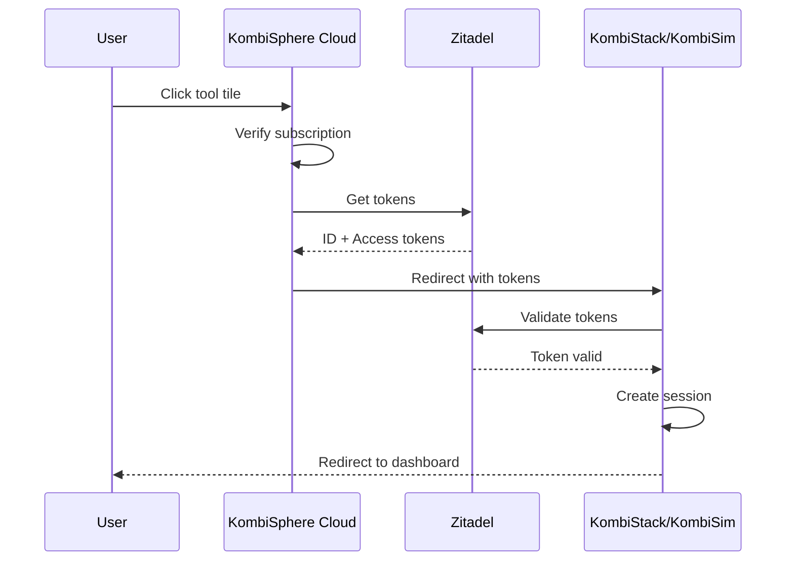

# KombiSphere Cloud

KombiSphere Cloud is the **managed SaaS portal** that provides unified access to KombiStack, KombiSim, and StackKits with enterprise-grade authentication and subscription management.

<CardGroup cols={2}>
  <Card
    title="Getting started"
    icon="rocket"
    href="/saas/cloud/getting-started"
  >
    Sign up and launch your first tool
  </Card>
  <Card
    title="Authentication"
    icon="key"
    href="/saas/cloud/authentication"
  >
    SSO and security features
  </Card>
  <Card
    title="Subscriptions"
    icon="credit-card"
    href="/saas/cloud/subscriptions"
  >
    Plans and billing
  </Card>
  <Card
    title="Tool launcher"
    icon="rocket"
    href="/saas/cloud/tool-launcher"
  >
    Access your tools
  </Card>
</CardGroup>

## Key features

<AccordionGroup>
  <Accordion title="OIDC authentication" icon="shield-check">
    Enterprise SSO with Zitadel Cloud:
    
    - Single sign-on across all tools
    - Multi-factor authentication
    - Social login (Google, GitHub)
    - SAML/OIDC for enterprise
  </Accordion>

  <Accordion title="Single sign-on" icon="key">
    Login once, access all tools seamlessly:
    
    ```
    User → KombiSphere Cloud → Zitadel → Tool (KombiStack/KombiSim)
    ```
    
    No need to login separately to each tool.
  </Accordion>

  <Accordion title="Stripe integration" icon="credit-card">
    Subscription management with Free, Pro, and Enterprise plans:
    
    - Secure payment processing
    - Customer portal
    - Invoice management
    - Usage tracking
  </Accordion>

  <Accordion title="Modern UI" icon="browser">
    Built with SvelteKit and shadcn-svelte:
    
    - Responsive design
    - Dark mode
    - Fast page loads
    - Intuitive navigation
  </Accordion>
</AccordionGroup>

## Architecture

```
┌─────────────────────────────────────────────────────────────┐
│                    KombiSphere Cloud                         │
├─────────────────────────────────────────────────────────────┤
│                                                             │
│  ┌─────────────┐    ┌─────────────┐    ┌─────────────┐     │
│  │   Landing   │    │  Dashboard  │    │   Settings  │     │
│  │    Page     │───▶│   (Tools)   │───▶│   (Profile) │     │
│  └─────────────┘    └─────────────┘    └─────────────┘     │
│                                                             │
│  ┌─────────────────────────────────────────────────────────┤
│  │                  Authentication Layer                    │
│  │  ┌──────────────────────────────────────────────────┐   │
│  │  │              Zitadel OIDC Provider               │   │
│  │  │  • ID Tokens  • Access Tokens  • Refresh Tokens  │   │
│  │  └──────────────────────────────────────────────────┘   │
│  └─────────────────────────────────────────────────────────┘
│                                                             │
│  ┌─────────────────────────────────────────────────────────┤
│  │                    Billing Layer                         │
│  │  ┌──────────────────────────────────────────────────┐   │
│  │  │                 Stripe Integration               │   │
│  │  │  • Checkout  • Portal  • Webhooks  • Invoices    │   │
│  │  └──────────────────────────────────────────────────┘   │
│  └─────────────────────────────────────────────────────────┘
│                                                             │
│  ┌─────────────────────────────────────────────────────────┤
│  │                    Tool Launcher                         │
│  │  ┌──────────┐  ┌──────────┐  ┌──────────┐              │
│  │  │KombiStack│  │ KombiSim │  │StackKits │              │
│  │  │   Tile   │  │   Tile   │  │   Tile   │              │
│  │  └──────────┘  └──────────┘  └──────────┘              │
│  └─────────────────────────────────────────────────────────┘
└─────────────────────────────────────────────────────────────┘
```

## Tech stack

| Component | Technology | Purpose |
|-----------|------------|---------|
| **Framework** | SvelteKit | Modern web framework |
| **Authentication** | Auth.js + Zitadel | Enterprise OIDC |
| **Payments** | Stripe | Subscription management |
| **Styling** | TailwindCSS + shadcn-svelte | UI components |
| **Icons** | Lucide Svelte | Icon library |
| **Database** | PostgreSQL | User and subscription data |

## SSO flow

When a user clicks on a tool tile:



**SSO URL structure:**

```
https://kombistack.kombisphere.io/auth/sso?
  id_token=eyJ...
  &access_token=eyJ...
  &user_id=123
  &email=user@example.com
  &return_url=/dashboard
```

## Subscription plans

| Feature | Free | Pro | Enterprise |
|---------|------|-----|------------|
| **KombiStack** | Basic | Full | Full |
| **KombiSim** | ❌ | ✅ | ✅ |
| **StackKits** | ❌ | ❌ | ✅ |
| **Projects** | 1 | 10 | Unlimited |
| **API Calls** | 100/mo | 10K/mo | Unlimited |
| **Support** | Community | Priority | 24/7 Dedicated |
| **Price** | $0 | $29/mo | $99/mo |

See [Subscriptions](/saas/cloud/subscriptions) for detailed pricing.

## Tool integration

Each tool (KombiStack, KombiSim, StackKits) implements:

### SSO endpoint

```typescript
// /auth/sso endpoint
export async function GET({ url, cookies }) {
  const idToken = url.searchParams.get('id_token');
  const accessToken = url.searchParams.get('access_token');
  
  // Validate tokens with Zitadel
  const user = await validateTokens(idToken, accessToken);
  
  // Create local session
  cookies.set('session', createSession(user), {
    httpOnly: true,
    secure: true,
    sameSite: 'lax'
  });
  
  // Redirect to dashboard
  return redirect(302, '/dashboard');
}
```

### Token validation

```typescript
async function validateTokens(idToken: string, accessToken: string) {
  // Verify ID token signature
  const decoded = await verifyJWT(idToken, {
    issuer: 'https://your-instance.zitadel.cloud',
    audience: 'your-client-id'
  });
  
  // Check token expiration
  if (decoded.exp < Date.now() / 1000) {
    throw new Error('Token expired');
  }
  
  return decoded;
}
```

## Features

### Dashboard

- **Tool tiles** - Quick access to all tools
- **Recent activity** - View recent deployments
- **Usage stats** - Track API usage
- **Quick actions** - Common tasks

### Settings

- **Profile** - Update personal information
- **Security** - MFA, password, sessions
- **Billing** - Manage subscription
- **API keys** - Generate API keys

### Billing

- **Subscription management** - Upgrade/downgrade
- **Payment methods** - Add/remove cards
- **Invoices** - Download past invoices
- **Usage** - View current usage

## Security

<CardGroup cols={2}>
  <Card title="OIDC authentication" icon="shield-check">
    Industry-standard OAuth 2.0 / OIDC
  </Card>
  <Card title="MFA support" icon="mobile">
    TOTP, SMS, and biometric
  </Card>
  <Card title="Session management" icon="clock">
    Automatic timeout and refresh
  </Card>
  <Card title="Audit logging" icon="file-text">
    Complete activity tracking
  </Card>
</CardGroup>

## Next steps

<CardGroup cols={2}>
  <Card
    title="Getting started"
    icon="rocket"
    href="/saas/cloud/getting-started"
  >
    Sign up and launch your first tool
  </Card>
  <Card
    title="Authentication"
    icon="key"
    href="/saas/cloud/authentication"
  >
    Learn about SSO and security
  </Card>
  <Card
    title="Subscriptions"
    icon="credit-card"
    href="/saas/cloud/subscriptions"
  >
    Choose your plan
  </Card>
  <Card
    title="Tool launcher"
    icon="rocket"
    href="/saas/cloud/tool-launcher"
  >
    Access your tools
  </Card>
</CardGroup>
