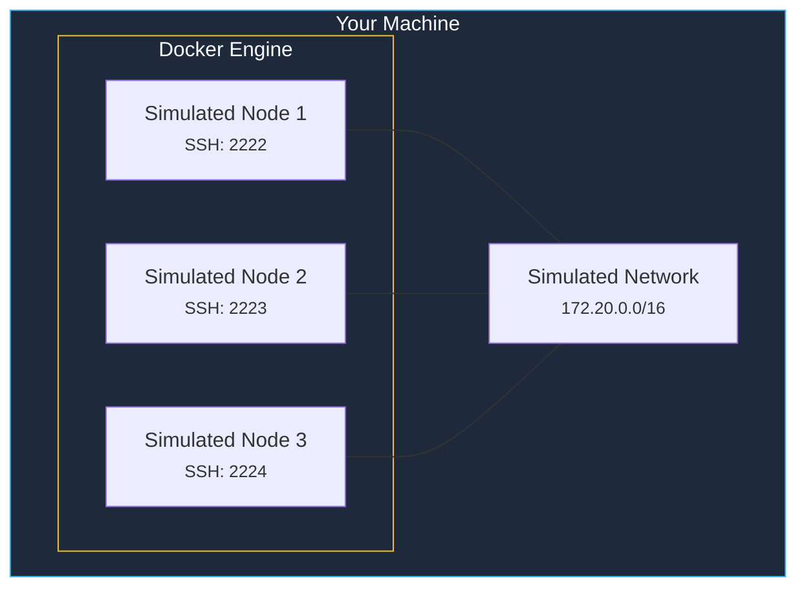
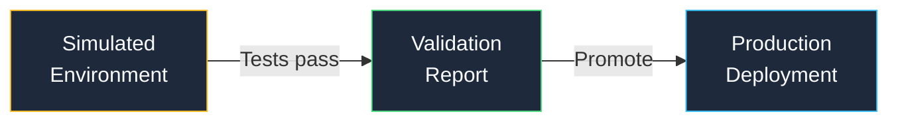

Understanding how kombify Simulate's simulation engines work helps you choose the right approach for your testing needs and get the most realistic results.

## Engine types

kombify Simulate supports multiple simulation backends, each with different trade-offs between realism, speed, and resource usage.

### Docker-based simulation (Default)

The default engine uses Docker containers that behave like lightweight virtual machines. Each simulated node gets:

- A full Linux userspace (Ubuntu-based)
- SSH access on dedicated ports (2222-2322)
- Realistic networking with configurable subnets
- Systemd-like service management

**Best for:** Quick iteration, CI/CD pipelines, most testing scenarios.

### Hybrid simulation

Hybrid mode mixes simulated nodes with real hardware. This lets you test configurations that include devices you already own.

**Best for:** Brownfield adoption, testing against real NAS devices or existing servers.

## How simulation differs from production

<Warning>
  Simulated nodes are not identical to production servers. Key differences to be aware of:
</Warning>

| Aspect | Simulation | Production |
|--------|-----------|------------|
| **Kernel** | Shared host kernel | Dedicated kernel |
| **Performance** | Limited by container resources | Full hardware access |
| **Networking** | Docker bridge network | Physical/VLAN networking |
| **Storage** | Ephemeral by default | Persistent disks |
| **Hardware access** | No direct hardware | Full hardware access |

## The promotion path

Once you have validated a configuration in simulation, you can promote it to production:

The same `kombination.yaml` that worked in simulation is used for production deployment — no configuration changes needed.

## Resource requirements

| Simulated Nodes | RAM | CPU | Disk |
|----------------|-----|-----|------|
| 1-2 nodes | 2 GB | 2 cores | 5 GB |
| 3-5 nodes | 4 GB | 4 cores | 10 GB |
| 6+ nodes | 8 GB+ | 4+ cores | 20 GB+ |

## Further reading

<CardGroup cols={2}>
  <Card title="Simulation-first approach" icon="flask" href="/concepts/simulation-first">
    Why testing before deploying is a core kombify principle
  </Card>
  <Card title="Using templates" icon="file-code" href="/sim/how-to/templates">
    Pre-built simulation templates for common scenarios
  </Card>
</CardGroup>
