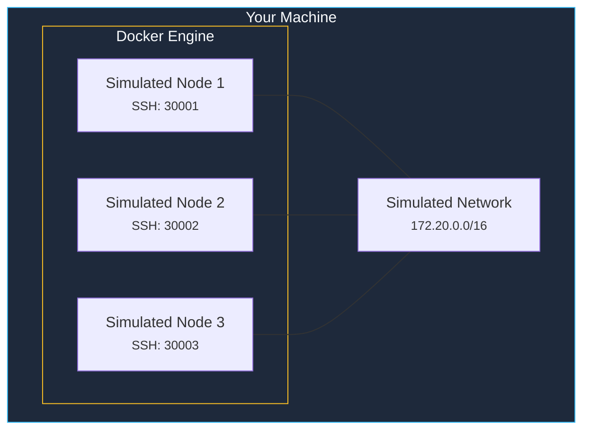
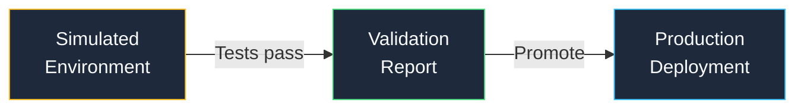

Understanding how kombify Simulate's simulation engines work helps you choose the right approach for your testing needs and get the most realistic results.

## Engine types

kombify Simulate supports five simulation engines, each with different trade-offs between realism, speed, and resource usage.

### Docker (Default)

The default engine uses Docker containers that behave like lightweight virtual machines. Each simulated node gets:

- A full Linux userspace (Ubuntu-based)
- SSH access on dedicated ports (30000-39999)
- Realistic networking with configurable subnets
- Systemd-like service management

**Best for:** Quick iteration, CI/CD pipelines, most testing scenarios.

### Incus

Incus provides full system containers with real systemd init. Higher fidelity than Docker containers, closer to real VM behavior.

**Best for:** Testing systemd-dependent configurations, realistic OS simulation.

### QEMU

Full virtual machine simulation using QEMU/KVM. Provides hardware-level fidelity with dedicated kernels.

**Best for:** Hardware-level testing, kernel-dependent configurations, GPU passthrough testing.

### Azure

Creates real Azure VMs for cloud-fidelity testing. Requires Azure credentials.

**Best for:** Testing cloud deployments, validating Azure-specific configurations.

### DigitalOcean

Creates real DigitalOcean Droplets for cloud-fidelity testing. Requires DigitalOcean API token.

**Best for:** Testing cloud deployments, validating production-like environments.

### Engine comparison

| Engine | Fidelity | Speed | Cost | Use case |
|--------|----------|-------|------|----------|
| **Docker** | Medium | Fast | Free | Development, CI/CD |
| **Incus** | High | Fast | Free | System-level testing |
| **QEMU** | Very High | Slow | Free | Hardware-level testing |
| **Azure** | Production | Medium | Paid | Cloud validation |
| **DigitalOcean** | Production | Medium | Paid | Cloud validation |

Set the engine via the `KOMBISIM_ENGINE` environment variable or API parameter.

## How simulation differs from production

<Warning>
  Simulated nodes are not identical to production servers. Key differences to be aware of:
</Warning>

| Aspect | Simulation | Production |
|--------|-----------|------------|
| **Kernel** | Shared host kernel | Dedicated kernel |
| **Performance** | Limited by container resources | Full hardware access |
| **Networking** | Docker bridge network | Physical/VLAN networking |
| **Storage** | Ephemeral by default | Persistent disks |
| **Hardware access** | No direct hardware | Full hardware access |

## The promotion path

Once you have validated a configuration in simulation, you can promote it to production:

The same `kombination.yaml` that worked in simulation is used for production deployment — no configuration changes needed.

## Resource requirements

| Simulated Nodes | RAM | CPU | Disk |
|----------------|-----|-----|------|
| 1-2 nodes | 2 GB | 2 cores | 5 GB |
| 3-5 nodes | 4 GB | 4 cores | 10 GB |
| 6+ nodes | 8 GB+ | 4+ cores | 20 GB+ |

## Further reading

<CardGroup cols={2}>
  <Card title="Simulation-first approach" icon="flask" href="/concepts/simulation-first">
    Why testing before deploying is a core kombify principle
  </Card>
  <Card title="Using templates" icon="file-code" href="/sim/how-to/templates">
    Pre-built simulation templates for common scenarios
  </Card>
</CardGroup>
