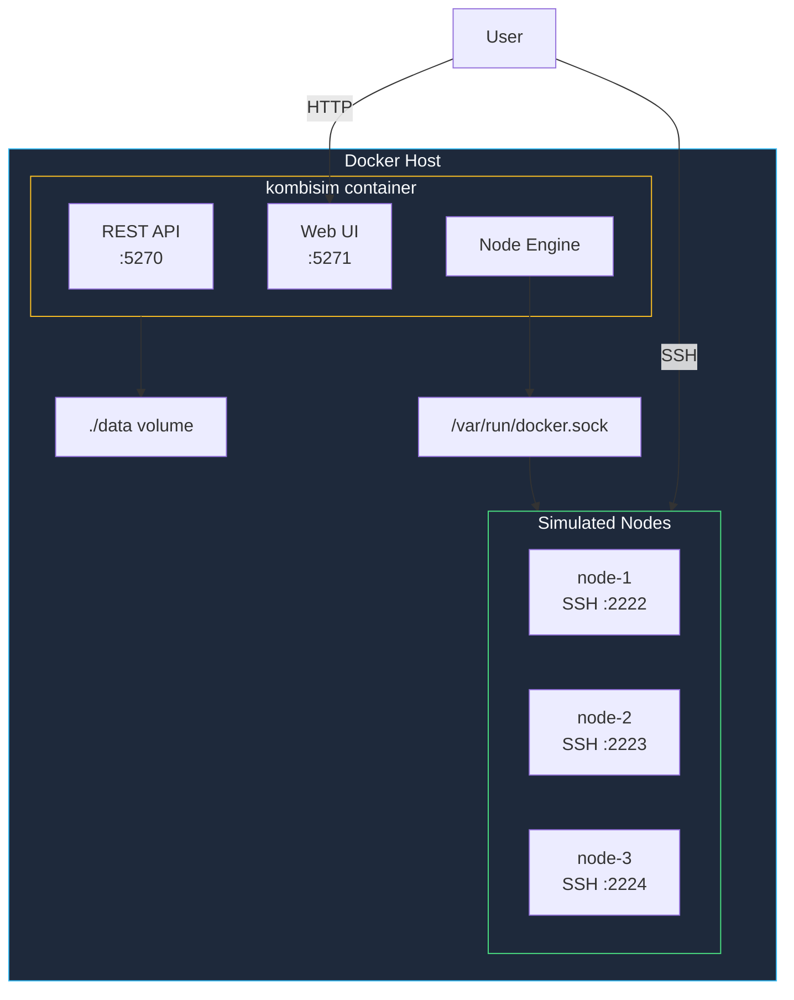

# Docker Compose Installation

Use Docker Compose for a more manageable, persistent kombify Sim deployment.

## Quick Start

<Steps>
  <Step title="Create project directory">
    ```bash
    mkdir -p ~/kombisim && cd ~/kombisim
    ```
  </Step>

  <Step title="Create docker-compose.yml">
    ```yaml docker-compose.yml
    version: "3.8"
    
    services:
      kombisim:
        image: ghcr.io/kombify/sim:latest
        container_name: kombisim
        restart: unless-stopped
        ports:
          - "5270:5270"       # API
          - "5271:5271"       # Dashboard
          - "2222-2322:2222-2322"  # SSH ports for nodes
        environment:
          - KOMBISIM_LOG_LEVEL=info
          - KOMBISIM_DATA_DIR=/data
          - KOMBISIM_ENGINE=container
        volumes:
          - /var/run/docker.sock:/var/run/docker.sock
          - ./data:/data
        healthcheck:
          test: ["CMD", "curl", "-f", "http://localhost:5270/api/v1/health"]
          interval: 30s
          timeout: 10s
          retries: 3
    
    volumes:
      data:
    ```
  </Step>

  <Step title="Start Sim">
    ```bash
    docker compose up -d
    ```
  </Step>

  <Step title="Access dashboard">
    Open `http://localhost:5271` in your browser.
  </Step>
</Steps>

## Architecture



## Configuration Options

### With Custom Network

For better isolation between simulations:

```yaml docker-compose.yml
version: "3.8"

services:
  kombisim:
    image: ghcr.io/kombify/sim:latest
    container_name: kombisim
    restart: unless-stopped
    ports:
      - "5270:5270"
      - "5271:5271"
      - "2222-2322:2222-2322"
    environment:
      - KOMBISIM_LOG_LEVEL=info
      - KOMBISIM_DATA_DIR=/data
      - KOMBISIM_ENGINE=container
    volumes:
      - /var/run/docker.sock:/var/run/docker.sock
      - ./data:/data
    networks:
      - sim-network

networks:
  sim-network:
    driver: bridge
    ipam:
      config:
        - subnet: 172.28.0.0/16
```

### With Traefik (Remote Access)

For accessing Sim remotely with HTTPS:

```yaml docker-compose.yml
version: "3.8"

services:
  kombisim:
    image: ghcr.io/kombify/sim:latest
    container_name: kombisim
    restart: unless-stopped
    expose:
      - "5270"
      - "5271"
    ports:
      - "2222-2322:2222-2322"  # SSH still needs direct access
    environment:
      - KOMBISIM_LOG_LEVEL=info
    volumes:
      - /var/run/docker.sock:/var/run/docker.sock
      - ./data:/data
    labels:
      - "traefik.enable=true"
      # Dashboard
      - "traefik.http.routers.sim.rule=Host(`sim.yourdomain.com`)"
      - "traefik.http.routers.sim.tls.certresolver=letsencrypt"
      - "traefik.http.services.sim.loadbalancer.server.port=5271"
      # API
      - "traefik.http.routers.sim-api.rule=Host(`sim-api.yourdomain.com`)"
      - "traefik.http.routers.sim-api.tls.certresolver=letsencrypt"
      - "traefik.http.services.sim-api.loadbalancer.server.port=5270"
    networks:
      - proxy

networks:
  proxy:
    external: true
```

### Environment Variables

| Variable | Default | Description |
|----------|---------|-------------|
| `KOMBISIM_PORT` | `5270` | API server port |
| `KOMBISIM_DATA_DIR` | `/data` | Data storage directory |
| `KOMBISIM_LOG_LEVEL` | `info` | Log level: debug, info, warn, error |
| `KOMBISIM_ENGINE` | `container` | Engine: container, qemu, external |
| `KOMBISIM_ENGINE_ENDPOINT` | - | External engine endpoint URL |

## Management Commands

```bash
# Start services
docker compose up -d

# View logs
docker compose logs -f

# Stop services
docker compose down

# Update to latest version
docker compose pull
docker compose up -d

# Reset all data
docker compose down -v
rm -rf ./data
docker compose up -d
```

## Verify Installation

```bash
# Check service health
docker compose ps

# Test API
curl http://localhost:5270/api/v1/health

# List simulations
curl http://localhost:5270/api/v1/simulations
```

## Quick Test

Create a test simulation:

```bash
# Create simulation
SIM_ID=$(curl -s -X POST http://localhost:5270/api/v1/simulations \
  -H "Content-Type: application/json" \
  -d '{"name": "quicktest"}' | jq -r '.id')

echo "Simulation ID: $SIM_ID"

# Add a node
curl -X POST http://localhost:5270/api/v1/nodes \
  -H "Content-Type: application/json" \
  -d "{
    \"name\": \"test-node\",
    \"simulation_id\": \"$SIM_ID\",
    \"type\": \"vps\",
    \"os\": \"ubuntu-22.04\"
  }"

# Wait a few seconds for container to start
sleep 5

# SSH into the node
ssh -o StrictHostKeyChecking=no -p 2222 root@localhost
# Password: kombisim
```

## Troubleshooting

<AccordionGroup>
  <Accordion title="Permission denied on Docker socket">
    Ensure your user is in the docker group:
    ```bash
    sudo usermod -aG docker $USER
    # Log out and back in
    ```
  </Accordion>
  
  <Accordion title="Port already in use">
    Change the port mapping in docker-compose.yml:
    ```yaml
    ports:
      - "5280:5270"  # Use different host port
      - "5281:5271"
    ```
  </Accordion>
  
  <Accordion title="SSH connection refused">
    1. Check node is running: `curl http://localhost:5270/api/v1/nodes`
    2. Verify port mapping includes SSH range
    3. Check container logs: `docker compose logs kombisim`
  </Accordion>
</AccordionGroup>

## Next Steps

<Columns cols={2}>
  <Card title="Templates" icon="book" href="/sim/templates">
    Use pre-built templates for common homelab setups
  </Card>
  <Card title="SSH Access Guide" icon="terminal" href="/sim/ssh-access">
    Learn about SSH access to simulated nodes
  </Card>
</Columns>
