**kombify Sim** lets you test your homelab configuration in a safe sandbox. Make mistakes, break things, learn — without risking your real servers.

## The simple version

<Card title="What is Sim?" icon="lightbulb">
  Sim creates virtual servers on your computer using Docker. These virtual servers look and act like real servers — you can SSH into them, install software, and test your entire homelab setup. When something breaks, just delete it and start over in seconds.
</Card>

## Why use Sim?

```mermaid
flowchart LR
    subgraph Without["Without Sim ❌"]
        direction TB
        W1["💡 Have an idea"]
        W2["🖥️ Deploy to server"]
        W3["💥 Something breaks"]
        W4["😰 Debug live system"]
        W5["🔄 Hours of frustration"]
        
        W1 --> W2 --> W3 --> W4 --> W5
    end
    
    subgraph With["With Sim ✅"]
        direction TB
        S1["💡 Have an idea"]
        S2["🧪 Test in Sim"]
        S3["✨ Works perfectly"]
        S4["🚀 Deploy with confidence"]
        
        S1 --> S2 --> S3 --> S4
    end
    
    style Without fill:#1e293b,stroke:#ef4444,color:#f8fafc
    style With fill:#1e293b,stroke:#4ade80,color:#f8fafc
```



<Accordion title="🔧 Technical details" icon="code">
  Sim uses Docker containers with full init systems (systemd/OpenRC) to simulate real Linux servers. Each simulated node:
  - Runs a complete Linux distribution (Ubuntu, Debian, Rocky, Alpine)
  - Has its own SSH server accessible on unique ports (2222-2322)
  - Can be networked together in custom topologies
  - Supports resource limits matching real hardware specs
  
  **Architecture:** Go backend with SvelteKit dashboard, REST API for automation
</Accordion>

## Key features

<CardGroup cols={2}>
  <Card title="Instant servers" icon="bolt">
    Spin up simulated servers in seconds — no ISO downloads or VM setup
  </Card>
  <Card title="Real SSH access" icon="terminal">
    SSH into any simulated server just like a real one
  </Card>
  <Card title="Safe experimentation" icon="flask">
    Break things without consequences — delete and recreate in seconds
  </Card>
  <Card title="Network simulation" icon="network-wired">
    Test multi-node setups with custom networks and topologies
  </Card>
</CardGroup>

## How it works

```mermaid
flowchart TB
    subgraph You["👤 You"]
        direction LR
        Dashboard["🖥️ Dashboard"]
        CLI["💻 CLI"]
        API["🔌 API"]
    end
    
    subgraph Sim["🧪 Sim Engine"]
        Controller["Controller"]
        NodeMgr["Node Manager"]
        NetMgr["Network Manager"]
    end
    
    subgraph Docker["🐳 Docker"]
        N1["<b>node-1</b><br/>Ubuntu 22.04<br/><small>SSH: 2222</small>"]
        N2["<b>node-2</b><br/>Debian 12<br/><small>SSH: 2223</small>"]
        N3["<b>node-3</b><br/>Rocky 9<br/><small>SSH: 2224</small>"]
        Net["🌐 Virtual Networks"]
    end
    
    You --> Controller
    Controller --> NodeMgr & NetMgr
    NodeMgr --> N1 & N2 & N3
    NetMgr --> Net
    Net --- N1 & N2 & N3
    
    style You fill:#1e293b,stroke:#38bdf8,color:#f8fafc
    style Sim fill:#1e293b,stroke:#fbbf24,color:#f8fafc
    style Docker fill:#1e293b,stroke:#4ade80,color:#f8fafc
```



<Steps>
  <Step title="Start Sim" icon="play">
    Run Sim via Docker — it needs access to Docker socket to create containers
  </Step>
  <Step title="Create simulation" icon="plus">
    Name your simulation and choose which nodes you want
  </Step>
  <Step title="Add nodes" icon="server">
    Add virtual servers with your choice of OS and resources
  </Step>
  <Step title="Connect and test" icon="terminal">
    SSH into nodes, install software, test your configuration
  </Step>
  <Step title="Clean up" icon="trash">
    Delete the simulation when done — everything disappears
  </Step>
</Steps>

## Quick Start

<Steps>
  <Step title="Start Sim">
    ```bash
    docker run -d \
      -p 5270:5270 \
      -p 5271:5271 \
      -p 2222-2322:2222-2322 \
      -v /var/run/docker.sock:/var/run/docker.sock \
      ghcr.io/kombify/sim:latest
    ```
  </Step>
  
  <Step title="Open Dashboard">
    Navigate to `http://localhost:5271` in your browser.
    
    
  </Step>
  
  <Step title="Create Simulation">
    ```bash
    curl -X POST http://localhost:5270/api/v1/simulations \
      -H "Content-Type: application/json" \
      -d '{"name": "my-homelab"}'
    ```
  </Step>
  
  <Step title="Add Nodes">
    ```bash
    curl -X POST http://localhost:5270/api/v1/nodes \
      -H "Content-Type: application/json" \
      -d '{
        "name": "server-1",
        "simulation_id": "sim_xxx",
        "os": "ubuntu-22.04",
        "resources": {
          "cpu": 2,
          "memory": "2048Mi"
        }
      }'
    ```
  </Step>
  
  <Step title="SSH into Node">
    ```bash
    ssh -p 2222 root@localhost
    # Password: kombisim
    ```
  </Step>
</Steps>

## Architecture


## Supported Operating Systems

| OS | Image | SSH Port Base |
|----|-------|---------------|
| Ubuntu 22.04 | `ubuntu-22.04` | 2222 |
| Ubuntu 24.04 | `ubuntu-24.04` | 2222 |
| Debian 12 | `debian-12` | 2222 |
| Rocky Linux 9 | `rocky-9` | 2222 |
| Alpine 3.19 | `alpine-3.19` | 2222 |

## Use Cases

<Tabs>
  <Tab title="Testing StackKits">
    Test a StackKit configuration before deploying:
    
    ```bash
    # Start simulation
    kombify sim start --from kombination.yaml
    
    # Run validation
    kombify validate --against-sim
    
    # Deploy to simulation
    kombify deploy --target sim
    
    # Verify everything works
    kombify test --target sim
    ```
  </Tab>
  
  <Tab title="Multi-Node Testing">
    Test HA configurations with multiple nodes:
    
    ```yaml
    # sim-config.yaml
    simulation:
      name: ha-test
      
    nodes:
      - name: node-1
        os: ubuntu-22.04
        role: primary
        
      - name: node-2
        os: ubuntu-22.04
        role: replica
        
      - name: node-3
        os: ubuntu-22.04
        role: replica
    
    network:
      subnet: 172.20.0.0/24
    ```
  </Tab>
  
  <Tab title="CI/CD Testing">
    Run tests in CI pipelines:
    
    ```yaml
    # .github/workflows/test.yml
    jobs:
      test:
        runs-on: ubuntu-latest
        steps:
          - uses: kombify/sim-action@v1
            with:
              config: test-config.yaml
              
          - name: Run integration tests
            run: |
              kombify test --target sim
    ```
  </Tab>
</Tabs>

## API Overview

### Simulations

```bash
# List simulations
curl http://localhost:5270/api/v1/simulations

# Create simulation
curl -X POST http://localhost:5270/api/v1/simulations \
  -d '{"name": "test"}'

# Delete simulation
curl -X DELETE http://localhost:5270/api/v1/simulations/{id}
```

### Nodes

```bash
# List nodes in simulation
curl http://localhost:5270/api/v1/nodes?simulation_id={sim_id}

# Create node
curl -X POST http://localhost:5270/api/v1/nodes \
  -d '{
    "name": "web-server",
    "simulation_id": "sim_xxx",
    "os": "ubuntu-22.04"
  }'

# Get node details
curl http://localhost:5270/api/v1/nodes/{id}

# Delete node
curl -X DELETE http://localhost:5270/api/v1/nodes/{id}
```

## Resource Limits

Configure resources per node:

```bash
curl -X POST http://localhost:5270/api/v1/nodes \
  -d '{
    "name": "db-server",
    "os": "ubuntu-22.04",
    "resources": {
      "cpu": 4,
      "memory": "4096Mi",
      "disk": "20Gi"
    }
  }'
```

## Networking

### Custom Networks

```bash
# Create isolated network
curl -X POST http://localhost:5270/api/v1/networks \
  -d '{
    "name": "backend",
    "subnet": "172.30.0.0/24",
    "simulation_id": "sim_xxx"
  }'

# Attach node to network
curl -X POST http://localhost:5270/api/v1/nodes/{id}/networks \
  -d '{"network_id": "net_xxx", "ip": "172.30.0.10"}'
```

### Network Topology Example


## Best Practices

<AccordionGroup>
  <Accordion title="Use realistic resource limits">
    Match your simulation resources to actual hardware specs:
    
    ```yaml
    nodes:
      - name: raspberry-pi
        resources:
          cpu: 4
          memory: "4096Mi"  # 4GB like real Pi 4
    ```
  </Accordion>
  
  <Accordion title="Test failure scenarios">
    Sim lets you safely test failures:
    
    ```bash
    # Stop a node to test failover
    curl -X POST http://localhost:5270/api/v1/nodes/{id}/stop
    
    # Simulate network partition
    curl -X POST http://localhost:5270/api/v1/networks/{id}/disconnect \
      -d '{"node_id": "node_xxx"}'
    ```
  </Accordion>
  
  <Accordion title="Clean up after testing">
    Delete simulations when done to free resources:
    
    ```bash
    curl -X DELETE http://localhost:5270/api/v1/simulations/{id}
    ```
  </Accordion>
</AccordionGroup>

## Next Steps

<CardGroup cols={2}>
  <Card title="Docker Installation" icon="docker" href="/sim/install/docker">
    Quick start with Docker
  </Card>
  <Card title="Docker Compose" icon="layer-group" href="/sim/install/docker-compose">
    Persistent deployment with Compose
  </Card>
  <Card title="Templates" icon="book" href="/sim/templates">
    Pre-built simulation templates
  </Card>
  <Card title="API Reference" icon="code" href="/api-reference/sim">
    Full API documentation
  </Card>
</CardGroup>
