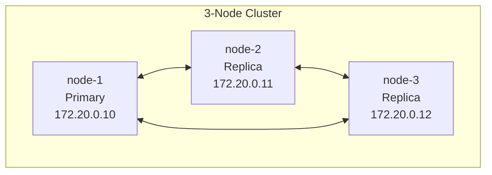

# Simulation Templates

Sim includes pre-built templates for common homelab scenarios. Templates define node configurations, networking, and initial setup.

## Available Templates

<CardGroup cols={2}>
  <Card title="Single Node" icon="server">
    One Ubuntu server for simple testing
  </Card>
  <Card title="3-Node Cluster" icon="server">
    Three nodes for HA testing
  </Card>
  <Card title="Development" icon="code">
    Dev environment with multiple services
  </Card>
  <Card title="Hybrid" icon="cloud">
    Mix of cloud and local nodes
  </Card>
</CardGroup>

## Using Templates

### Via API

```bash
curl -X POST http://localhost:5270/api/v1/simulations \
  -H "Content-Type: application/json" \
  -d '{
    "name": "my-cluster",
    "template": "3-node-cluster"
  }'
```

### Via Dashboard

1. Open `http://localhost:5271`
2. Click **New Simulation**
3. Select a template
4. Customize if needed
5. Click **Create**

## Template: 3-Node Cluster

Perfect for testing high-availability setups:



**Nodes:**
- `node-1`: Ubuntu 22.04, 2 CPU, 2GB RAM
- `node-2`: Ubuntu 22.04, 2 CPU, 2GB RAM
- `node-3`: Ubuntu 22.04, 2 CPU, 2GB RAM

**Network:** `172.20.0.0/24`

## Creating Custom Templates

```yaml
# my-template.yaml
name: my-custom-template
description: My custom homelab setup

nodes:
  - name: web-server
    os: ubuntu-22.04
    resources:
      cpu: 2
      memory: 2048Mi
    
  - name: db-server
    os: debian-12
    resources:
      cpu: 4
      memory: 4096Mi

network:
  subnet: 172.30.0.0/24
  
scripts:
  post_create:
    - apt-get update
    - apt-get install -y docker.io
```

Load your template:

```bash
curl -X POST http://localhost:5270/api/v1/templates \
  -H "Content-Type: application/json" \
  -d @my-template.yaml
```
