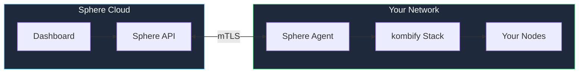

# Getting Started with Sphere

Connect your homelab to kombify Sphere for managed monitoring, updates, and team collaboration.

## Prerequisites

- A kombify Stack installation (self-hosted or managed)
- A Sphere account at [sphere.kombify.dev](https://sphere.kombify.dev)

## Step 1: Create Account

<Steps>
  <Step title="Sign up">
    Visit [sphere.kombify.dev](https://sphere.kombify.dev) and click **Sign Up**.
  </Step>
  <Step title="Verify email">
    Check your inbox and verify your email address.
  </Step>
  <Step title="Complete profile">
    Fill in your organization details.
  </Step>
</Steps>

## Step 2: Add Your Homelab

<Steps>
  <Step title="Click Add Homelab">
    In the dashboard, click **Homelabs → Add Homelab**.
  </Step>
  <Step title="Get pairing token">
    Copy the displayed pairing token.
  </Step>
  <Step title="Install agent">
    On your homelab server:
    ```bash
    curl -fsSL https://get.kombify.dev/sphere-agent | bash
    sphere-agent init --token YOUR_TOKEN
    sudo systemctl enable --now sphere-agent
    ```
  </Step>
  <Step title="Verify connection">
    Your homelab should appear in the dashboard within 30 seconds.
  </Step>
</Steps>

## Step 3: Explore the Dashboard

Once connected, you can:

- **Monitor** - View node health and resource usage
- **Deploy** - Push configurations from the UI
- **Collaborate** - Invite team members
- **Backup** - Access configuration backups

## What's Connected?



**Important:** Your data stays on your infrastructure. Sphere only manages configuration and provides monitoring.

## Next Steps

<CardGroup cols={2}>
  <Card title="Team Management" icon="users" href="/sphere/team-management">
    Invite your team members
  </Card>
  <Card title="SSO Setup" icon="key" href="/guides/auth/sso-integration">
    Configure enterprise SSO
  </Card>
</CardGroup>
