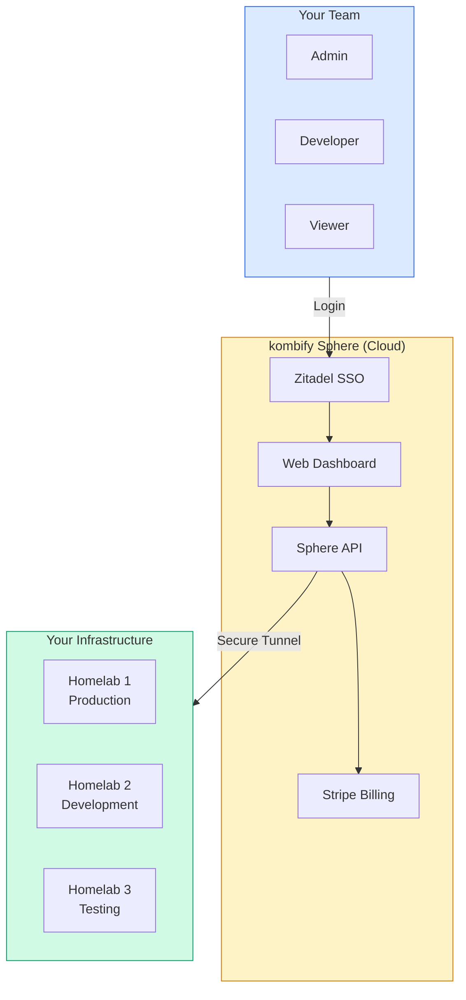
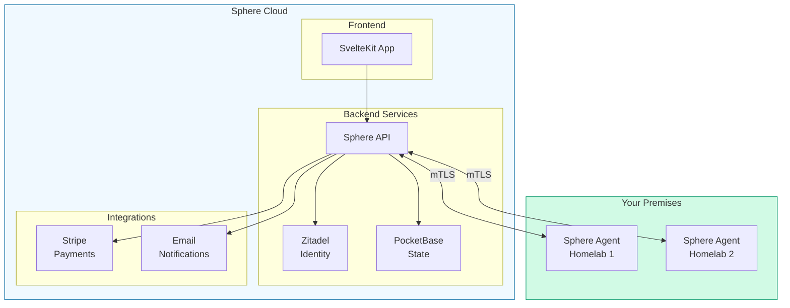
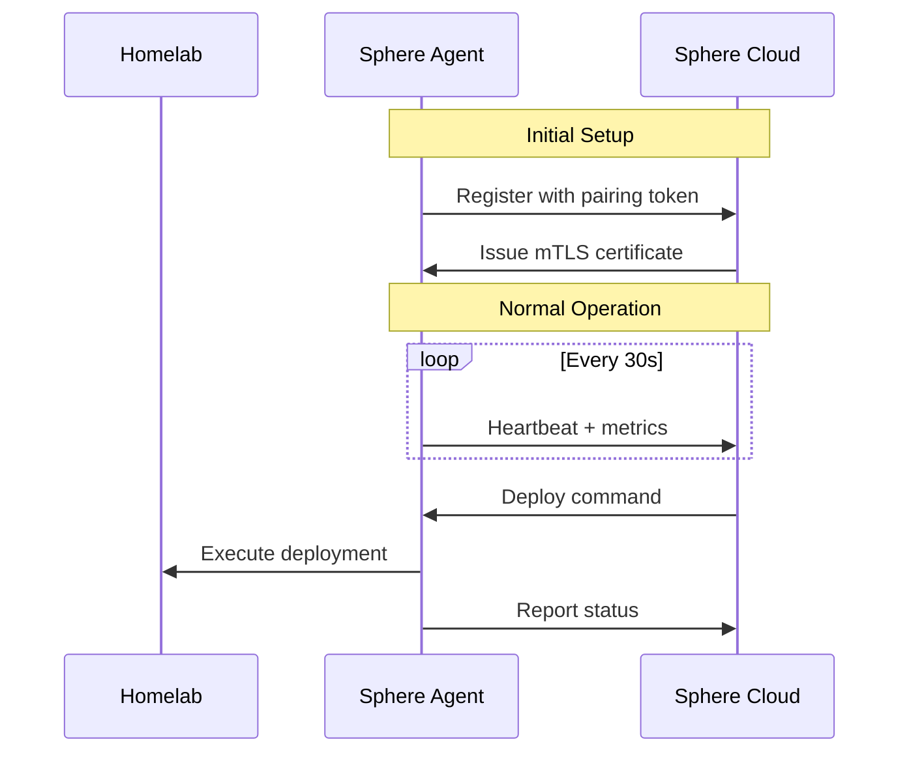
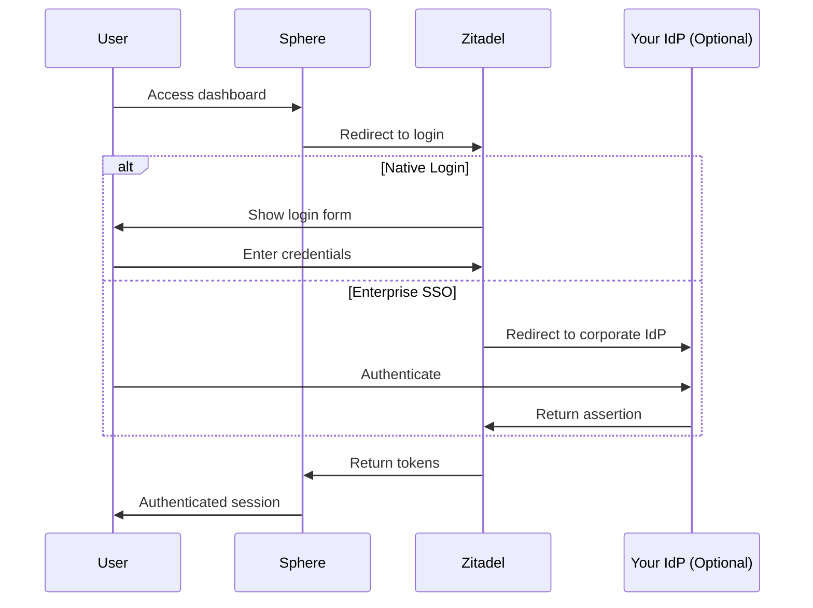

# kombify Sphere

**Sphere** is kombify's managed SaaS platform. It provides hosted infrastructure management with enterprise features like SSO, billing, and team collaboration.

## Why Sphere?

<Tabs>
  <Tab title="Self-Hosted (Stack)">
    **You manage everything:**
    - ✅ Full control
    - ✅ No subscription costs
    - ❌ You handle updates
    - ❌ You manage backups
    - ❌ You configure SSO
    - ❌ Single homelab only
  </Tab>
  <Tab title="Managed (Sphere)">
    **We handle the complexity:**
    - ✅ Automatic updates
    - ✅ Managed backups
    - ✅ SSO pre-configured
    - ✅ Multi-homelab support
    - ✅ Team collaboration
    - ✅ 24/7 support
  </Tab>
</Tabs>

## How It Works



## Key Features

<CardGroup cols={3}>
  <Card title="Multi-Homelab" icon="server">
    Manage multiple homelabs from a single dashboard
  </Card>
  <Card title="SSO / OIDC" icon="key">
    Enterprise authentication via Zitadel
  </Card>
  <Card title="Team Management" icon="users">
    Role-based access control for teams
  </Card>
  <Card title="Automated Backups" icon="cloud-arrow-up">
    Scheduled configuration backups
  </Card>
  <Card title="Usage Analytics" icon="chart-line">
    Insights into your infrastructure
  </Card>
  <Card title="Priority Support" icon="headset">
    Direct access to the kombify team
  </Card>
</CardGroup>

## Architecture



## Connecting Your Homelab

The Sphere Agent establishes a secure connection from your homelab to the Sphere cloud:



### Agent Installation

<Steps>
  <Step title="Get pairing token">
    In Sphere dashboard, go to **Homelabs → Add Homelab** and copy your pairing token.
  </Step>
  
  <Step title="Install agent">
    ```bash
    curl -fsSL https://get.kombify.dev/sphere-agent | bash
    ```
  </Step>
  
  <Step title="Configure agent">
    ```bash
    sphere-agent init --token YOUR_PAIRING_TOKEN
    ```
  </Step>
  
  <Step title="Start agent">
    ```bash
    sudo systemctl enable --now sphere-agent
    ```
  </Step>
</Steps>

## Team & Access Control

### Role-Based Access

| Role | View | Deploy | Configure | Billing | Admin |
|------|:----:|:------:|:---------:|:-------:|:-----:|
| Viewer | ✅ | ❌ | ❌ | ❌ | ❌ |
| Operator | ✅ | ✅ | ❌ | ❌ | ❌ |
| Developer | ✅ | ✅ | ✅ | ❌ | ❌ |
| Admin | ✅ | ✅ | ✅ | ✅ | ✅ |
| Owner | ✅ | ✅ | ✅ | ✅ | ✅ |

### SSO Configuration

Sphere uses Zitadel for enterprise-grade authentication:



Supported identity providers:
- **OIDC**: Any OIDC-compliant provider
- **SAML**: Okta, Azure AD, OneLogin, etc.
- **LDAP**: Active Directory, OpenLDAP
- **Social**: GitHub, Google, Microsoft

## Pricing Plans

<CardGroup cols={3}>
  <Card title="Starter" icon="seedling">
    **Free**
    
    - 1 homelab
    - 5 nodes max
    - Community support
    - 7-day backup retention
  </Card>
  
  <Card title="Pro" icon="rocket">
    **$19/month**
    
    - 3 homelabs
    - Unlimited nodes
    - Priority support
    - 30-day backup retention
    - Custom domain
  </Card>
  
  <Card title="Team" icon="building">
    **$49/month**
    
    - 10 homelabs
    - Unlimited nodes
    - 5 team members
    - SSO integration
    - 90-day backup retention
    - SLA guarantee
  </Card>
</CardGroup>

<Note>
  All plans include a 14-day free trial. No credit card required.
</Note>

## Dashboard Features

### Homelab Overview

View all your homelabs at a glance:
- Node health status
- Resource utilization
- Recent deployments
- Active alerts

### Deployment History

Track all changes:
- Who deployed what
- When it was deployed
- Rollback capability
- Diff viewer

### Monitoring & Alerts

Built-in monitoring:
- Node availability
- Resource usage
- Service health
- Custom alert rules

## Security

<AccordionGroup>
  <Accordion title="Data Encryption" icon="lock">
    - All data encrypted at rest (AES-256)
    - All traffic encrypted in transit (TLS 1.3)
    - mTLS for agent communication
  </Accordion>
  
  <Accordion title="Access Control" icon="shield">
    - Role-based access control
    - Audit logging for all actions
    - IP allowlist support (Team plan)
  </Accordion>
  
  <Accordion title="Compliance" icon="clipboard-check">
    - SOC 2 Type II (in progress)
    - GDPR compliant
    - Data residency options (EU/US)
  </Accordion>
</AccordionGroup>

## Self-Hosted vs Sphere

| Feature | Self-Hosted (Stack) | Managed (Sphere) |
|---------|---------------------|------------------|
| **Cost** | Free | $0-49/month |
| **Setup** | ~1 hour | ~5 minutes |
| **Updates** | Manual | Automatic |
| **Multi-homelab** | No | Yes |
| **Team access** | DIY | Built-in |
| **SSO** | DIY | Included |
| **Backups** | DIY | Automatic |
| **Support** | Community | Priority |

## Getting Started

<Steps>
  <Step title="Create account">
    Sign up at [sphere.kombify.dev](https://sphere.kombify.dev)
  </Step>
  
  <Step title="Add your first homelab">
    Follow the guided setup to connect your infrastructure
  </Step>
  
  <Step title="Deploy your first stack">
    Choose a StackKit and deploy in minutes
  </Step>
</Steps>

## Next Steps

<CardGroup cols={2}>
  <Card title="Quickstart Guide" icon="rocket" href="/sphere/quickstart">
    Get up and running in 5 minutes
  </Card>
  <Card title="Agent Installation" icon="download" href="/sphere/agent">
    Detailed agent setup instructions
  </Card>
  <Card title="SSO Setup" icon="key" href="/sphere/sso">
    Configure enterprise authentication
  </Card>
  <Card title="API Reference" icon="code" href="/api-reference/sphere">
    Automate with the Sphere API
  </Card>
</CardGroup>
