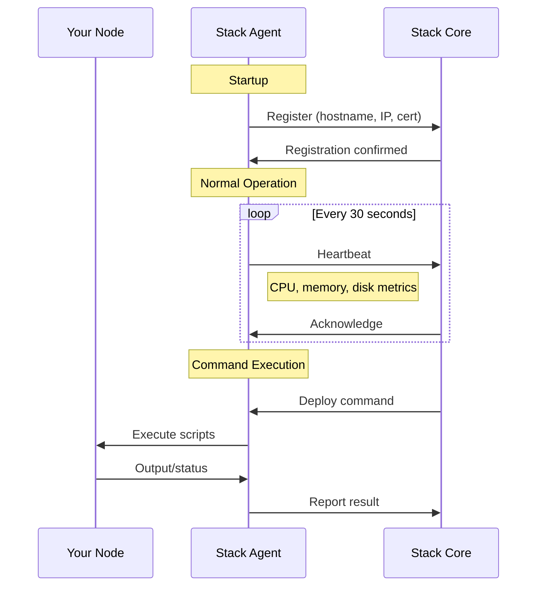
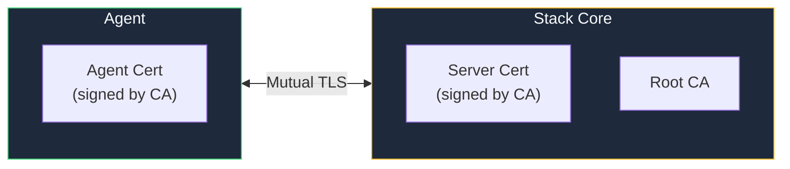

# Stack Agents

Agents are lightweight daemons that run on each managed node, enabling secure communication with the Stack control plane.

## How Agents Work



## Installation

<Tabs>
  <Tab title="Quick Install">
    ```bash
    curl -fsSL https://get.kombify.dev/agent | bash
    ```
  </Tab>
  <Tab title="Manual Install">
    ```bash
    # Download
    wget https://releases.kombify.dev/agent/latest/linux-amd64/stack-agent
    chmod +x stack-agent
    sudo mv stack-agent /usr/local/bin/
    
    # Configure
    sudo stack-agent init \
      --server https://stack.example.com:5263 \
      --token YOUR_REGISTRATION_TOKEN
    
    # Start
    sudo systemctl enable --now stack-agent
    ```
  </Tab>
</Tabs>

## Security

### mTLS Authentication

All agent communication uses mutual TLS:



### Certificate Management

```bash
# Generate CA (once)
kombify certs init

# Generate agent certificate
kombify certs agent --name node-1

# Certificates stored in:
# - data/certs/ca.crt       (CA certificate)
# - data/certs/ca.key       (CA private key)
# - data/certs/node-1.crt   (Agent certificate)
# - data/certs/node-1.key   (Agent private key)
```

## Configuration

```yaml
# /etc/stack-agent/config.yaml
server:
  address: stack.example.com:5263
  
tls:
  ca_cert: /etc/stack-agent/ca.crt
  client_cert: /etc/stack-agent/agent.crt
  client_key: /etc/stack-agent/agent.key

heartbeat:
  interval: 30s
  
logging:
  level: info
  format: json
```

## Agent Commands

The agent executes commands from Stack:

| Command | Description |
|---------|-------------|
| `deploy` | Run deployment scripts |
| `exec` | Execute arbitrary commands |
| `upload` | Receive files from Stack |
| `status` | Report current state |

## Troubleshooting

<AccordionGroup>
  <Accordion title="Agent not connecting">
    1. Check network connectivity: `nc -zv stack.example.com 5263`
    2. Verify certificates are valid: `openssl x509 -in agent.crt -text`
    3. Check agent logs: `journalctl -u stack-agent -f`
  </Accordion>
  
  <Accordion title="Certificate errors">
    1. Ensure CA cert matches server's CA
    2. Check certificate expiry dates
    3. Regenerate certificates if needed
  </Accordion>
</AccordionGroup>
