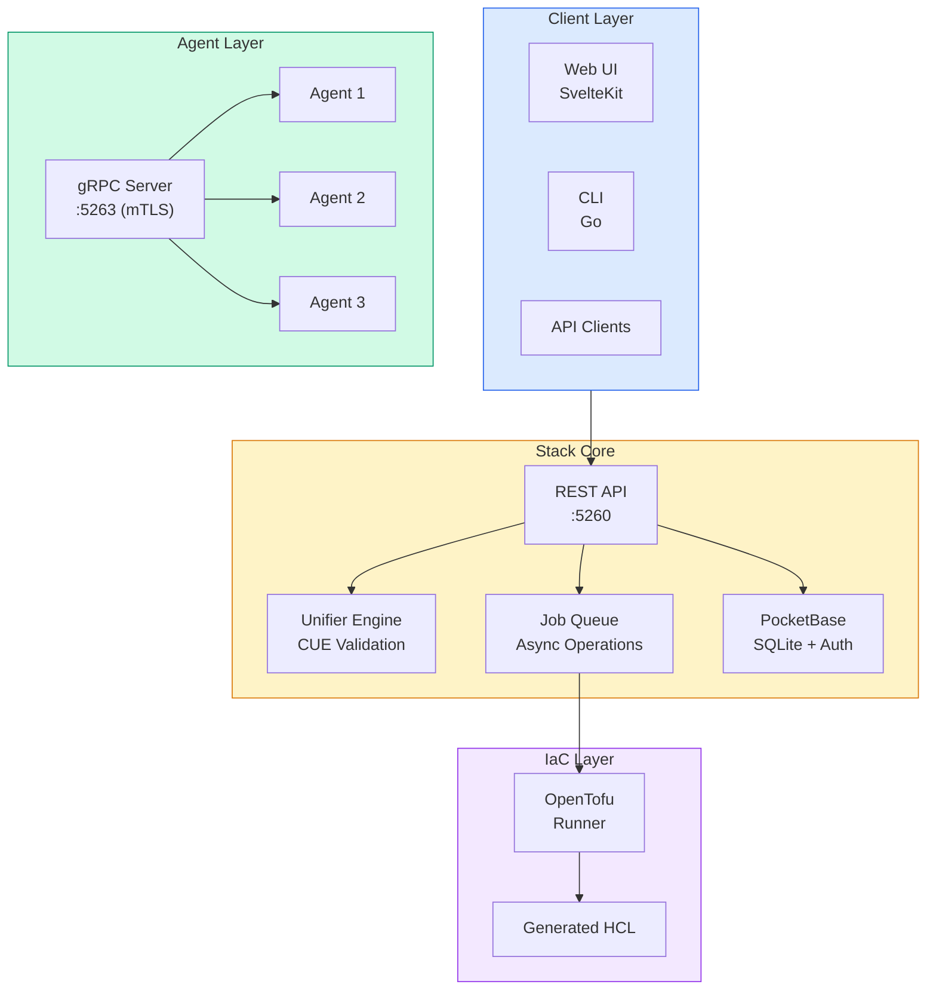
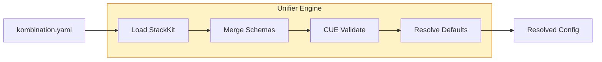
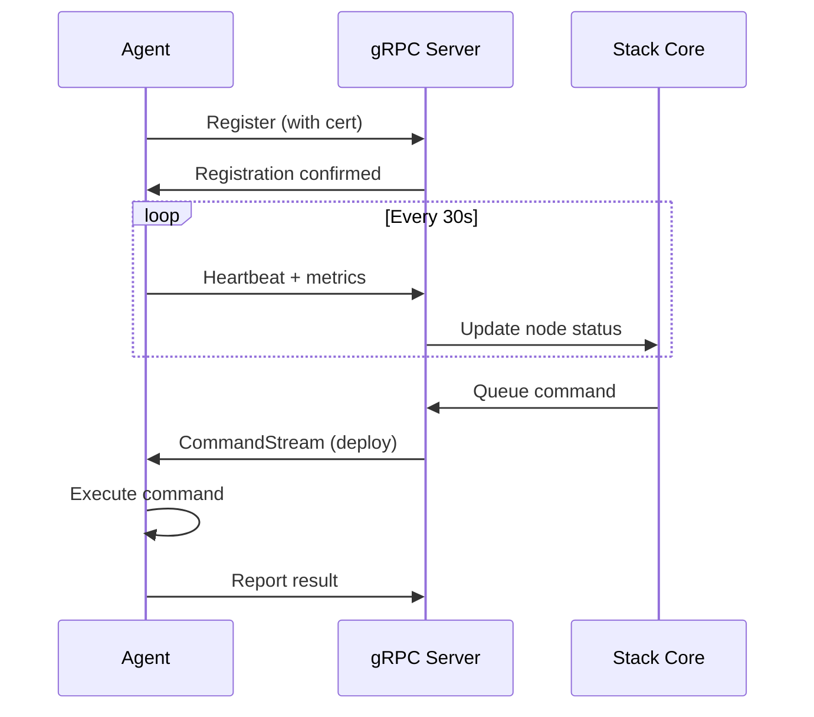
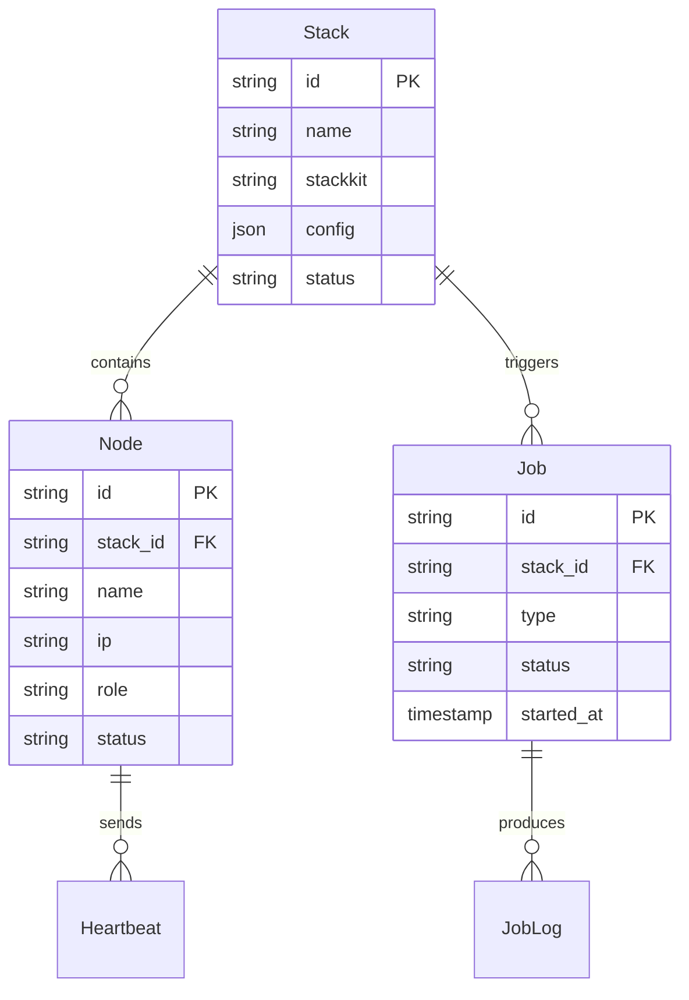

# Stack Architecture

kombify Stack is a hybrid control plane built with Go that orchestrates infrastructure across cloud and on-premises environments.

## System Overview

## Core Components

### Unifier Engine

The Unifier validates and resolves user configurations:

### Job Queue

Async operations for long-running tasks:

| Job Type | Description | Duration |
|----------|-------------|----------|
| `provision` | Provision infrastructure | Minutes |
| `destroy` | Tear down infrastructure | Minutes |
| `validate` | Validate configuration | Seconds |
| `healthcheck` | Check node health | Seconds |

### Agent Protocol

Agents communicate via gRPC with mTLS:

## Data Model

## Ports & Networking

| Port | Service | Protocol |
|------|---------|----------|
| `5260` | REST API | HTTP/HTTPS |
| `5261` | Web UI | HTTP/HTTPS |
| `5263` | Agent gRPC | HTTP/2 + mTLS |

## Security Model

- **API Auth**: API keys or OIDC tokens
- **Agent Auth**: mTLS with client certificates
- **Data**: SQLite with WAL mode, encrypted at rest (optional)

## Next Steps

<CardGroup cols={2}>
  <Card title="Agent Protocol" icon="satellite-dish" href="/stack/agents">
    Deep dive into agent communication
  </Card>
  <Card title="Unifier Engine" icon="wand-magic-sparkles" href="/stack/unifier">
    Learn about configuration validation
  </Card>
</CardGroup>
