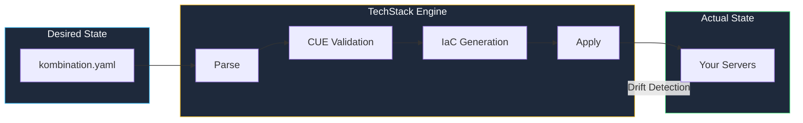
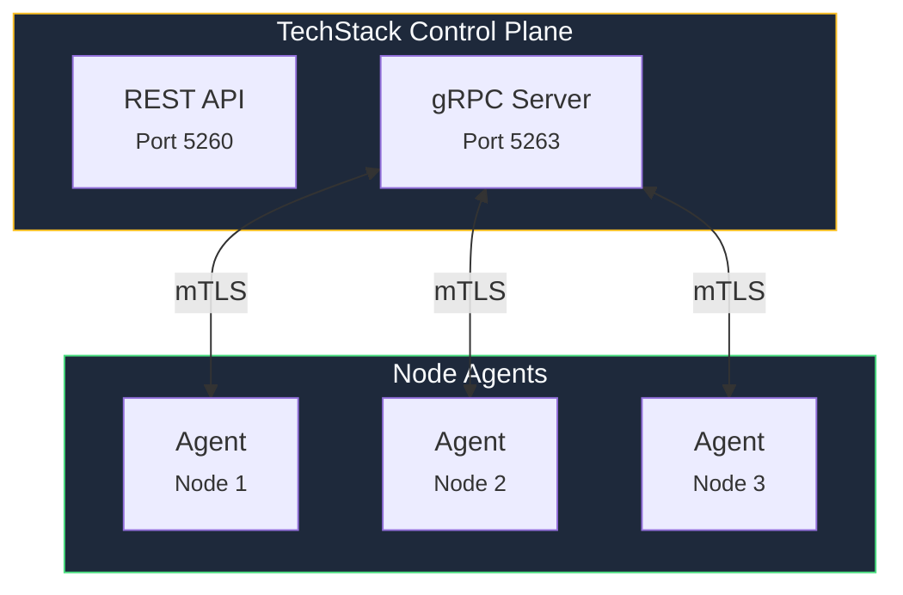

Understanding how kombify TechStack works under the hood helps you make better decisions about configuration, deployment, and troubleshooting.

## Core design principles

kombify TechStack follows a **spec-driven** architecture: you declare your desired state in a `kombination.yaml` file, and TechStack converges your infrastructure toward that state.

## The Unifier Engine

The Unifier is TechStack's core processing pipeline. It takes your high-level intent and transforms it into concrete infrastructure configuration.

### Processing stages

<Steps>
  <Step title="Parse" icon="file-code">
    Your `kombination.yaml` is parsed and normalized. References to StackKits are resolved, and the full configuration tree is assembled.
  </Step>
  <Step title="Validate" icon="check">
    CUE schemas from the selected StackKit validate every field. Type errors, missing required values, and constraint violations are caught here — before anything touches your servers.
  </Step>
  <Step title="Resolve Dependencies" icon="diagram-project">
    Services declare their dependencies (e.g., Immich needs a database). The Unifier resolves the dependency graph and determines the correct deployment order.
  </Step>
  <Step title="Generate" icon="code">
    OpenTofu HCL and Docker Compose configurations are generated. These are the actual files that will be applied to your infrastructure.
  </Step>
  <Step title="Apply" icon="rocket">
    Generated configurations are sent to node agents via mTLS-secured gRPC connections. Agents execute the changes on their respective nodes.
  </Step>
</Steps>

## Agent architecture

TechStack uses lightweight gRPC agents installed on each managed node. These agents handle the "last mile" of deployment.

**Key properties:**
- **mTLS authentication** — Every connection is mutually authenticated with TLS certificates
- **Heartbeat monitoring** — Agents report status at regular intervals
- **Idempotent operations** — Applying the same configuration twice produces the same result
- **Pull-based updates** — Agents pull their configuration from the control plane

## Drift detection

TechStack continuously compares the desired state (your spec) with the actual state (what is running on your nodes). When differences are detected, TechStack can:

1. **Alert** — Notify you about the drift
2. **Propose** — Show you what changes would fix the drift
3. **Auto-fix** — Automatically converge back to the desired state (if enabled)

## State management

TechStack uses PocketBase (SQLite) as its embedded database for:
- Stack state and configuration history
- Job execution logs
- Agent registry and health status
- User sessions and preferences

This zero-dependency approach means TechStack runs as a single binary with no external database required.

## Technology choices

| Component | Choice | Why |
|-----------|--------|-----|
| **Go** | Backend language | Single binary, low memory, fast startup |
| **PocketBase** | State storage | Embedded SQLite, zero config, built-in auth |
| **OpenTofu** | IaC engine | Open-source, battle-tested, declarative |
| **CUE** | Validation | Type-safe, composable, catches errors early |
| **gRPC + mTLS** | Agent communication | Efficient, secure, strongly typed |
| **SvelteKit** | Dashboard | Modern, reactive, small bundle size |

## Further reading

<CardGroup cols={2}>
  <Card title="Spec-driven design" icon="file-code" href="/concepts/spec-driven">
    Understand the philosophy behind spec-driven infrastructure
  </Card>
  <Card title="StackKits & CUE" icon="boxes-stacked" href="/concepts/stackkits">
    How CUE schemas power the StackKits validation system
  </Card>
</CardGroup>
