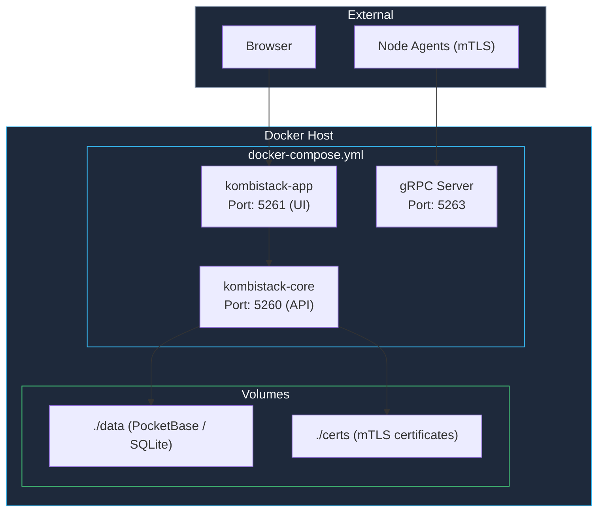

Deploy kombify TechStack on your own server using Docker Compose. This is the recommended self-hosting method -- the same approach used in production via Coolify.

<Note>
  **Requirements:** Docker 24+ and Docker Compose v2 on a Linux host. See the [official Docker installation guide](https://docs.docker.com/engine/install/) if not yet installed.
</Note>

## Quick start

<Steps>
  <Step title="Create project directory">
    ```bash
    mkdir -p ~/kombistack && cd ~/kombistack
    mkdir -p data certs
    ```
  </Step>

  <Step title="Create Docker Compose file">
    Create `docker-compose.yml` with the following content:

    ```yaml docker-compose.yml
    services:
      kombistack-core:
        image: ghcr.io/kombify/stack:latest
        container_name: kombistack-core
        restart: unless-stopped
        ports:
          - "5260:5260"   # REST API
          - "5263:5263"   # gRPC (agent communication)
        environment:
          - KOMBISTACK_PORT=5260
          - KOMBISTACK_GRPC_PORT=5263
          - KOMBISTACK_DATA_DIR=/data
          - KOMBISTACK_LOG_LEVEL=${KOMBISTACK_LOG_LEVEL:-info}
        volumes:
          - ./data:/data
          - ./certs:/certs
          - /var/run/docker.sock:/var/run/docker.sock:ro
        healthcheck:
          test: ["CMD", "curl", "-f", "http://localhost:5260/api/v1/health"]
          interval: 30s
          timeout: 10s
          retries: 3

      kombistack-app:
        image: ghcr.io/kombify/stack-app:latest
        container_name: kombistack-app
        restart: unless-stopped
        ports:
          - "5261:5261"
        environment:
          - VITE_API_URL=http://kombistack-core:5260
        depends_on:
          kombistack-core:
            condition: service_healthy
    ```
  </Step>

  <Step title="Create environment file (optional)">
    Create a `.env` file for customization:

    ```bash .env
    KOMBISTACK_LOG_LEVEL=info
    ```
  </Step>

  <Step title="Start services">
    ```bash
    docker compose up -d
    ```
  </Step>

  <Step title="Access the dashboard">
    Open `http://your-server:5261` in your browser.

    <Warning>
      Change the default admin password immediately after first login.
    </Warning>
  </Step>
</Steps>

## Architecture



TechStack uses **PocketBase** (embedded SQLite) as its default database. An optional PostgreSQL connection can be configured for larger deployments. The Docker socket is mounted read-only so TechStack can manage containers on the host.

## Environment variables

| Variable | Default | Description |
|----------|---------|-------------|
| `KOMBISTACK_PORT` | `5260` | REST API port |
| `KOMBISTACK_GRPC_PORT` | `5263` | gRPC server port for agent communication |
| `KOMBISTACK_DATA_DIR` | `/data` | Data directory (PocketBase/SQLite storage) |
| `KOMBISTACK_LOG_LEVEL` | `info` | Log verbosity: `debug`, `info`, `warn`, `error` |
| `KOMBISTACK_DOMAIN` | - | Public domain for the UI |
| `KOMBISTACK_ADMIN_EMAIL` | - | Admin email for notifications |

## Agent installation

To manage remote nodes, install the kombify agent on each target machine. Agents connect to TechStack via gRPC with mTLS authentication.

<Steps>
  <Step title="Get the registration token">
    In the TechStack dashboard, go to **Settings > Agents** and copy the registration token.
  </Step>

  <Step title="Install the agent">
    On each node you want to manage:

    ```bash
    curl -fsSL https://install.kombify.dev/agent | sudo sh -s -- \
      --server https://your-stack-server:5263 \
      --token YOUR_REGISTRATION_TOKEN
    ```
  </Step>

  <Step title="Verify connection">
    The agent should appear in the TechStack dashboard under **Nodes** within a few seconds.
  </Step>
</Steps>

<Tip>
  Agents use mTLS for encrypted communication. Certificates are automatically exchanged during registration and stored in the `/certs` directory on the TechStack host.
</Tip>

## Production setup with Traefik

For production deployments, put TechStack behind Traefik for automatic TLS via Let's Encrypt.

```yaml docker-compose.yml
services:
  kombistack-core:
    image: ghcr.io/kombify/stack:latest
    restart: unless-stopped
    environment:
      - KOMBISTACK_PORT=5260
      - KOMBISTACK_GRPC_PORT=5263
      - KOMBISTACK_DATA_DIR=/data
      - KOMBISTACK_LOG_LEVEL=${KOMBISTACK_LOG_LEVEL:-info}
    volumes:
      - ./data:/data
      - ./certs:/certs
      - /var/run/docker.sock:/var/run/docker.sock:ro
    labels:
      - "traefik.enable=true"
      - "traefik.http.routers.stack-api.rule=Host(`api.stack.yourdomain.com`)"
      - "traefik.http.routers.stack-api.tls.certresolver=letsencrypt"
      - "traefik.http.services.stack-api.loadbalancer.server.port=5260"
    healthcheck:
      test: ["CMD", "curl", "-f", "http://localhost:5260/api/v1/health"]
      interval: 30s
      timeout: 10s
      retries: 3

  kombistack-app:
    image: ghcr.io/kombify/stack-app:latest
    restart: unless-stopped
    environment:
      - VITE_API_URL=http://kombistack-core:5260
    labels:
      - "traefik.enable=true"
      - "traefik.http.routers.stack-app.rule=Host(`stack.yourdomain.com`)"
      - "traefik.http.routers.stack-app.tls.certresolver=letsencrypt"
      - "traefik.http.services.stack-app.loadbalancer.server.port=5261"
    depends_on:
      kombistack-core:
        condition: service_healthy

networks:
  default:
    external: true
    name: proxy
```

<Note>
  When using Traefik, remove the `ports` mappings from the services -- Traefik handles routing through the Docker network. The gRPC port (5263) still needs to be exposed directly for agent connections since agents use mTLS, not HTTP.
</Note>

## Verify installation

```bash
# Check containers are running
docker compose ps

# Check API health
curl http://localhost:5260/api/v1/health

# Check logs
docker compose logs -f kombistack-core
```

A healthy response looks like:

```json
{"status": "ok"}
```

## Troubleshooting

<AccordionGroup>
  <Accordion title="Container fails to start">
    Check logs for the specific error:
    ```bash
    docker compose logs kombistack-core
    ```

    Common causes:
    - **Port conflict:** Another process is using port 5260, 5261, or 5263. Change the host-side port mapping in `docker-compose.yml`.
    - **Docker socket permission denied:** Ensure the container user has access to `/var/run/docker.sock`.
    - **Data directory permissions:** The `/data` mount must be writable by the container process.
  </Accordion>

  <Accordion title="Dashboard not loading">
    1. Confirm the `kombistack-app` container is running: `docker compose ps`
    2. Check that port 5261 is open in your firewall
    3. Verify the `VITE_API_URL` points to the correct core service address
  </Accordion>

  <Accordion title="Agent cannot connect">
    1. Ensure port 5263 is reachable from the agent host (check firewalls)
    2. Verify mTLS certificates in `/certs` are valid and not expired
    3. Confirm the registration token has not been rotated since the agent was installed
  </Accordion>
</AccordionGroup>

## Next steps

<CardGroup cols={2}>
  <Card title="Deploying infrastructure" icon="rocket" href="/stack/how-to/deploying">
    Create your first infrastructure deployment
  </Card>
  <Card title="StackKits" icon="cubes" href="/stackkits/overview">
    Learn about reusable infrastructure templates
  </Card>
</CardGroup>
