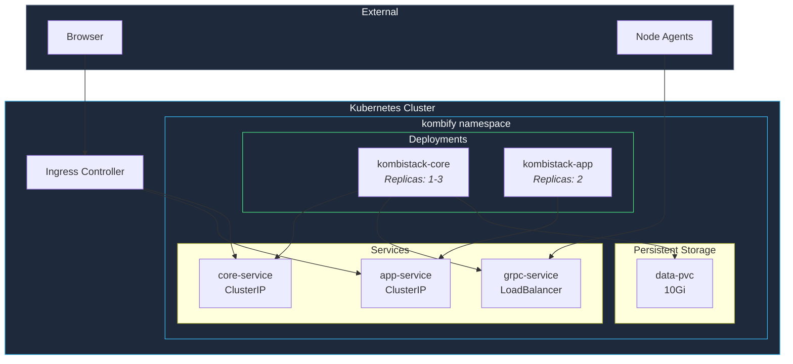

Deploy kombify Stack on Kubernetes using the official Helm chart. This is recommended for production environments requiring high availability.

<Note>
  **Requirements:** Kubernetes 1.27+ and Helm 3.12+
</Note>

## Quick Start

<Steps>
  <Step title="Add Helm repository">
    ```bash
    helm repo add kombify https://charts.kombify.dev
    helm repo update
    ```
  </Step>

  <Step title="Create namespace">
    ```bash
    kubectl create namespace kombify
    ```
  </Step>

  <Step title="Create values file">
    ```yaml values.yaml
    # Domain configuration
    ingress:
      enabled: true
      className: nginx
      hosts:
        - host: stack.yourdomain.com
          paths:
            - path: /
              pathType: Prefix
      tls:
        - secretName: kombify-tls
          hosts:
            - stack.yourdomain.com
    
    # Core configuration
    core:
      replicas: 1
      resources:
        requests:
          memory: "256Mi"
          cpu: "100m"
        limits:
          memory: "512Mi"
          cpu: "500m"
    
    # Persistence
    persistence:
      enabled: true
      size: 10Gi
      storageClass: ""  # Use default
    ```
  </Step>

  <Step title="Install chart">
    ```bash
    helm install kombify kombify/kombistack \
      --namespace kombify \
      --values values.yaml
    ```
  </Step>

  <Step title="Wait for pods">
    ```bash
    kubectl wait --for=condition=ready pod \
      -l app.kubernetes.io/name=kombistack \
      -n kombify \
      --timeout=120s
    ```
  </Step>

  <Step title="Access dashboard">
    Get the initial admin password:
    ```bash
    kubectl get secret kombify-admin \
      -n kombify \
      -o jsonpath="{.data.password}" | base64 -d
    ```
    
    Access via your configured ingress host.
  </Step>
</Steps>

## Architecture



## Helm Chart Values

### Full Configuration

```yaml values.yaml
# Global settings
global:
  imageRegistry: ghcr.io
  imagePullSecrets: []

# Core API server
core:
  image:
    repository: kombify/stack
    tag: ""  # Defaults to chart appVersion
    pullPolicy: IfNotPresent
  
  replicas: 1
  
  # Resource limits
  resources:
    requests:
      memory: "256Mi"
      cpu: "100m"
    limits:
      memory: "1Gi"
      cpu: "1000m"
  
  # Environment configuration
  config:
    logLevel: info
    dataDir: /data
  
  # gRPC service for agents
  grpc:
    enabled: true
    port: 5263
    service:
      type: LoadBalancer
      annotations: {}

# Web application
app:
  image:
    repository: kombify/stack-app
    tag: ""
    pullPolicy: IfNotPresent
  
  replicas: 2
  
  resources:
    requests:
      memory: "128Mi"
      cpu: "50m"
    limits:
      memory: "256Mi"
      cpu: "200m"

# Ingress configuration
ingress:
  enabled: true
  className: nginx
  annotations:
    cert-manager.io/cluster-issuer: letsencrypt-prod
  hosts:
    - host: stack.example.com
      paths:
        - path: /
          pathType: Prefix
          service: app
        - path: /api
          pathType: Prefix
          service: core
  tls:
    - secretName: kombify-tls
      hosts:
        - stack.example.com

# Persistent storage
persistence:
  enabled: true
  storageClass: ""
  accessMode: ReadWriteOnce
  size: 10Gi
  annotations: {}

# Service account
serviceAccount:
  create: true
  annotations: {}
  name: ""

# Pod security
podSecurityContext:
  runAsNonRoot: true
  runAsUser: 1000
  fsGroup: 1000

# Node selection
nodeSelector: {}
tolerations: []
affinity: {}

# Monitoring
metrics:
  enabled: false
  serviceMonitor:
    enabled: false
    interval: 30s
```

## High Availability Setup

For production environments, enable HA mode:

```yaml values-ha.yaml
core:
  replicas: 3
  
  affinity:
    podAntiAffinity:
      requiredDuringSchedulingIgnoredDuringExecution:
        - labelSelector:
            matchExpressions:
              - key: app.kubernetes.io/name
                operator: In
                values:
                  - kombistack-core
          topologyKey: kubernetes.io/hostname

app:
  replicas: 3

# Use external PostgreSQL for HA
externalDatabase:
  enabled: true
  host: postgres.database.svc.cluster.local
  port: 5432
  database: kombify
  username: kombify
  existingSecret: kombify-db-credentials
  existingSecretPasswordKey: password

persistence:
  # Use ReadWriteMany for shared storage
  accessMode: ReadWriteMany
  storageClass: nfs-csi
```

## cert-manager Integration

Automatic TLS with cert-manager:

```yaml
# Create ClusterIssuer
apiVersion: cert-manager.io/v1
kind: ClusterIssuer
metadata:
  name: letsencrypt-prod
spec:
  acme:
    server: https://acme-v02.api.letsencrypt.org/directory
    email: admin@example.com
    privateKeySecretRef:
      name: letsencrypt-prod
    solvers:
      - http01:
          ingress:
            class: nginx
---
# Update values.yaml
ingress:
  annotations:
    cert-manager.io/cluster-issuer: letsencrypt-prod
```

## Verify Installation

```bash
# Check all pods are running
kubectl get pods -n kombify

# Check services
kubectl get svc -n kombify

# Check ingress
kubectl get ingress -n kombify

# View logs
kubectl logs -f deployment/kombistack-core -n kombify

# Test API health
kubectl port-forward svc/kombistack-core 5260:5260 -n kombify
curl http://localhost:5260/api/v1/health
```

## Upgrade

```bash
# Update Helm repository
helm repo update

# Upgrade release
helm upgrade kombify kombify/kombistack \
  --namespace kombify \
  --values values.yaml
```

## Uninstall

```bash
# Uninstall release
helm uninstall kombify -n kombify

# Delete namespace (optional, deletes all resources)
kubectl delete namespace kombify

# Delete PVCs if needed
kubectl delete pvc -l app.kubernetes.io/name=kombistack -n kombify
```

## Troubleshooting

<AccordionGroup>
  <Accordion title="Pods stuck in Pending">
    Check for resource constraints:
    ```bash
    kubectl describe pod <pod-name> -n kombify
    ```
    
    Common causes:
    - Insufficient CPU/memory
    - PVC not bound (check storage class)
    - Node selector/tolerations mismatch
  </Accordion>
  
  <Accordion title="Ingress not working">
    1. Verify ingress controller is running
    2. Check ingress resource: `kubectl describe ingress -n kombify`
    3. Verify DNS points to ingress IP
    4. Check TLS certificate status with cert-manager
  </Accordion>
  
  <Accordion title="gRPC connection issues">
    For agents to connect:
    1. Ensure LoadBalancer has external IP
    2. Check firewall allows port 5263
    3. Verify mTLS certificates
  </Accordion>
</AccordionGroup>

## Next Steps

<Columns cols={2}>
  <Card title="Configure Stack" icon="gear" href="/stack/configuration">
    Set up StackKits and integrations
  </Card>
  <Card title="High Availability Guide" icon="shield" href="/guides/self-hosting/kubernetes">
    Production deployment best practices
  </Card>
</Columns>
