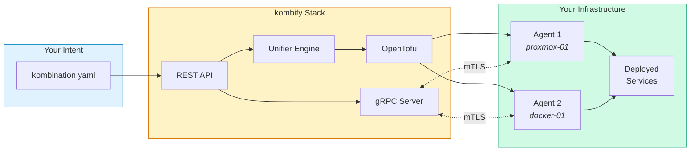
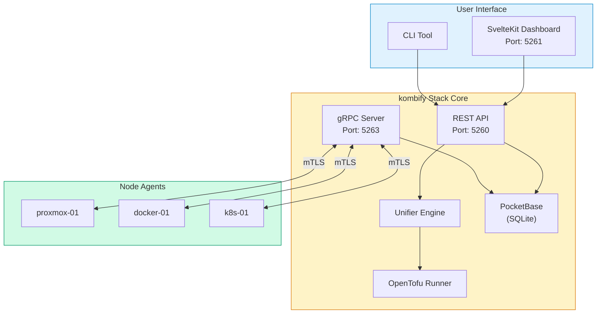
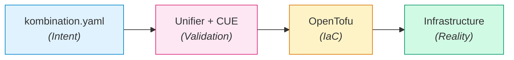

# kombify Stack

**kombify Stack** is an open-source infrastructure control plane that manages your homelab nodes through a unified spec-driven workflow.

<Card title="What is kombify Stack?" icon="circle-info">
  Stack orchestrates your infrastructure by reading a single `kombination.yaml` file, validating it with CUE schemas, and deploying using OpenTofu. It manages both local servers and cloud VPS through lightweight gRPC agents.
</Card>

## Key Features

<CardGroup cols={2}>
  <Card title="Spec-Driven" icon="file-code">
    Define your infrastructure in YAML — Stack handles validation, generation, and deployment
  </Card>
  <Card title="Agent-Based" icon="robot">
    Lightweight agents connect your nodes to the control plane via secure mTLS
  </Card>
  <Card title="Multi-Engine" icon="gears">
    Support for Proxmox, Docker, Kubernetes, and cloud providers
  </Card>
  <Card title="Open Source" icon="code-branch">
    MIT licensed core with optional enterprise features
  </Card>
</CardGroup>

## How It Works



<Steps>
  <Step title="Define" icon="file-code">
    Write your desired state in `kombination.yaml`
  </Step>
  <Step title="Validate" icon="check">
    Stack validates against StackKit CUE schemas
  </Step>
  <Step title="Generate" icon="code">
    OpenTofu code is generated automatically
  </Step>
  <Step title="Deploy" icon="rocket">
    Infrastructure is provisioned via agents
  </Step>
</Steps>

## Architecture



### Service Ports

| Service | Port | Protocol | Description |
|---------|------|----------|-------------|
| Core API | 5260 | HTTP | REST API + PocketBase Admin |
| Frontend | 5261 | HTTP | SvelteKit Dashboard |
| gRPC | 5263 | gRPC/mTLS | Agent communication |

### Tech Stack

| Component | Technology | Purpose |
|-----------|------------|---------|
| **Backend** | Go 1.24+ | Core services and agents |
| **Frontend** | SvelteKit 2.x | Modern reactive UI |
| **Database** | PocketBase (SQLite) | Embedded state management |
| **IaC Engine** | OpenTofu 1.6+ | Infrastructure provisioning |
| **Validation** | CUE 0.15+ | Type-safe configuration |
| **Networking** | gRPC + mTLS | Secure agent communication |

## Core Principles

### 1. Spec-Driven Flow



User intent is **never** automatically modified. All transformations create separate artifacts.

### 2. Single-Stack Architecture

<Note>
  **1 kombify Stack = 1 Homelab**
</Note>

- One instance manages exactly one homelab
- A homelab can include multiple physical servers (nodes)
- Multi-homelab scenarios require multiple Stack instances

### 3. Interface-First Design

Business logic changes begin with `pkg/core` interfaces. Implementations follow the contracts.

## Quick Example

```yaml kombination.yaml
version: "1.0"
stackkit: base-homelab

meta:
  name: my-homelab
  domain: home.example.com

nodes:
  - name: proxmox-01
    type: hypervisor
    connection:
      host: 192.168.1.100
      user: root
      ssh_key: ~/.ssh/id_ed25519

services:
  - traefik      # Reverse proxy with auto-SSL
  - authelia     # Single sign-on
  - homepage     # Dashboard
  - immich       # Photo management
```

```bash
# Validate configuration
kombify validate

# Preview changes
kombify plan

# Apply to infrastructure
kombify apply
```

## Installation Options

<CardGroup cols={3}>
  <Card title="Docker" icon="docker" href="/stack/install/docker">
    Fastest way to get started — single `docker compose up`
  </Card>
  <Card title="Kubernetes" icon="dharmachakra" href="/stack/install/kubernetes">
    Production-ready Helm chart with HA support
  </Card>
  <Card title="Bare Metal" icon="server" href="/stack/install/bare-metal">
    Install directly on Linux servers
  </Card>
</CardGroup>

## Next Steps

<Columns cols={2}>
  <Card title="Quick Start" icon="rocket" href="/stack/quickstart">
    Deploy your first stack in 10 minutes
  </Card>
  <Card title="Architecture Deep Dive" icon="sitemap" href="/stack/architecture">
    Understand the Unifier, agents, and data flow
  </Card>
</Columns>

---

## Getting Help

<Columns cols={3}>
  <Card title="Troubleshooting" icon="wrench" href="/stack/troubleshooting">
    Common issues and solutions
  </Card>
  <Card title="Discord" icon="discord" href="https://discord.gg/kombify">
    Real-time community support
  </Card>
  <Card title="GitHub" icon="github" href="https://github.com/kombify/stack">
    Report issues and contribute
  </Card>
</Columns>
