# kombify Stack

**kombify Stack** is your homelab's control center. Tell it what you want, and it figures out how to make it happen — from a single server to a multi-node cluster.

## The simple version

<Card title="What does Stack do?" icon="lightbulb">
  Imagine you want a private photo cloud for your family. Instead of spending days researching Docker, reverse proxies, and SSL certificates, you write a simple configuration file describing *what* you want. Stack handles *everything else* — validation, setup, deployment, and ongoing maintenance.
</Card>

```yaml kombination.yaml
# This is all you write
stackkit: base-homelab
services:
  - traefik    # Handles web traffic
  - immich     # Your photo cloud
```

Stack transforms this into hundreds of lines of configuration and deploys it to your server automatically.

<Accordion title="🔧 Technical details" icon="code">
  Stack is a Go-based orchestration engine that:
  - Reads your `kombination.yaml` specification
  - Validates it against CUE schemas from StackKits
  - Generates OpenTofu/Docker configurations
  - Deploys via mTLS-secured gRPC agents on your nodes
  - Continuously monitors for drift between desired and actual state
  
  **Tech stack:** Go 1.24+, PocketBase (SQLite), OpenTofu, CUE, gRPC with mTLS
</Accordion>

## Key features

<CardGroup cols={2}>
  <Card title="Write once, deploy anywhere" icon="file-code">
    Your entire homelab configuration lives in one YAML file — version-controlled, shareable, reproducible
  </Card>
  <Card title="Test before you break things" icon="flask">
    Simulate deployments in Docker before touching real hardware
  </Card>
  <Card title="Works with what you have" icon="arrows-rotate">
    Already running servers? Stack discovers them and lets you adopt gradually
  </Card>
  <Card title="Self-healing" icon="shield-check">
    Detects when reality drifts from your configuration and can fix it automatically
  </Card>
</CardGroup>

## How it works

```mermaid
flowchart LR
    subgraph You["👤 You"]
        YAML["<b>kombination.yaml</b><br/>Your wishlist"]
    end

    subgraph Stack["⚙️ kombify Stack"]
        direction TB
        Wizard["Wizard<br/><i>or manual edit</i>"]
        Validate["Validate<br/><i>against rules</i>"]
        Generate["Generate<br/><i>real configs</i>"]
        Deploy["Deploy<br/><i>to servers</i>"]
        
        Wizard --> Validate --> Generate --> Deploy
    end

    subgraph Result["🏠 Your Homelab"]
        S1["📸 Immich<br/>Photo Cloud"]
        S2["🔐 Authelia<br/>Login Portal"]
        S3["📊 Homepage<br/>Dashboard"]
    end

    YAML --> Wizard
    Deploy --> Result

    style You fill:#dbeafe,stroke:#2563eb
    style Stack fill:#fef3c7,stroke:#d97706
    style Result fill:#d1fae5,stroke:#059669
```



<Steps>
  <Step title="Describe what you want" icon="wand-magic-sparkles">
    Use the Easy Wizard or write a simple YAML file — no need to understand Docker, networking, or certificates
  </Step>
  <Step title="Stack validates your choices" icon="check">
    Your configuration is checked against proven patterns to catch errors before deployment
  </Step>
  <Step title="Infrastructure code is generated" icon="code">
    Stack creates all the complex configuration files you'd otherwise write by hand
  </Step>
  <Step title="Services are deployed" icon="rocket">
    Lightweight agents on your servers apply the changes and report back
  </Step>
</Steps>

<Accordion title="🔧 Under the hood: The complete data flow" icon="diagram-project">


**Data flow explained:**
1. **Input** — Configuration enters via Web UI, CLI, or direct YAML file
2. **Unifier Engine** — Parses, validates against CUE schemas, resolves dependencies, generates OpenTofu code
3. **State Management** — PocketBase stores stack state, job history, and agent registry
4. **Agent Communication** — gRPC with mutual TLS ensures secure, authenticated communication
5. **Deployment** — Agents execute changes on their respective nodes

</Accordion>

## Architecture at a glance

```mermaid
graph TB
    subgraph Users["Users"]
        Admin["👤 Admin"]
        Dev["👤 Developer"]
    end

    subgraph Stack["kombify Stack"]
        Dashboard["🖥️ Dashboard<br/><small>SvelteKit</small>"]
        API["🔌 API<br/><small>Go + PocketBase</small>"]
        Agents["🤖 Agents<br/><small>Go + gRPC</small>"]
    end

    subgraph Nodes["Your Servers"]
        N1["🖥️ Server 1"]
        N2["🖥️ Server 2"]
        N3["🖥️ Server 3"]
    end

    Users --> Dashboard
    Dashboard --> API
    API <-->|"Secure tunnel"| Agents
    Agents --> Nodes

    style Users fill:#dbeafe,stroke:#2563eb
    style Stack fill:#fef3c7,stroke:#d97706
    style Nodes fill:#d1fae5,stroke:#059669
```



### Ports and services

| Service | Port | What it does |
|---------|------|--------------|
| **Dashboard** | 5261 | Web interface for managing your homelab |
| **API** | 5260 | REST API + PocketBase admin panel |
| **gRPC** | 5263 | Secure communication with agents |

<Accordion title="🔧 Technical specifications" icon="microchip">

| Component | Technology | Purpose |
|-----------|------------|---------|
| **Backend** | Go 1.24+ | Core services, agents, CLI |
| **Frontend** | SvelteKit 2.x | Modern reactive dashboard |
| **Database** | PocketBase (SQLite) | Embedded state management |
| **IaC Engine** | OpenTofu 1.6+ | Infrastructure provisioning |
| **Validation** | CUE 0.15+ | Type-safe schema validation |
| **Networking** | gRPC + mTLS | Encrypted agent communication |

**Why these choices?**
- **Go** — Single binary, low memory, cross-platform
- **PocketBase** — Zero-config embedded database with auth
- **OpenTofu** — Open-source Terraform fork, battle-tested
- **CUE** — Catch configuration errors before deployment
- **mTLS** — Every connection is encrypted and authenticated

</Accordion>

## Core principles

### 1. Your intent stays untouched

```mermaid
flowchart LR
    Intent["📝 Your File<br/><i>kombination.yaml</i>"]
    Generated["⚙️ Generated<br/><i>docker-compose.yml<br/>traefik.yml<br/>...</i>"]
    Infra["🖥️ Running<br/><i>Your servers</i>"]

    Intent -->|"read only"| Generated
    Generated -->|"deployed"| Infra

    style Intent fill:#dbeafe,stroke:#2563eb
    style Generated fill:#fef3c7,stroke:#d97706
    style Infra fill:#d1fae5,stroke:#059669
```



Stack never modifies your configuration file. All transformations create separate artifacts that you can inspect.

### 2. One Stack = one homelab

<Note>
  A single kombify Stack instance manages one homelab. That homelab can include multiple physical servers (nodes), but they belong to one logical unit.
</Note>

Need multiple homelabs? Use [kombify Sphere](/sphere/overview) to manage several Stack instances from one dashboard.

### 3. Brownfield-friendly

Already have servers running? Stack doesn't force you to start from scratch:

```mermaid
flowchart LR
    subgraph Existing["Existing Setup"]
        E1["🖥️ NAS Server<br/><i>unmanaged</i>"]
        E2["🖥️ Docker Host<br/><i>unmanaged</i>"]
    end

    subgraph Discovery["Stack Discovery"]
        Scan["🔍 Scan network"]
        Classify["📋 Classify devices"]
    end

    subgraph Adoption["Gradual Adoption"]
        M1["✅ Docker Host<br/><i>managed</i>"]
        U1["📋 NAS Server<br/><i>monitored only</i>"]
    end

    Existing --> Scan
    Scan --> Classify
    Classify --> Adoption

    style Existing fill:#fee2e2,stroke:#dc2626
    style Discovery fill:#fef3c7,stroke:#d97706
    style Adoption fill:#d1fae5,stroke:#059669
```



- **Managed** — Stack fully controls configuration and deployment
- **Unmanaged** — Stack sees the device but doesn't touch it
- You can gradually move devices from unmanaged to managed as you're ready

## Quick Example

```yaml kombination.yaml
version: "1.0"
stackkit: base-homelab

meta:
  name: my-homelab
  domain: home.example.com

nodes:
  - name: proxmox-01
    type: hypervisor
    connection:
      host: 192.168.1.100
      user: root
      ssh_key: ~/.ssh/id_ed25519

services:
  - traefik      # Reverse proxy with auto-SSL
  - authelia     # Single sign-on
  - homepage     # Dashboard
  - immich       # Photo management
```

```bash
# Validate configuration
kombify validate

# Preview changes
kombify plan

# Apply to infrastructure
kombify apply
```

## Installation Options

<CardGroup cols={3}>
  <Card title="Docker" icon="docker" href="/stack/install/docker">
    Fastest way to get started — single `docker compose up`
  </Card>
  <Card title="Kubernetes" icon="dharmachakra" href="/stack/install/kubernetes">
    Production-ready Helm chart with HA support
  </Card>
  <Card title="Bare Metal" icon="server" href="/stack/install/bare-metal">
    Install directly on Linux servers
  </Card>
</CardGroup>

## Next Steps

<Columns cols={2}>
  <Card title="Quick Start" icon="rocket" href="/stack/quickstart">
    Deploy your first stack in 10 minutes
  </Card>
  <Card title="Architecture Deep Dive" icon="sitemap" href="/stack/architecture">
    Understand the Unifier, agents, and data flow
  </Card>
</Columns>

---

## Getting Help

<Columns cols={3}>
  <Card title="Troubleshooting" icon="wrench" href="/stack/troubleshooting">
    Common issues and solutions
  </Card>
  <Card title="Discord" icon="discord" href="https://discord.gg/kombify">
    Real-time community support
  </Card>
  <Card title="GitHub" icon="github" href="https://github.com/kombify/stack">
    Report issues and contribute
  </Card>
</Columns>
