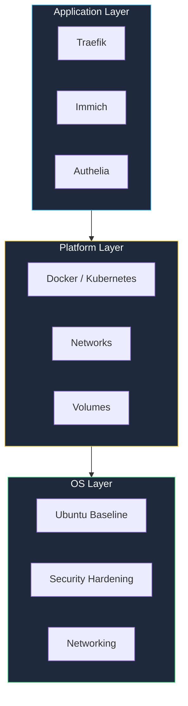

StackKits use CUE as their schema language. Understanding this architecture helps you customize kits and create your own.

## Why CUE?

CUE (Configure, Unify, Execute) provides something that YAML and JSON Schema cannot: **types, constraints, and composition** in a single language.

```cue
// CUE catches errors that YAML cannot
#Service: {
    name:    string & =~"^[a-z][a-z0-9-]*$"
    port:    int & >0 & <65536
    enabled: bool | *true  // default: true
}
```

**Key advantages:**
- **Type safety** — Catch configuration errors before deployment
- **Composable** — Kits can extend and override each other
- **Defaults** — Sensible defaults reduce configuration burden
- **Constraints** — Express rules like "port must be > 1024" or "domain must be valid"

## Three-layer architecture

Every StackKit follows a three-layer model:



1. **OS Layer** — Base operating system configuration, security hardening, networking
2. **Platform Layer** — Container runtime (Docker or Kubernetes), standard networks, volumes
3. **Application Layer** — Modular services that users select and configure

## How validation works

When you run `kombify validate`, your `kombination.yaml` is checked against the CUE schema of your selected StackKit:

<Steps>
  <Step title="Schema loading">
    The StackKit's CUE schema is loaded, including all layer definitions and constraints.
  </Step>
  <Step title="Unification">
    Your configuration is unified with the schema. CUE checks that every value satisfies its type and constraints.
  </Step>
  <Step title="Default resolution">
    Missing optional values are filled with CUE defaults.
  </Step>
  <Step title="Error reporting">
    Any validation errors are reported with clear messages indicating what went wrong and where.
  </Step>
</Steps>

## Extending kits

StackKits are designed to be extended. You can:

- **Override defaults** — Change any default value in your `kombination.yaml`
- **Add services** — Include additional services not in the base kit
- **Customize layers** — Modify OS or platform settings for your environment

## Further reading

<CardGroup cols={2}>
  <Card title="Spec-driven design" icon="file-code" href="/concepts/spec-driven">
    The philosophy behind declarative infrastructure
  </Card>
  <Card title="Available kits" icon="boxes-stacked" href="/stackkits/overview">
    Browse the StackKit catalog
  </Card>
</CardGroup>
