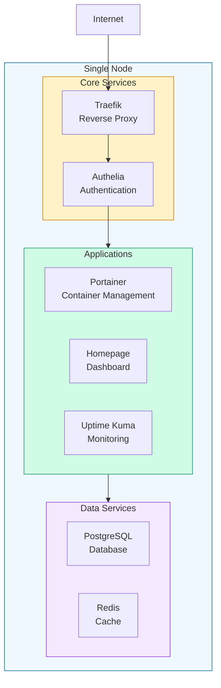
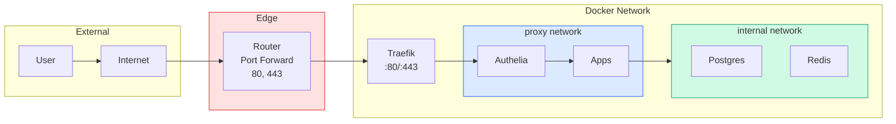

# base-homelab StackKit

The **base-homelab** StackKit is designed for beginners and single-node setups. It provides a carefully curated set of services that work well together out of the box.

## Overview



## Included Services

<CardGroup cols={2}>
  <Card title="Traefik" icon="route">
    **Reverse Proxy & SSL**
    
    Automatic HTTPS certificates and routing for all services.
  </Card>
  <Card title="Authelia" icon="lock">
    **Single Sign-On**
    
    Secure authentication for all protected services.
  </Card>
  <Card title="Portainer" icon="docker">
    **Container Management**
    
    Web UI to manage your Docker containers.
  </Card>
  <Card title="Homepage" icon="house">
    **Dashboard**
    
    Beautiful landing page for your homelab.
  </Card>
  <Card title="Uptime Kuma" icon="heart-pulse">
    **Monitoring**
    
    Track the health of your services.
  </Card>
  <Card title="PostgreSQL" icon="database">
    **Database**
    
    Reliable data storage for your applications.
  </Card>
</CardGroup>

## Requirements

| Resource | Minimum | Recommended |
|----------|---------|-------------|
| **CPU** | 2 cores | 4 cores |
| **RAM** | 4 GB | 8 GB |
| **Storage** | 20 GB | 50 GB SSD |
| **OS** | Debian 11+ / Ubuntu 22.04+ | - |
| **Docker** | 24.0+ | Latest |

## Quick Start

<Steps>
  <Step title="Create your spec file">
    ```yaml kombination.yaml
    stackkit: base-homelab
    
    # Your domain configuration
    domain: homelab.local
    email: you@example.com
    
    # SSL certificate provider
    ssl:
      provider: letsencrypt  # or "selfsigned" for local
      
    # Enable the services you want
    services:
      traefik:
        enabled: true
        dashboard: true
        
      authelia:
        enabled: true
        
      portainer:
        enabled: true
        
      homepage:
        enabled: true
        
      uptime-kuma:
        enabled: true
    ```
  </Step>
  
  <Step title="Validate your configuration">
    ```bash
    kombify validate
    ```
    
    Expected output:
    ```
    ✓ Configuration valid
    ✓ All service dependencies satisfied
    ✓ No port conflicts detected
    
    Ready to deploy!
    ```
  </Step>
  
  <Step title="Generate deployment files">
    ```bash
    kombify generate
    ```
    
    This creates:
    - `docker-compose.yml`
    - `traefik/` configuration directory
    - `authelia/configuration.yml`
  </Step>
  
  <Step title="Deploy">
    ```bash
    docker compose up -d
    ```
  </Step>
</Steps>

## Configuration Reference

### Domain Settings

```yaml
# Required
domain: homelab.local

# Optional email for Let's Encrypt
email: you@example.com

# Enable wildcard subdomains
wildcard: true
```

### SSL Options

<Tabs>
  <Tab title="Let's Encrypt (Production)">
    ```yaml
    ssl:
      provider: letsencrypt
      email: you@example.com
    ```
    Automatic certificate renewal for public domains.
  </Tab>
  <Tab title="Self-Signed (Local)">
    ```yaml
    ssl:
      provider: selfsigned
    ```
    For local development or `.local` domains.
  </Tab>
  <Tab title="Custom Certificate">
    ```yaml
    ssl:
      provider: custom
      cert_file: /path/to/cert.pem
      key_file: /path/to/key.pem
    ```
  </Tab>
</Tabs>

### Service Configuration

#### Traefik

```yaml
services:
  traefik:
    enabled: true
    dashboard: true              # Enable web dashboard
    dashboard_auth: true         # Protect with Authelia
    ports:
      http: 80
      https: 443
    log_level: INFO
```

#### Authelia

```yaml
services:
  authelia:
    enabled: true
    default_policy: two_factor   # one_factor, two_factor, deny
    session_duration: 1h
    totp:
      issuer: "My Homelab"
```

#### Portainer

```yaml
services:
  portainer:
    enabled: true
    edition: ce                  # ce (Community) or be (Business)
    agent_mode: false           # true for multi-node
```

## Network Architecture



## File Structure

After running `kombify generate`:

```
.
├── kombination.yaml          # Your configuration
├── docker-compose.yml        # Generated compose file
├── traefik/
│   ├── traefik.yml          # Static configuration
│   └── dynamic/
│       └── routes.yml       # Dynamic routes
├── authelia/
│   └── configuration.yml    # Authelia config
└── data/                    # Persistent volumes
    ├── postgres/
    ├── authelia/
    └── portainer/
```

## Adding Services

To add optional services:

<AccordionGroup>
  <Accordion title="Add Nextcloud">
    ```yaml
    services:
      # ... existing services
      
      nextcloud:
        enabled: true
        storage_path: /mnt/data/nextcloud
        max_upload_size: 10G
    ```
  </Accordion>
  
  <Accordion title="Add Home Assistant">
    ```yaml
    services:
      home-assistant:
        enabled: true
        zigbee:
          enabled: true
          device: /dev/ttyUSB0
    ```
  </Accordion>
  
  <Accordion title="Add Plex">
    ```yaml
    services:
      plex:
        enabled: true
        claim_token: claim-xxxx   # Get from plex.tv/claim
        media_paths:
          movies: /mnt/media/movies
          tv: /mnt/media/tv
    ```
  </Accordion>
</AccordionGroup>

## Constraints

The base-homelab StackKit enforces these rules:

| Constraint | Value | Reason |
|------------|-------|--------|
| Max nodes | 1 | Single-node design |
| Traefik required | Yes | All services need routing |
| Network mode | bridge | Simplest networking |

<Warning>
  If you need more than 1 node, use the [ha-homelab](/stackkits/kits/ha-homelab) StackKit instead.
</Warning>

## Upgrading to ha-homelab

When you outgrow base-homelab:

```bash
# Update your kombination.yaml
stackkit: ha-homelab  # Changed from base-homelab

# Add the second node
nodes:
  - name: node-1
    ip: 192.168.1.10
  - name: node-2
    ip: 192.168.1.11

# Regenerate
kombify generate
```

## Troubleshooting

<AccordionGroup>
  <Accordion title="Services not accessible">
    1. Check Traefik logs: `docker logs traefik`
    2. Verify DNS resolves to your server
    3. Check firewall allows ports 80/443
  </Accordion>
  
  <Accordion title="SSL certificate errors">
    - For Let's Encrypt: Ensure domain is publicly accessible
    - For self-signed: Add exception in browser or use `curl -k`
  </Accordion>
  
  <Accordion title="Authelia login loop">
    1. Clear browser cookies
    2. Check Authelia logs: `docker logs authelia`
    3. Verify session domain matches your domain
  </Accordion>
</AccordionGroup>

## Next Steps

<CardGroup cols={2}>
  <Card title="Add More Services" icon="plus" href="/guides/adding-services">
    Expand your homelab with additional applications
  </Card>
  <Card title="Backup Strategy" icon="cloud-arrow-up" href="/guides/backups">
    Protect your data with automated backups
  </Card>
</CardGroup>
