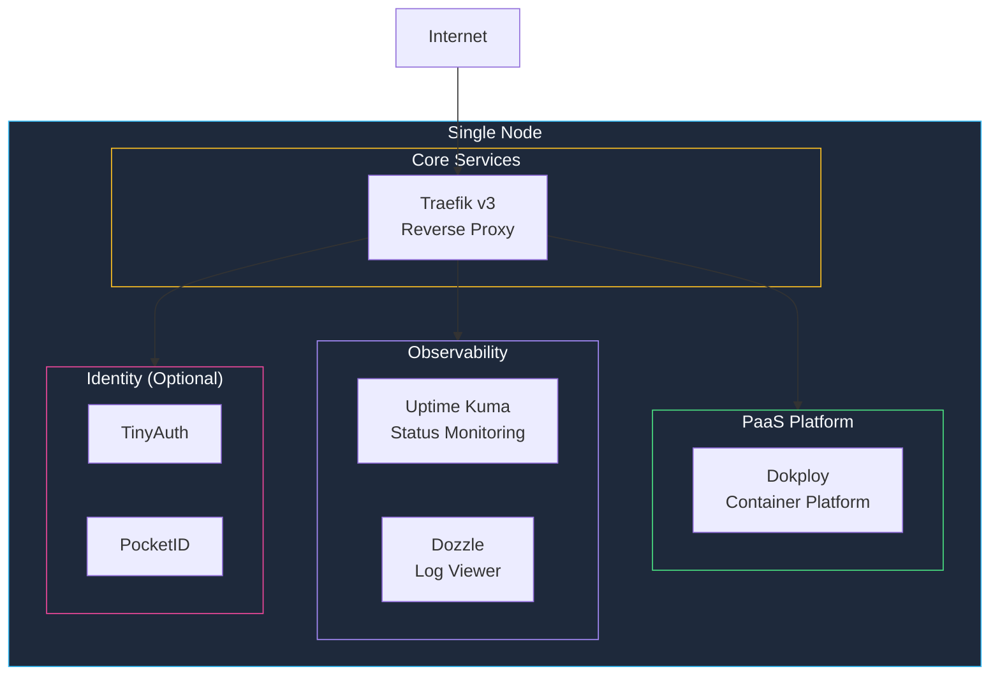

The **base-homelab** StackKit is designed for **professional single-server deployments**. It provides a carefully curated set of services that work well together out of the box, optimized for reliability and simplicity on a standalone node. This solution is built for both efficiency and complexity management on a single host, making it suitable for any skill level requiring a standalone architecture.

<Note>
  base-homelab follows an IaC-first approach using OpenTofu for infrastructure provisioning and Docker Compose for service deployment.
</Note>

## Overview



## Available variants

Choose a variant that matches your use case:

<Tabs>
  <Tab title="Default (Dokploy)">
    The standard variant for users **without** their own domain. Port-based access.
    
    | Service | Description |
    |---------|-------------|
    | **Traefik v3** | Reverse proxy with auto-SSL |
    | **Dokploy** | Container platform (like Vercel for your homelab) |
    | **Uptime Kuma** | Status monitoring with public pages |
    | **Dozzle** | Real-time Docker log viewer |
    | **whoami** | Debug/test service |
    
    ```yaml kombination.yaml
    stackkit: base-homelab
    variant: default
    ```
  </Tab>
  <Tab title="Beszel">
    Focused on **server metrics** instead of uptime monitoring.
    
    | Service | Description |
    |---------|-------------|
    | **Traefik v3** | Reverse proxy with auto-SSL |
    | **Dokploy** | Container platform |
    | **Beszel** | Lightweight server metrics (CPU/RAM/disk) |
    | **Dozzle** | Real-time Docker log viewer |
    | **whoami** | Debug/test service |
    
    ```yaml kombination.yaml
    stackkit: base-homelab
    variant: beszel
    ```
  </Tab>
  <Tab title="Minimal">
    Lightweight classic stack with **direct Docker management**.
    
    | Service | Description |
    |---------|-------------|
    | **Traefik v3** | Reverse proxy with auto-SSL |
    | **Dockge** | Docker Compose stack manager |
    | **Portainer** | Container management UI |
    | **Netdata** | Real-time performance monitoring |
    | **Dozzle** | Real-time Docker log viewer |
    
    ```yaml kombination.yaml
    stackkit: base-homelab
    variant: minimal
    ```
  </Tab>
</Tabs>

## Included services

<CardGroup cols={2}>
  <Card title="Traefik v3" icon="route">
    **Reverse Proxy & SSL**
    
    Automatic HTTPS certificates (Let's Encrypt), routing, and load balancing for all services.
  </Card>
  <Card title="Dokploy" icon="rocket">
    **Container Platform**
    
    Self-hosted PaaS like Vercel/Railway. Deploy from Git, manage databases, and scale apps.
  </Card>
  <Card title="Coolify" icon="cloud">
    **Alternative PaaS**
    
    Open-source alternative to Heroku. Best for users with their own domain.
  </Card>
  <Card title="Uptime Kuma" icon="heart-pulse">
    **Status Monitoring**
    
    Monitor your services with beautiful status pages and alerts.
  </Card>
  <Card title="Beszel" icon="chart-line">
    **Server Metrics**
    
    Lightweight resource monitoring (CPU, RAM, disk, network).
  </Card>
  <Card title="Dozzle" icon="list">
    **Log Viewer**
    
    Real-time Docker container log viewer in your browser.
  </Card>
</CardGroup>

### Optional identity services

<CardGroup cols={2}>
  <Card title="TinyAuth" icon="key">
    **Lightweight Auth Proxy**
    
    Simple authentication middleware for protecting services with basic auth or OAuth2.
  </Card>
  <Card title="PocketID" icon="id-card">
    **OIDC Provider**
    
    Full-featured OpenID Connect provider for single sign-on across your homelab.
  </Card>
</CardGroup>

## Requirements

| Resource | Low | Standard | High |
|----------|-----|----------|------|
| **CPU** | 2 cores | 4 cores | 8 cores |
| **RAM** | 4 GB | 8 GB | 16 GB |
| **Storage** | 20 GB SSD | 50 GB SSD | 100+ GB SSD |
| **Variant** | Forces minimal | Any | Adds Prometheus/Grafana |

### Supported operating systems

| OS | Version | Status |
|----|---------|--------|
| Ubuntu | 24.04 LTS | ✅ Recommended |
| Ubuntu | 22.04 LTS | ✅ Supported |
| Debian | 12 (Bookworm) | ✅ Supported |

## Quick start

<Steps>
  <Step title="Create your spec file">
    ```yaml kombination.yaml
    stackkit: base-homelab
    variant: default
    
    # Node configuration
    nodes:
      - name: main-server
        type: local  # or vps, cloud
        connection:
          host: 192.168.1.100
          user: root
          ssh_key: ~/.ssh/id_ed25519
    
    # Domain (optional - enables auto-SSL)
    domain: homelab.example.com
    email: you@example.com
    
    # Service toggles
    services:
      dokploy:
        enabled: true
      uptime_kuma:
        enabled: true
      dozzle:
        enabled: true
    ```
  </Step>
  
  <Step title="Validate configuration">
    ```bash
    stackkit validate
    ```
    
    Output:
    ```
    ✓ StackKit: base-homelab (v1.0.0)
    ✓ Variant: default
    ✓ OS: ubuntu-24
    ✓ Compute tier: standard
    ✓ All service dependencies satisfied
    ✓ No port conflicts detected
    
    Ready to deploy!
    ```
  </Step>
  
  <Step title="Generate infrastructure code">
    ```bash
    stackkit generate
    ```
    
    Creates:
    - `tofu/main.tf` — OpenTofu configuration
    - `tofu/variables.tf` — Variables
    - `docker-compose.yml` — Service definitions
    - `traefik/` — Reverse proxy config
  </Step>
  
  <Step title="Preview and apply">
    ```bash
    stackkit plan   # Preview changes
    stackkit apply  # Deploy
    ```
  </Step>
</Steps>

## Configuration reference

### Node settings

```yaml
nodes:
  - name: main-server
    type: local              # local, vps, cloud
    os: ubuntu-24            # ubuntu-24, ubuntu-22, debian-12
    
    connection:
      host: 192.168.1.100
      port: 22
      user: root
      ssh_key: ~/.ssh/id_ed25519
      # OR password: ${SSH_PASSWORD}
    
    resources:               # Optional — auto-detected
      cpu: 4
      memory_gb: 8
      disk_gb: 50
```

### Domain and SSL

<Tabs>
  <Tab title="With domain">
    ```yaml
    domain: homelab.example.com
    email: you@example.com
    
    ssl:
      provider: letsencrypt
      # Optional: wildcard for *.homelab.example.com
      wildcard: true
    ```
  </Tab>
  <Tab title="Local only">
    ```yaml
    # No domain — access via IP:port
    # Dokploy will be available at http://IP:3000
    
    ssl:
      provider: selfsigned
    ```
  </Tab>
</Tabs>

### Service configuration

```yaml
services:
  traefik:
    enabled: true           # Always required
    dashboard: true         # Enable Traefik UI
    log_level: INFO
    
  dokploy:
    enabled: true
    # Dokploy runs on port 3000 by default
    
  uptime_kuma:
    enabled: true
    public_page: true       # Enable public status page
    
  dozzle:
    enabled: true
    remote_hosts: []        # Add remote Docker hosts
    
  # Optional identity
  tinyauth:
    enabled: false
    
  pocketid:
    enabled: false
```

## Deployment modes

base-homelab supports two deployment modes:

| Mode | Engine | When to use |
|------|--------|-------------|
| **Simple** | OpenTofu only | Quick setup, one-time deployment |
| **Advanced** | OpenTofu + Terramate | Drift detection, Day-2 operations |

Advanced mode is automatically enabled when:
- `driftDetection.enabled: true`
- `autoUpdates.enabled: true`
- `compliance.required: true`

```yaml
# Enable advanced mode
operations:
  driftDetection:
    enabled: true
    schedule: "0 */6 * * *"  # Every 6 hours
  autoUpdates:
    enabled: true
    schedule: "0 4 * * 0"    # Sunday 4am
```

## File structure

After `stackkit generate`:

```
.
├── kombination.yaml          # Your configuration
├── tofu/
│   ├── main.tf              # Infrastructure definition
│   ├── variables.tf         # Input variables
│   ├── outputs.tf           # Output values
│   └── terraform.tfvars     # Generated values
├── docker-compose.yml        # Service definitions
├── traefik/
│   ├── traefik.yml          # Static config
│   └── dynamic/
│       └── routes.yml       # Dynamic routing
└── data/                    # Persistent volumes
```

## Constraints

The base-homelab StackKit enforces these rules:

| Constraint | Value | Reason |
|------------|-------|--------|
| Max nodes | 1 | Single-node design |
| Traefik required | Yes | All services need routing |
| Min RAM | 4 GB | Services won't fit in less |

<Warning>
  If you need more than 1 node, consider:
  - [modern-homelab](/stackkits/kits/modern-homelab) — Multi-node with Headscale VPN
  - [ha-homelab](/stackkits/kits/ha-homelab) — High-availability k3s cluster
</Warning>

## Troubleshooting

<AccordionGroup>
  <Accordion title="Services not accessible">
    1. Check Traefik is running: `docker logs traefik`
    2. Verify DNS resolves to your server
    3. Check firewall allows ports 80/443
    4. For local: Use `http://IP:PORT` instead of domain
  </Accordion>
  
  <Accordion title="SSL certificate errors">
    - **Let's Encrypt**: Domain must be publicly accessible
    - **Self-signed**: Add browser exception or use `curl -k`
    - Check rate limits at https://letsencrypt.org/docs/rate-limits/
  </Accordion>
  
  <Accordion title="Dokploy not starting">
    1. Check port 3000 is not in use: `netstat -tlnp | grep 3000`
    2. Verify Docker socket permissions
    3. Check logs: `docker logs dokploy`
  </Accordion>
  
  <Accordion title="Low disk space warnings">
    1. Prune unused images: `docker image prune -a`
    2. Check volume sizes: `docker system df`
    3. Consider adding external storage
  </Accordion>
</AccordionGroup>

## Next steps

<CardGroup cols={2}>
  <Card title="CUE basics" icon="code" href="/stackkits/cue-basics">
    Learn how to customize StackKit schemas
  </Card>
  <Card title="Create custom StackKit" icon="plus" href="/stackkits/creating-custom">
    Build your own StackKit from scratch
  </Card>
</CardGroup>
