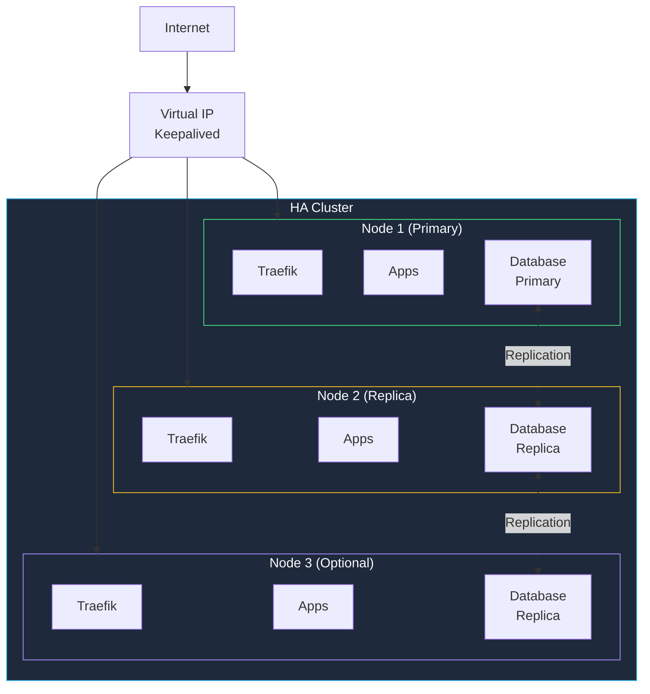
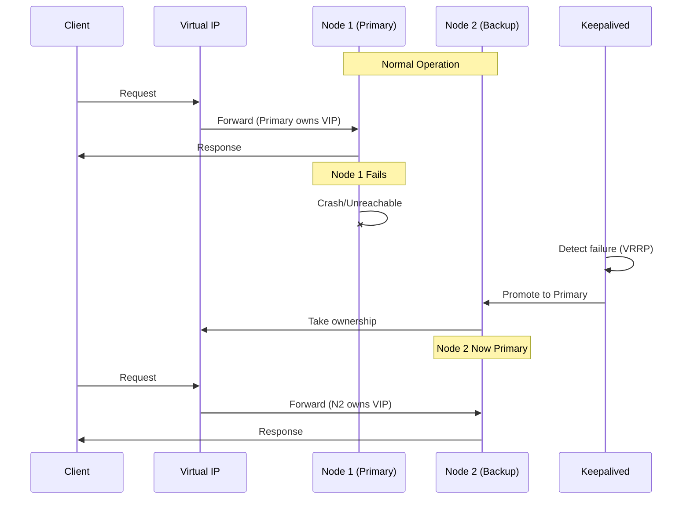
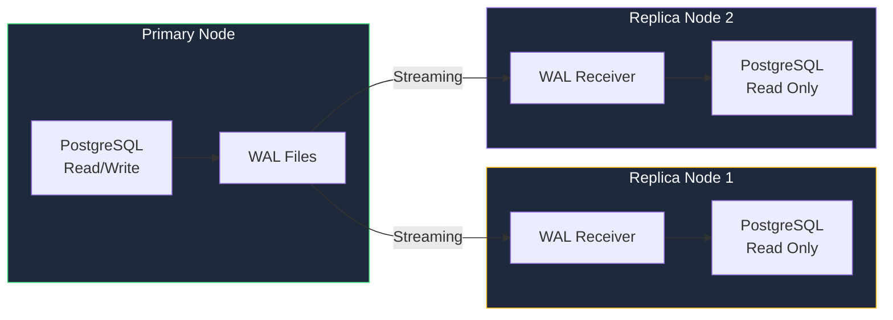
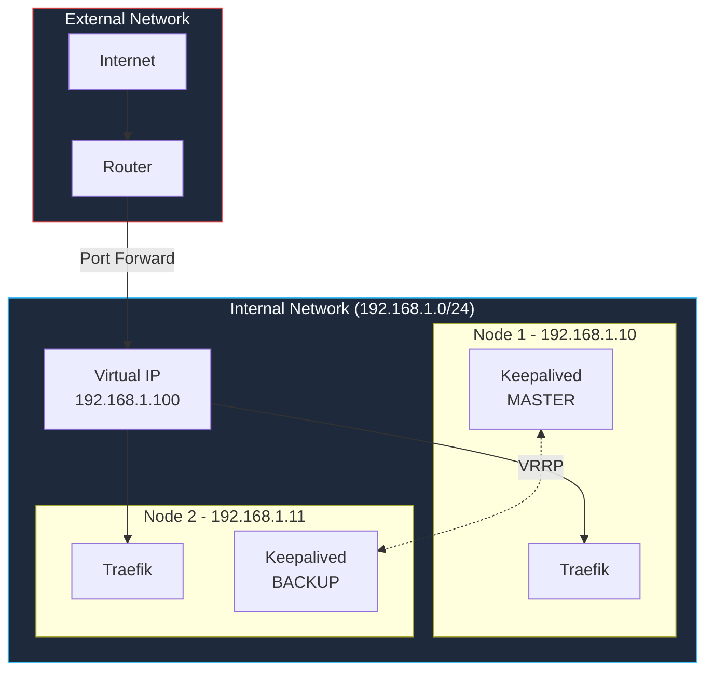

The **ha-homelab** StackKit provides high-availability infrastructure for homelabs that can't afford downtime. It supports 2-5 nodes with automatic failover.

## Overview



## Key Features

<CardGroup cols={3}>
  <Card title="Auto Failover" icon="rotate">
    Automatic failover when primary node fails
  </Card>
  <Card title="Load Balancing" icon="scale-balanced">
    Distribute traffic across healthy nodes
  </Card>
  <Card title="Data Replication" icon="clone">
    Synchronous database replication
  </Card>
</CardGroup>

## Requirements

| Resource | Per Node | Total (2 nodes) |
|----------|----------|-----------------|
| **CPU** | 2 cores | 4 cores |
| **RAM** | 8 GB | 16 GB |
| **Storage** | 50 GB SSD | 100 GB |
| **Network** | 1 Gbps | Same subnet |

## Architecture

### Failover Mechanism



### Database Replication



## Quick Start

<Steps>
  <Step title="Define your nodes">
    ```yaml kombination.yaml
    stackkit: ha-homelab
    
    domain: homelab.local
    email: you@example.com
    
    nodes:
      - name: node-1
        ip: 192.168.1.10
        role: primary
        
      - name: node-2
        ip: 192.168.1.11
        role: replica
    
    # Virtual IP for failover
    failover:
      strategy: keepalived
      virtual_ip: 192.168.1.100
      interface: eth0
    ```
  </Step>
  
  <Step title="Configure services">
    ```yaml
    services:
      traefik:
        enabled: true
        replicas: all         # Run on all nodes
        
      authelia:
        enabled: true
        replicas: all
        
      postgres:
        enabled: true
        mode: ha              # Enable replication
        synchronous: true     # Zero data loss
        
      redis:
        enabled: true
        mode: sentinel        # Redis Sentinel for HA
    ```
  </Step>
  
  <Step title="Validate and generate">
    ```bash
    kombify validate
    kombify generate
    ```
  </Step>
  
  <Step title="Deploy to all nodes">
    ```bash
    # Deploy to primary first
    kombify deploy --node node-1
    
    # Then replicas
    kombify deploy --node node-2
    ```
  </Step>
</Steps>

## Configuration Reference

### Failover Strategies

<Tabs>
  <Tab title="Keepalived (Recommended)">
    ```yaml
    failover:
      strategy: keepalived
      virtual_ip: 192.168.1.100
      interface: eth0
      priority:
        node-1: 100  # Higher = preferred primary
        node-2: 90
    ```
    
    Uses VRRP protocol for fast failover (~3 seconds).
  </Tab>
  
  <Tab title="Corosync/Pacemaker">
    ```yaml
    failover:
      strategy: corosync
      quorum: majority
      resources:
        - virtual_ip: 192.168.1.100
        - postgres_primary
    ```
    
    Enterprise-grade with resource management.
  </Tab>
</Tabs>

### Database HA Modes

| Mode | Description | RPO | RTO |
|------|-------------|-----|-----|
| `async` | Async replication | Seconds | ~30s |
| `sync` | Sync replication | Zero | ~30s |
| `quorum` | Quorum commit | Zero | ~30s |

```yaml
services:
  postgres:
    enabled: true
    mode: ha
    replication:
      type: sync        # async, sync, quorum
      max_replicas: 2
```

### Service Distribution

```yaml
services:
  # Run on all nodes (stateless)
  traefik:
    replicas: all
    
  # Run on specific nodes
  home-assistant:
    replicas: 1
    preferred_node: node-1
    
  # Run on N nodes
  plex:
    replicas: 2
```

## Network Architecture



## Monitoring

Built-in health checks and monitoring:

```yaml
monitoring:
  enabled: true
  
  healthchecks:
    interval: 10s
    timeout: 5s
    
  alerts:
    - type: node_down
      notify: email
    - type: failover_triggered
      notify: [email, slack]
    - type: replication_lag
      threshold: 10s
      notify: slack
```

## Testing Failover

<Warning>
  Always test failover in a maintenance window first!
</Warning>

```bash
# Simulate node failure
ssh node-1 "sudo systemctl stop docker"

# Watch failover
kombify status --watch

# Expected output:
# [12:00:01] node-1: UNREACHABLE
# [12:00:03] Failover triggered: node-1 → node-2
# [12:00:04] VIP 192.168.1.100 moved to node-2
# [12:00:05] Services healthy on node-2

# Restore node-1
ssh node-1 "sudo systemctl start docker"

# node-1 becomes backup (no auto-failback by default)
```

## Constraints

| Constraint | Value | Reason |
|------------|-------|--------|
| Min nodes | 2 | Need backup for HA |
| Max nodes | 5 | Complexity ceiling |
| Same subnet | Required | VRRP/VIP requirement |
| Network | 1 Gbps+ | Replication bandwidth |

## Troubleshooting

<AccordionGroup>
  <Accordion title="Split-brain scenario">
    When nodes can't communicate but both think they're primary:
    
    1. Check network connectivity between nodes
    2. Review Keepalived logs: `journalctl -u keepalived`
    3. Consider adding a third node for quorum
  </Accordion>
  
  <Accordion title="Replication lag">
    If replica falls behind:
    
    1. Check network bandwidth: `iperf3 -c node-1`
    2. Review PostgreSQL logs for errors
    3. Consider async replication for high-write workloads
  </Accordion>
  
  <Accordion title="Failover not triggering">
    1. Verify Keepalived is running on both nodes
    2. Check VRRP traffic: `tcpdump -i eth0 vrrp`
    3. Review interface configuration
  </Accordion>
</AccordionGroup>

## Migration from base-homelab

<Steps>
  <Step title="Add second node hardware">
    Install same OS and Docker version as your current node.
  </Step>
  
  <Step title="Update kombination.yaml">
    ```yaml
    stackkit: ha-homelab  # Changed!
    
    nodes:
      - name: node-1      # Existing
        ip: 192.168.1.10
        role: primary
      - name: node-2      # New
        ip: 192.168.1.11
        role: replica
    
    failover:
      strategy: keepalived
      virtual_ip: 192.168.1.100
    ```
  </Step>
  
  <Step title="Migrate data">
    ```bash
    kombify migrate --from base-homelab --to ha-homelab
    ```
  </Step>
</Steps>

## Next Steps

<CardGroup cols={2}>
  <Card title="Backup Strategy" icon="cloud-arrow-up" href="/guides/backups">
    Even HA needs backups!
  </Card>
  <Card title="Monitoring Setup" icon="chart-line" href="/guides/monitoring">
    Set up comprehensive monitoring
  </Card>
</CardGroup>
