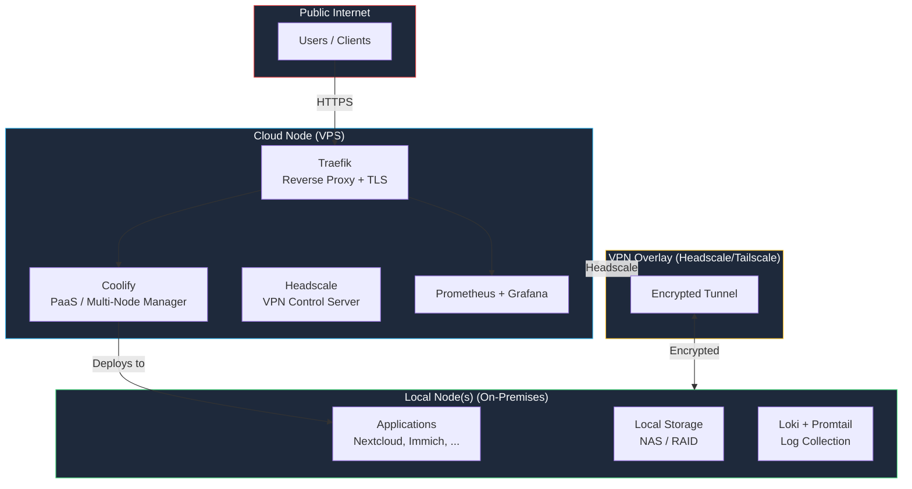
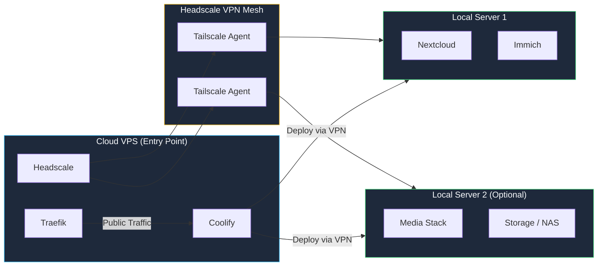
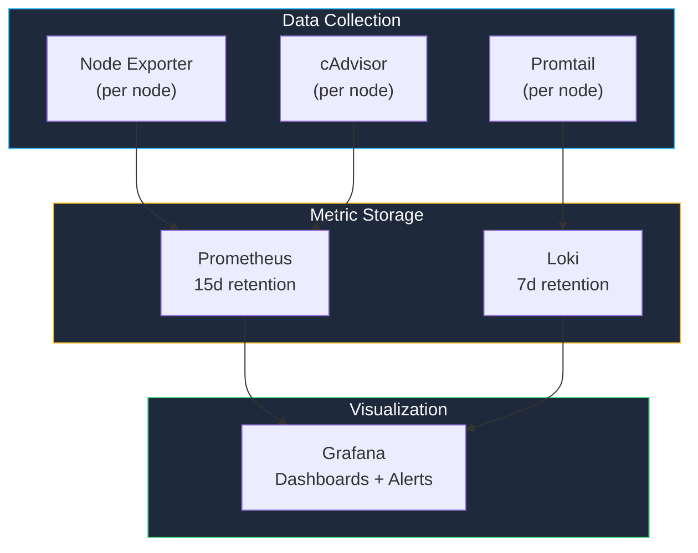

The **modern-homelab** StackKit brings multi-node hybrid infrastructure to your homelab. Designed for advanced users who need public-facing services, cloud+local server setups, and full observability across nodes.

<Warning>
  **v1.1 Planned** -- This StackKit is designed and specified but not yet functional. Use [base-homelab](/stackkits/kits/base-homelab) for v1.0 deployments.
</Warning>

## Overview



## Key features

<CardGroup cols={3}>
  <Card title="Multi-Node Docker" icon="server">
    Deploy across cloud VPS and local servers
  </Card>
  <Card title="Coolify PaaS" icon="rocket">
    Professional deployment platform for multi-node setups
  </Card>
  <Card title="VPN Overlay" icon="lock">
    Headscale/Tailscale for secure inter-node communication
  </Card>
  <Card title="Full Observability" icon="chart-line">
    Prometheus, Grafana, Loki (PLG) monitoring stack
  </Card>
  <Card title="Automatic TLS" icon="shield">
    Let's Encrypt certificates via Traefik
  </Card>
  <Card title="Public Access" icon="globe">
    Services accessible from the internet by default
  </Card>
</CardGroup>

## Requirements

| Resource | Cloud Node (VPS) | Local Node | Total Minimum |
|----------|------------------|------------|---------------|
| **Nodes** | 1 VPS | 1+ local | 2+ |
| **CPU** | 2 cores | 4 cores | 6 cores |
| **RAM** | 4 GB | 8 GB | 12 GB |
| **Storage** | 50 GB SSD | 100 GB | 150 GB |
| **Network** | Public IPv4, 1 Gbps | LAN access | -- |

**Additional prerequisites:**
- Own domain with DNS control (e.g., Cloudflare, Hetzner DNS)
- DNS provider API access for automated TLS provisioning
- SSH access to all nodes

<Warning>
  modern-homelab has higher complexity and resource requirements than base-homelab. If you only need a single local server, use [base-homelab](/stackkits/kits/base-homelab) instead.
</Warning>

## Architecture deep dive

### Hybrid topology

The modern-homelab connects cloud and local infrastructure using a VPN overlay:



**Traffic flow:**
1. Public requests hit Traefik on the cloud VPS
2. Traefik routes to Coolify-managed applications
3. Applications on local nodes are reached via the Headscale VPN tunnel
4. Local nodes never expose ports to the public internet

### Observability stack



| Component | Purpose | Default Config |
|-----------|---------|----------------|
| Prometheus | Metrics collection | 15d retention, 15s scrape interval |
| Grafana | Visualization | Pre-built dashboards |
| Loki | Log aggregation | 7d retention |
| Promtail | Log shipping | Per-node agent |
| Node Exporter | Hardware metrics | Per-node agent |
| cAdvisor | Container metrics | Per-node agent |
| Alertmanager | Alert routing | Discord/Email |

## Quick start

<Steps>
  <Step title="Define your hybrid setup">
    ```yaml kombination.yaml
    stackkit: modern-homelab

    domain: homelab.example.com
    email: you@example.com

    nodes:
      - name: cloud-entry
        type: cloud
        provider:
          type: hetzner
          region: fsn1
          size: cx21
          image: debian-12

      - name: local-server
        type: local
        network:
          localIp: 192.168.1.100
          subnet: 192.168.1.0/24
    ```
  </Step>

  <Step title="Configure VPN overlay">
    ```yaml
    vpn:
      enabled: true
      provider: headscale
      magicDns: true
    ```
  </Step>

  <Step title="Enable services">
    ```yaml
    services:
      # Reverse proxy (cloud node)
      traefik:
        enabled: true
        acme: true
        acmeEmail: you@example.com

      # PaaS platform (cloud node)
      coolify:
        enabled: true

      # VPN control server (cloud node)
      headscale:
        enabled: true

      # Monitoring
      prometheus:
        enabled: true
        retention: 15d

      grafana:
        enabled: true

      loki:
        enabled: true
        retention: 7d
    ```
  </Step>

  <Step title="Deploy infrastructure">
    ```bash
    kombify validate
    kombify generate
    kombify deploy
    ```
  </Step>
</Steps>

## Configuration reference

### Node configuration

<Tabs>
  <Tab title="Cloud Node">
    ```yaml
    nodes:
      - name: cloud-entry
        type: cloud
        hostname: cloud-entry

        provider:
          type: hetzner        # hetzner, digitalocean, vultr, linode
          region: fsn1
          size: cx21           # 2 vCPU, 4 GB RAM
          image: debian-12

        docker:
          version: "24.0"
          dataRoot: /var/lib/docker

        ssh:
          user: root
          port: 22
    ```
  </Tab>
  <Tab title="Local Node">
    ```yaml
    nodes:
      - name: local-server
        type: local
        hostname: local-server

        provider:
          type: bare-metal

        network:
          localIp: 192.168.1.100
          subnet: 192.168.1.0/24

        docker:
          version: "24.0"
          dataRoot: /var/lib/docker

        labels:
          storage: "true"
          role: application
    ```
  </Tab>
</Tabs>

### VPN configuration

```yaml
vpn:
  enabled: true
  provider: headscale
  derpEnabled: true
  derpRegions:
    - default
  magicDns: true
```

The VPN overlay creates an encrypted mesh between all nodes. Headscale is the self-hosted Tailscale control server -- no third-party dependency required.

### Monitoring configuration

```yaml
observability:
  prometheus:
    retention: 15d
    storage: 50Gi
    scrapeInterval: 15s

  grafana:
    dashboards:
      - node-health
      - docker-containers
      - traefik-traffic
      - coolify-deployments

  loki:
    retention: 7d

  alertmanager:
    receivers:
      - name: discord
        webhook: https://discord.com/api/webhooks/xxx
      - name: email
        to: alerts@example.com
```

## Platform components

### Coolify -- Multi-node PaaS

Coolify manages deployments across your nodes. Unlike Dokploy (used in base-homelab for single nodes), Coolify provides:

- Multi-node deployment via SSH
- Git-based deployments (push to deploy)
- Built-in database management
- Application monitoring and logs
- Resource limits per container

```yaml
coolify:
  autoUpdate: false
  pushEnabled: true
  instanceSettings:
    isRegistrationEnabled: false
    isAutoUpdateEnabled: false
  resources:
    cpuLimit: "2.0"
    memoryLimit: "2048m"
```

### Service placement

Services are placed on specific nodes based on their role:

| Service | Placement | Reason |
|---------|-----------|--------|
| Traefik | Cloud node | Public entry point, TLS termination |
| Coolify | Cloud node | Needs SSH access to all nodes |
| Headscale | Cloud node | VPN coordination server |
| Prometheus + Grafana | Cloud node | Accessible remotely |
| Applications | Local node(s) | Data stays on-premises |
| Storage/NAS | Local node(s) | Physical disk access |
| Promtail + Node Exporter | All nodes | Per-node monitoring agents |

## Adding more nodes

```yaml
# Add to kombination.yaml
nodes:
  # ... existing nodes

  - name: local-media
    type: local
    network:
      localIp: 192.168.1.101
      subnet: 192.168.1.0/24
    labels:
      role: media-server
```

```bash
kombify deploy --node local-media
```

The new node is automatically joined to the Headscale VPN mesh and registered in Coolify.

## Security

### Network isolation

- Local nodes are **never** directly exposed to the internet
- All inter-node traffic is encrypted via Headscale VPN
- Traefik handles TLS termination for public services
- Coolify enforces resource limits per container

### Authentication

```yaml
auth:
  provider: pocketid      # PocketID for SSO
  twoFactor: true
  allowedDomains:
    - example.com
```

### Firewall rules

The StackKit configures firewall rules automatically:

| Port | Cloud Node | Local Node | Purpose |
|------|-----------|------------|---------|
| 22 | Open | LAN only | SSH access |
| 80 | Open | Closed | HTTP redirect |
| 443 | Open | Closed | HTTPS traffic |
| 41641 | Open | Open | Headscale/WireGuard |
| All others | Closed | Closed | -- |

## Comparison with other StackKits

| Feature | base-homelab | ha-homelab | modern-homelab |
|---------|-------------|------------|----------------|
| **Nodes** | 1 | 2+ (local) | 2+ (cloud + local) |
| **Platform** | Docker + Dokploy | Docker Swarm | Docker + Coolify |
| **Network** | Local only | Local LAN | VPN overlay (Headscale) |
| **Public Access** | Optional (Cloudflare Tunnel) | Optional | Default |
| **Monitoring** | Basic (Uptime Kuma) | Prometheus + Grafana | Full PLG stack |
| **Domain Required** | No | No | Yes |
| **Complexity** | Low | Medium | High |
| **Status** | v1.0 | v1.0 | v1.1 planned |

## Troubleshooting

<AccordionGroup>
  <Accordion title="VPN connection issues">
    1. Check Headscale status: `headscale nodes list`
    2. Verify Tailscale agent on local node: `tailscale status`
    3. Test connectivity: `tailscale ping <cloud-node>`
    4. Check firewall: ensure UDP port 41641 is open on both sides
  </Accordion>

  <Accordion title="Coolify cannot reach local node">
    1. Verify VPN tunnel is established
    2. Check SSH access via VPN IP: `ssh root@<tailscale-ip>`
    3. Ensure Docker is running on the target node
    4. Check Coolify server settings for the correct VPN IP
  </Accordion>

  <Accordion title="TLS certificate errors">
    1. Verify DNS records point to cloud node public IP
    2. Check Traefik ACME logs: `docker logs traefik`
    3. Ensure port 80 and 443 are open on the cloud node
    4. Verify DNS provider API credentials in Traefik config
  </Accordion>

  <Accordion title="Monitoring gaps">
    1. Verify Promtail and Node Exporter are running on all nodes
    2. Check Prometheus targets: navigate to `prometheus.yourdomain.com/targets`
    3. Ensure VPN tunnel is stable (metrics travel over VPN)
    4. Check Grafana data source configuration
  </Accordion>
</AccordionGroup>

## Migration from base-homelab

<Steps>
  <Step title="Backup all data">
    ```bash
    kombify backup --all --output ./backup
    ```
  </Step>

  <Step title="Provision cloud node">
    Add a cloud node to your `kombination.yaml` and provision it:
    ```yaml
    stackkit: modern-homelab  # Changed from base-homelab

    nodes:
      - name: cloud-entry
        type: cloud
        provider:
          type: hetzner
          region: fsn1
          size: cx21
          image: debian-12

      - name: local-server   # Your existing server
        type: local
        network:
          localIp: 192.168.1.100
    ```
  </Step>

  <Step title="Deploy hybrid infrastructure">
    ```bash
    kombify generate
    kombify deploy
    ```
  </Step>

  <Step title="Restore data on local node">
    ```bash
    kombify restore --from ./backup --node local-server
    ```
  </Step>
</Steps>

## Next steps

<CardGroup cols={2}>
  <Card title="VPN Setup Guide" icon="lock" href="/guides/networking">
    Configure Headscale VPN for your homelab
  </Card>
  <Card title="Monitoring Setup" icon="chart-line" href="/guides/monitoring">
    Configure the PLG observability stack
  </Card>
  <Card title="Coolify Guide" icon="rocket" href="/guides/coolify">
    Deploy applications with Coolify
  </Card>
  <Card title="Security Hardening" icon="shield" href="/guides/security">
    Secure your hybrid infrastructure
  </Card>
</CardGroup>
