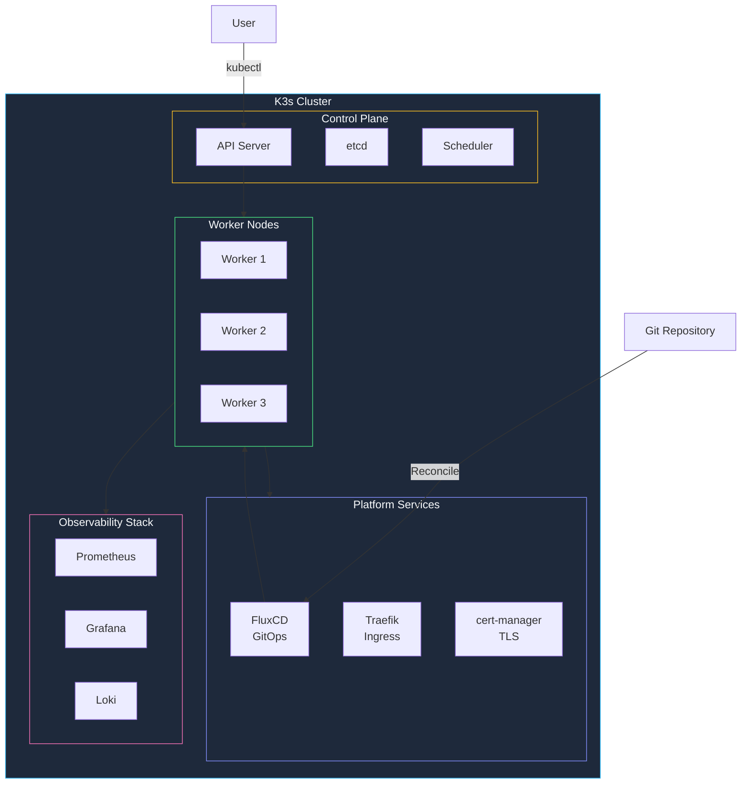

The **modern-homelab** StackKit brings cloud-native Kubernetes infrastructure to your homelab. Designed for power users who want GitOps, auto-scaling, and full observability.

## Overview



## Key Features

<CardGroup cols={3}>
  <Card title="K3s Kubernetes" icon="dharmachakra">
    Lightweight, production-grade Kubernetes
  </Card>
  <Card title="GitOps with Flux" icon="code-branch">
    Declarative infrastructure from Git
  </Card>
  <Card title="Auto-Scaling" icon="arrows-up-down">
    Scale workloads based on demand
  </Card>
  <Card title="Full Observability" icon="chart-line">
    Prometheus, Grafana, Loki stack
  </Card>
  <Card title="Service Mesh Ready" icon="network-wired">
    Optional Linkerd integration
  </Card>
  <Card title="Persistent Storage" icon="hard-drive">
    Longhorn distributed storage
  </Card>
</CardGroup>

## Requirements

| Resource | Per Node | Minimum Cluster |
|----------|----------|-----------------|
| **Nodes** | 1 control + 2 workers | 3 total |
| **CPU** | 4 cores | 12 cores |
| **RAM** | 8 GB | 24 GB |
| **Storage** | 50 GB SSD | 150 GB |
| **Network** | 1 Gbps | Same subnet |

<Warning>
  modern-homelab has higher resource requirements than other StackKits. Ensure your hardware meets the minimums.
</Warning>

## Architecture Deep Dive

### GitOps Workflow


### Storage Architecture


## Quick Start

<Steps>
  <Step title="Define your cluster">
    ```yaml kombination.yaml
    stackkit: modern-homelab
    
    domain: k8s.homelab.local
    email: you@example.com
    
    cluster:
      name: homelab
      version: "1.29"  # K3s version
      
    nodes:
      - name: control-1
        ip: 192.168.1.10
        role: control-plane
        
      - name: worker-1
        ip: 192.168.1.11
        role: worker
        
      - name: worker-2
        ip: 192.168.1.12
        role: worker
    ```
  </Step>
  
  <Step title="Configure GitOps">
    ```yaml
    gitops:
      enabled: true
      provider: flux
      repository:
        url: git@github.com:you/homelab-config.git
        branch: main
        path: clusters/homelab
    ```
  </Step>
  
  <Step title="Enable platform services">
    ```yaml
    services:
      # Ingress
      traefik:
        enabled: true
        replicas: 2
        
      # TLS
      cert-manager:
        enabled: true
        issuer: letsencrypt-prod
        
      # Storage
      longhorn:
        enabled: true
        replicas: 2
        
      # Observability
      prometheus:
        enabled: true
        retention: 15d
        
      grafana:
        enabled: true
        
      loki:
        enabled: true
        retention: 7d
    ```
  </Step>
  
  <Step title="Deploy cluster">
    ```bash
    kombify validate
    kombify generate
    kombify deploy
    ```
  </Step>
</Steps>

## Configuration Reference

### Cluster Options

```yaml
cluster:
  name: homelab
  version: "1.29"
  
  # High availability control plane
  ha:
    enabled: true
    datastore: etcd  # or "embedded" for single control-plane
    
  # Network plugin
  cni: flannel  # flannel, calico, cilium
  
  # Feature gates
  features:
    - GracefulNodeShutdown
    - PodDisruptionConditions
```

### Node Configuration

```yaml
nodes:
  - name: control-1
    ip: 192.168.1.10
    role: control-plane
    taints:
      - "node-role.kubernetes.io/control-plane:NoSchedule"
    
  - name: worker-1
    ip: 192.168.1.11
    role: worker
    labels:
      node-type: compute
      
  - name: worker-2
    ip: 192.168.1.12
    role: worker
    labels:
      node-type: storage
      longhorn-node: "true"
```

### GitOps Configuration

<Tabs>
  <Tab title="FluxCD (Default)">
    ```yaml
    gitops:
      enabled: true
      provider: flux
      repository:
        url: git@github.com:you/homelab-config.git
        branch: main
        path: clusters/homelab
      interval: 1m
      prune: true
    ```
  </Tab>
  <Tab title="ArgoCD">
    ```yaml
    gitops:
      enabled: true
      provider: argocd
      repository:
        url: https://github.com/you/homelab-config.git
        branch: main
        path: clusters/homelab
      sync:
        automated: true
        prune: true
        selfHeal: true
    ```
  </Tab>
</Tabs>

## Platform Components

### Ingress & Networking


### Observability Stack

| Component | Purpose | Default Config |
|-----------|---------|----------------|
| Prometheus | Metrics collection | 15d retention |
| Grafana | Visualization | Pre-built dashboards |
| Loki | Log aggregation | 7d retention |
| Promtail | Log shipping | DaemonSet |
| Alertmanager | Alert routing | Slack/Discord/Email |

```yaml
observability:
  prometheus:
    retention: 15d
    storage: 50Gi
    scrapeInterval: 30s
    
  grafana:
    dashboards:
      - kubernetes-cluster
      - node-exporter
      - traefik
      - longhorn
      
  alertmanager:
    receivers:
      - name: discord
        webhook: https://discord.com/api/webhooks/xxx
      - name: email
        to: alerts@example.com
```

## Deploying Applications

With GitOps, you deploy applications by adding manifests to your Git repository:

```yaml
# clusters/homelab/apps/homepage.yaml
apiVersion: v1
kind: Namespace
metadata:
  name: homepage
---
apiVersion: helm.toolkit.fluxcd.io/v2beta1
kind: HelmRelease
metadata:
  name: homepage
  namespace: homepage
spec:
  interval: 5m
  chart:
    spec:
      chart: homepage
      version: "1.x"
      sourceRef:
        kind: HelmRepository
        name: homepage
        namespace: flux-system
  values:
    ingress:
      enabled: true
      hosts:
        - host: home.homelab.local
          paths:
            - path: /
```

Commit and push—Flux handles the rest:

```bash
git add .
git commit -m "Add homepage application"
git push
# Flux automatically deploys within 1 minute
```

## Scaling

### Horizontal Pod Autoscaling

```yaml
services:
  myapp:
    autoscaling:
      enabled: true
      minReplicas: 2
      maxReplicas: 10
      metrics:
        - type: cpu
          target: 80
        - type: memory
          target: 80
```

### Adding Worker Nodes

```yaml
# Add to kombination.yaml
nodes:
  # ... existing nodes
  
  - name: worker-3
    ip: 192.168.1.13
    role: worker
    labels:
      node-type: compute
```

```bash
kombify deploy --node worker-3
```

## Security

### Network Policies

```yaml
security:
  networkPolicies:
    enabled: true
    defaultDeny: true  # Deny all by default
    
  # Pod Security Standards
  podSecurity:
    enforce: baseline
    audit: restricted
    warn: restricted
```

### Secrets Management

```yaml
security:
  secrets:
    provider: sealed-secrets  # or vault, external-secrets
    
  # If using Sealed Secrets
  sealedSecrets:
    enabled: true
```

## Monitoring Dashboard

Pre-configured Grafana dashboards:


## Troubleshooting

<AccordionGroup>
  <Accordion title="Pods stuck in Pending">
    1. Check node resources: `kubectl describe nodes`
    2. Verify PVC binding: `kubectl get pvc -A`
    3. Check for taints: `kubectl get nodes -o jsonpath='{.items[*].spec.taints}'`
  </Accordion>
  
  <Accordion title="GitOps not syncing">
    1. Check Flux logs: `kubectl logs -n flux-system deploy/source-controller`
    2. Verify Git credentials: `kubectl get secrets -n flux-system`
    3. Check repository status: `flux get sources git`
  </Accordion>
  
  <Accordion title="Storage issues">
    1. Check Longhorn UI: `kubectl port-forward -n longhorn-system svc/longhorn-frontend 8080:80`
    2. Verify disk space on nodes
    3. Check replica health: `kubectl get volumes.longhorn.io -A`
  </Accordion>
</AccordionGroup>

## Migration from ha-homelab

<Warning>
  Migration from Docker to Kubernetes requires data migration planning. Backup everything first!
</Warning>

<Steps>
  <Step title="Backup all data">
    ```bash
    kombify backup --all --output ./backup
    ```
  </Step>
  
  <Step title="Update kombination.yaml">
    ```yaml
    stackkit: modern-homelab  # Changed!
    
    cluster:
      name: homelab
      
    nodes:
      - name: control-1
        ip: 192.168.1.10  # Can reuse existing IPs
        role: control-plane
    # ...
    ```
  </Step>
  
  <Step title="Deploy new cluster">
    ```bash
    kombify generate
    kombify deploy
    ```
  </Step>
  
  <Step title="Restore data">
    ```bash
    kombify restore --from ./backup
    ```
  </Step>
</Steps>

## Next Steps

<CardGroup cols={2}>
  <Card title="GitOps Guide" icon="code-branch" href="/guides/gitops">
    Deep dive into GitOps workflows
  </Card>
  <Card title="Monitoring Setup" icon="chart-line" href="/guides/monitoring">
    Configure comprehensive monitoring
  </Card>
  <Card title="Backup Strategy" icon="cloud-arrow-up" href="/guides/backups">
    Protect your Kubernetes data
  </Card>
  <Card title="Security Hardening" icon="shield" href="/guides/security">
    Secure your cluster
  </Card>
</CardGroup>
