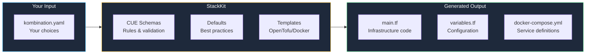
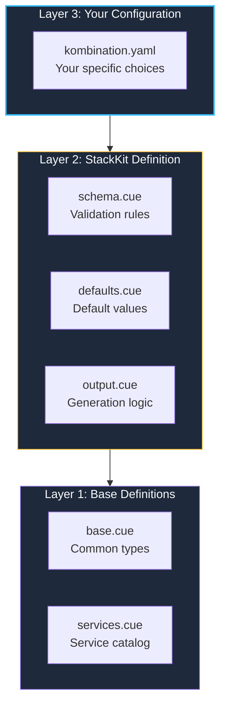
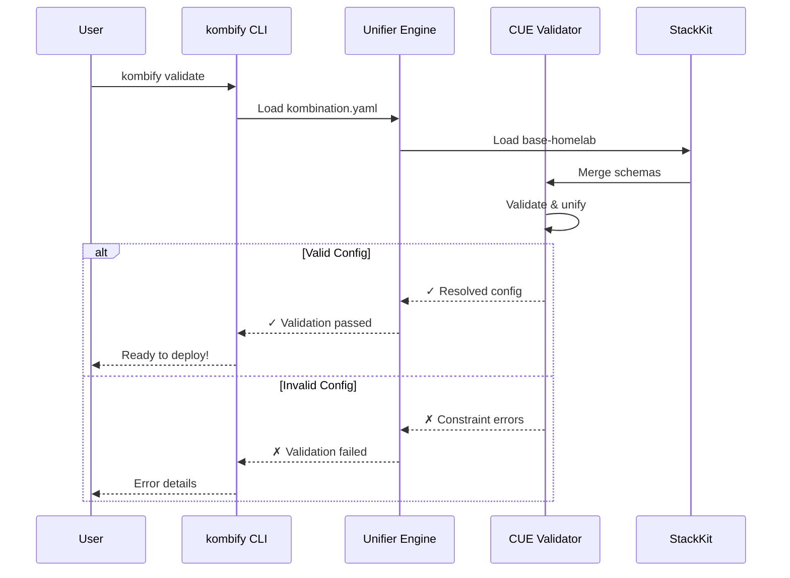

StackKits are validated, reusable infrastructure blueprints that define how your homelab should be configured. Each StackKit provides a complete infrastructure pattern that you can customize for your needs.

## What is a StackKit?



A StackKit is essentially a **smart template system** that:
1. **Validates** your choices against proven patterns
2. **Applies** sensible defaults for things you don't specify
3. **Generates** production-ready infrastructure code

## The Problem StackKits Solve

<Tabs>
  <Tab title="The Challenge">
    You want to set up a homelab. You've heard of:
    - Traefik (or Caddy? or nginx?)
    - Authelia (or Authentik? or Keycloak?)
    - Portainer (or Dockge? or Coolify?)
    - Immich (or Photoprism?)

    **Questions that keep you stuck:**
    - Which tools work well together?
    - How do I configure them correctly?
    - What are the best practices?
    - How do I avoid security issues?
  </Tab>
  <Tab title="The Solution">
    Pick a StackKit and customize it:
    
    ```yaml kombination.yaml
    stackkit: base-homelab
    domain: homelab.local
    services:
      traefik:
        enabled: true
      authelia:
        enabled: true
    ```
    
    **StackKits provide:**
    - ✅ Curated service combinations
    - ✅ Pre-configured integrations
    - ✅ Security best practices built-in
    - ✅ Validation before deployment
  </Tab>
</Tabs>

## Available StackKits

<CardGroup cols={3}>
  <Card title="base-homelab" icon="house" href="/stackkits/kits/base-homelab">
    **For beginners**
    
    Single-node homelab with essential services. Perfect for getting started.
    
    - Docker Compose
    - Single node
    - 4-6 core services
  </Card>
  
  <Card title="ha-homelab" icon="shield-halved" href="/stackkits/kits/ha-homelab">
    **For reliability**
    
    High-availability setup with redundancy and failover.
    
    - Multi-node (2-5)
    - Load balancing
    - 8-12 services
  </Card>
  
  <Card title="modern-homelab" icon="microchip" href="/stackkits/kits/modern-homelab">
    **For scale**
    
    Cloud-native Kubernetes infrastructure for advanced users.
    
    - Kubernetes
    - GitOps ready
    - 15+ services
  </Card>
</CardGroup>

## How StackKits Work

### The Three-Layer Architecture



<Steps>
  <Step title="Layer 1: Base Definitions (shared)">
    Common type definitions used by all StackKits:
    ```cue
    // base.cue
    #Service: {
        name:    string
        image:   string
        ports:   [...#Port]
        volumes: [...#Volume]
        depends: [...string]
    }
    ```
  </Step>
  
  <Step title="Layer 2: StackKit Rules">
    Each StackKit defines its validation schema and defaults:
    ```cue
    // base-homelab/schema.cue
    config: {
        nodes: [1]  // Only 1 node allowed
        network: "bridge" | "macvlan"
        services: {
            traefik:  #TraefikConfig
            portainer: #PortainerConfig
            // ...
        }
    }
    ```
  </Step>
  
  <Step title="Layer 3: Your Choices">
    You only specify what you want to customize:
    ```yaml
    # kombination.yaml
    stackkit: base-homelab
    domain: homelab.local
    services:
      traefik:
        enabled: true
      portainer:
        enabled: true
    ```
  </Step>
</Steps>

### Validation Flow

When you run `kombify validate`:



### Example CUE Definition

```cue
// base-homelab/stack.cue
package base_homelab

import "kombify.dev/base"

#Stack: base.#Stack & {
    services: {
        traefik: #TraefikService
        authelia: #AutheliaService
        homepage: #HomepageService
    }
    
    // Constraint: Authelia requires Traefik
    if services.authelia != _|_ {
        services.traefik: _
    }
}
```

### Validation Output

```bash
$ kombify validate

✓ YAML syntax valid
✓ Required fields present
✓ Service dependencies satisfied
✓ Port conflicts: none
✓ Network configuration: valid
✓ SSL configuration: valid

Ready to deploy!
```

## Choosing a StackKit

<AccordionGroup>
  <Accordion title="I'm new to homelabs" icon="seedling">
    **Use: base-homelab**
    
    Start simple with a single-node setup:
    - Easy to understand
    - Minimal resource requirements (4GB RAM)
    - Great for learning
    
    You can always migrate to ha-homelab later as your needs grow.
  </Accordion>
  
  <Accordion title="I need high availability" icon="shield">
    **Use: ha-homelab**
    
    When downtime is unacceptable:
    - Database services (Nextcloud, Home Assistant)
    - Media servers (Plex, Jellyfin)
    - Network infrastructure (DNS, VPN)
    
    Requires at least 2 nodes (16GB+ RAM total) for failover.
  </Accordion>
  
  <Accordion title="I want cloud-native infrastructure" icon="cloud">
    **Use: modern-homelab**
    
    For advanced users wanting:
    - Kubernetes orchestration
    - GitOps workflows
    - Auto-scaling
    - Full observability
    
    Requires more resources (32GB+ RAM) but offers maximum flexibility.
  </Accordion>
</AccordionGroup>

## StackKit Comparison

| Feature | base-homelab | ha-homelab | modern-homelab |
|---------|-------------|------------|----------------|
| **Nodes** | 1 | 2-5 | 3+ |
| **Orchestration** | Docker Compose | Docker Swarm | Kubernetes |
| **Complexity** | Low | Medium | High |
| **Min Resources** | 4GB RAM | 16GB RAM | 32GB+ RAM |
| **Use Case** | Learning, single apps | Home servers | Production-grade |
| **Failover** | ❌ | ✅ | ✅ |
| **Auto-scaling** | ❌ | ❌ | ✅ |

## Next Steps

<CardGroup cols={2}>
  <Card title="base-homelab Kit" icon="house" href="/stackkits/kits/base-homelab">
    Detailed documentation for the beginner-friendly StackKit
  </Card>
  <Card title="CUE Language Basics" icon="code" href="/stackkits/cue-basics">
    Learn the CUE language used in StackKits
  </Card>
  <Card title="Customization Guide" icon="sliders" href="/stackkits/customization">
    How to customize StackKits for your needs
  </Card>
  <Card title="Creating StackKits" icon="hammer" href="/stackkits/creating">
    Build your own StackKits from scratch
  </Card>
</CardGroup>
