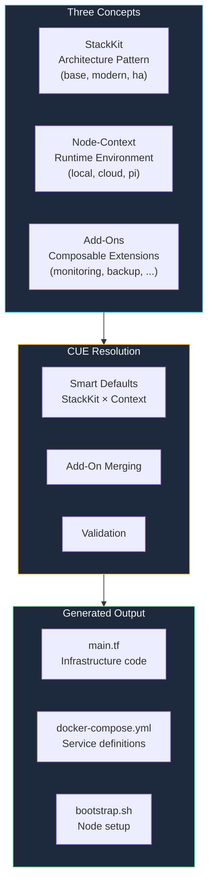
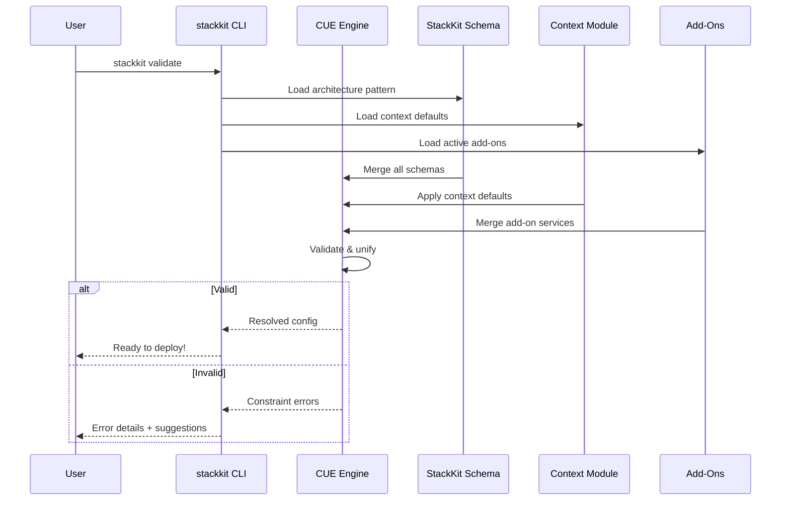

StackKits are validated, reusable infrastructure blueprints that define **architecture patterns** for your homelab. Each StackKit describes how services relate to each other — not how many servers you need.

## What is a StackKit?

A StackKit combines three concepts to produce your infrastructure:



A StackKit is a **smart configuration system** that:
1. **Validates** your choices against proven architecture patterns
2. **Detects** your runtime environment and applies context-aware defaults
3. **Merges** composable Add-Ons for additional capabilities
4. **Generates** production-ready infrastructure code

## The problem StackKits solve

<Tabs>
  <Tab title="The challenge">
    You want to set up a homelab. You've heard of:
    - Traefik (or Caddy? or nginx?)
    - Authelia (or Authentik? or Keycloak?)
    - Portainer (or Dockge? or Coolify?)
    - Immich (or Photoprism?)

    **Questions that keep you stuck:**
    - Which tools work well together?
    - How do I configure them correctly?
    - What are the best practices?
    - How do I avoid security issues?
  </Tab>
  <Tab title="The solution">
    Pick a StackKit pattern, let context handle the rest:
    
    ```yaml kombination.yaml
    version: "2.0"
    stackkit: base
    domain: homelab.example.com

    addons:
      - monitoring
      - backup
    ```
    
    **StackKits provide:**
    - Curated service combinations
    - Context-aware defaults (local vs cloud vs Raspberry Pi)
    - Composable Add-Ons instead of monolithic configs
    - Validation before deployment
  </Tab>
</Tabs>

## Available StackKits

StackKits are **architecture patterns**, not node-count definitions.

<CardGroup cols={3}>
  <Card title="Base Kit" icon="house" href="/stackkits/kits/base-homelab">
    **Single-environment pattern**
    
    All services in one deployment target. Simple, predictable.
    
    - Docker Compose
    - Any node count
    - Context-aware defaults
  </Card>
  
  <Card title="Modern Homelab Kit" icon="cloud" href="/stackkits/kits/modern-homelab">
    **Hybrid infrastructure pattern**
    
    Bridges local and cloud environments with VPN overlay.
    
    - Multi-environment
    - Coolify PAAS
    - Public + private services
  </Card>
  
  <Card title="High Availability Kit" icon="shield-halved" href="/stackkits/kits/ha-homelab">
    **High-availability pattern**
    
    Redundancy, failover, and quorum-based consensus.
    
    - Docker Swarm cluster
    - Keepalived VIP
    - 3+ nodes recommended
  </Card>
</CardGroup>

## The three concepts

### 1. StackKit = Architecture pattern

A StackKit defines **how services relate to each other**, not how many servers you have.

| StackKit | Pattern | Example |
|----------|---------|---------|
| **base** | Single-environment | 1 Pi running all services, or 3 servers sharing the same stack |
| **modern** | Hybrid | Home server + cloud VPS connected via VPN |
| **ha** | HA cluster | 3-node Docker Swarm with failover |

<Tip>
  A `base` StackKit can run on multiple nodes (same stack replicated). An `ha` StackKit can run on a single powerful node (simulated HA). The pattern defines the architecture, not the scale.
</Tip>

### 2. Node-Context = auto-detected environment

Each node is automatically classified based on hardware and provider metadata:

| Context | Detection | Affects |
|---------|-----------|---------|
| **local** | Physical hardware, no cloud metadata | Self-signed TLS, Dokploy PAAS, local DNS |
| **cloud** | Cloud provider metadata detected | Let's Encrypt, Coolify PAAS, public DNS |
| **pi** | ARM + low memory or RPi detection | Reduced services, ARM images, tmpfs |

<Note>
  At Level 0 (standalone CLI), you specify context manually. At Level 2+ (with kombify Stack agent), context is auto-detected from hardware reports.
</Note>

### 3. Add-Ons = composable extensions

Add-Ons replace the old monolithic variant system. They are stackable and declare their compatibility:

| Add-On | Category | Compatible StackKits |
|--------|----------|---------------------|
| `monitoring` | Observability | base, modern, ha |
| `backup` | Data | base, modern, ha |
| `vpn-overlay` | Networking | modern, ha |
| `gpu-workloads` | Compute | base, modern |
| `media` | Applications | base, modern |
| `smart-home` | IoT | base |

```yaml kombination.yaml
addons:
  - monitoring       # Prometheus + Grafana + Alertmanager
  - backup           # Restic + configurable targets
  - media            # Jellyfin + *arr stack
```

## Progressive capability model

StackKits operates at different capability levels depending on how you access it:

| Level | Name | Access Method | Capabilities |
|-------|------|---------------|-------------|
| **0** | Standalone CLI | `stackkit` CLI directly | CUE validation, IaC generation, direct provisioning |
| **1** | Control Plane | kombify Stack Web UI/API | Unifier pipeline, wizard UI, StackKit resolver |
| **2** | Worker Agent | kombify Stack + gRPC Agent | Context auto-detection, placement engine |
| **3** | Runtime Intelligence | Day-2 operations | Drift detection, auto-remediation, cert renewal |
| **4** | AI-Assisted (SaaS) | kombify Sphere | Natural language config, predictive scaling |

<Warning>
  Level 4 capabilities are available exclusively through kombify Sphere (SaaS) and require cloud connectivity.
</Warning>

## How StackKits work

### Context-driven defaults matrix

The combination of StackKit × Context produces curated default configurations:

| | local | cloud | pi |
|---|---|---|---|
| **base** | Dokploy, self-signed TLS | Coolify, Let's Encrypt | Lean Docker, reduced services |
| **modern** | Tailscale exit node, hybrid DNS | Multi-cloud mesh | Edge relay role |
| **ha** | Swarm + Keepalived | Cloud HA + managed LB | Not recommended |

### Validation flow

When you run `stackkit validate` or use kombify Stack:



## StackKit comparison

| Feature | base | modern | ha |
|---------|------|--------|-----|
| **Pattern** | Single-environment | Hybrid infrastructure | HA cluster |
| **Container runtime** | Docker Compose | Docker + Coolify | Docker Swarm |
| **Typical nodes** | 1 (supports N) | 2+ (multi-environment) | 3+ (odd for quorum) |
| **Complexity** | Low | Medium | High |
| **VPN overlay** | Optional (Add-On) | Built-in | Optional |
| **Failover** | No | No | Yes |
| **Best for** | First homelab, single VPS | Hybrid setups, public services | Production workloads |

## Choosing a StackKit

<AccordionGroup>
  <Accordion title="I'm new to homelabs" icon="seedling">
    **Use: base**
    
    Start simple with a single-environment setup:
    - Easy to understand
    - Minimal resource requirements
    - Great for learning
    - Add capabilities later with Add-Ons
  </Accordion>
  
  <Accordion title="I want local + cloud" icon="cloud">
    **Use: modern**
    
    For hybrid setups connecting different environments:
    - VPN overlay connects all nodes
    - Public services via cloud nodes
    - Private services stay local
    - Coolify manages deployments
  </Accordion>
  
  <Accordion title="I need high availability" icon="shield">
    **Use: ha**
    
    When downtime is unacceptable:
    - Automatic failover
    - Database clustering
    - Load balancing with Keepalived
    - Requires 3+ nodes (odd number for quorum)
  </Accordion>
</AccordionGroup>

## Next steps

<CardGroup cols={2}>
  <Card title="Base Kit" icon="house" href="/stackkits/kits/base-homelab">
    Detailed documentation for the single-environment StackKit
  </Card>
  <Card title="CUE language basics" icon="code" href="/stackkits/customization/cue-basics">
    Learn the CUE language used in StackKits
  </Card>
  <Card title="Customization guide" icon="sliders" href="/stackkits/customization/creating-custom">
    How to customize StackKits for your needs
  </Card>
  <Card title="Quick start" icon="rocket" href="/stackkits/quickstart">
    Deploy your first StackKit
  </Card>
</CardGroup>
