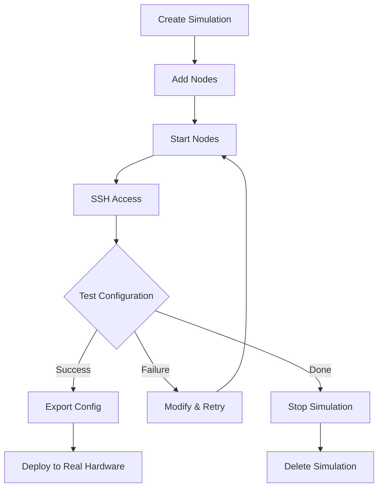

# KombiSim

KombiSim is a **lightweight simulation engine** that creates Docker-based "VMs" for testing infrastructure configurations before deployment. Test your entire homelab setup without real hardware.

<CardGroup cols={2}>
  <Card
    title="Quick start"
    icon="rocket"
    href="/tools/kombisim/quickstart"
  >
    Create your first simulation
  </Card>
  <Card
    title="Templates"
    icon="file-code"
    href="/tools/kombisim/templates"
  >
    Browse pre-built templates
  </Card>
  <Card
    title="Installation"
    icon="download"
    href="/tools/kombisim/installation"
  >
    Install KombiSim
  </Card>
  <Card
    title="API reference"
    icon="code"
    href="/api/kombisim/overview"
  >
    Explore the REST API
  </Card>
</CardGroup>

## Key features

<AccordionGroup>
  <Accordion title="Docker-based simulation" icon="docker">
    Fast, lightweight "VMs" using Docker containers with real Docker SDK:
    
    - Real SSH access (ports 2222-2322)
    - Persistent storage via Docker volumes
    - Network isolation with custom networks
    - Resource limits to simulate hardware tiers
  </Accordion>

  <Accordion title="Real SSH access" icon="key">
    SSH into simulated nodes like real servers:
    
    ```bash
    # Get SSH details
    curl http://localhost:5270/api/v1/nodes/{id}/ssh
    
    # SSH into node
    ssh -p 2222 root@localhost
    # Password: kombisim
    ```
  </Accordion>

  <Accordion title="Simulation groups" icon="layer-group">
    Organize nodes into logical simulations:
    
    - SQLite persistence
    - Group management
    - Bulk operations
    - State tracking
  </Accordion>

  <Accordion title="Node types" icon="server">
    Distinguish between VPS and local server simulations:
    
    - `vps` - Cloud VPS simulation
    - `local` - Local server simulation
    - Custom resource allocation
    - Location-based grouping
  </Accordion>

  <Accordion title="Web UI" icon="browser">
    Full SvelteKit dashboard for managing simulations:
    
    - Dashboard with stats
    - Simulation management
    - Node monitoring
    - Template browser
  </Accordion>

  <Accordion title="Pre-built templates" icon="file-code">
    6 templates for common setups:
    
    - Single node (development)
    - Homelab basic (2 nodes)
    - Homelab advanced (5 nodes)
    - Hybrid setup (VPS + local)
    - Dev environment
    - HA setup
  </Accordion>
</AccordionGroup>

## Architecture

```
┌─────────────────────────────────────────────────────────────┐
│                      KombiSim Engine                         │
├─────────────────────────────────────────────────────────────┤
│                                                             │
│  ┌─────────────┐    ┌─────────────┐    ┌─────────────┐     │
│  │   Web UI    │───▶│  REST API   │───▶│   Docker    │     │
│  │ :5271       │    │   :5270     │    │   Engine    │     │
│  └─────────────┘    └─────────────┘    └─────────────┘     │
│                                                             │
│  ┌─────────────────────────────────────────────────────────┤
│  │  Port Range: 2222-2322 (SSH to containers)              │
│  └─────────────────────────────────────────────────────────┘
│                                                             │
│  ┌─────────────────────────────────────────────────────────┤
│  │  Simulated Nodes (Docker Containers)                    │
│  │  ┌──────────┐  ┌──────────┐  ┌──────────┐              │
│  │  │  Node 1  │  │  Node 2  │  │  Node 3  │              │
│  │  │  :2222   │  │  :2223   │  │  :2224   │              │
│  │  └──────────┘  └──────────┘  └──────────┘              │
│  └─────────────────────────────────────────────────────────┘
└─────────────────────────────────────────────────────────────┘
```

## Tech stack

| Component | Technology | Purpose |
|-----------|------------|---------|
| **Backend** | Go 1.22+ | Core simulation engine |
| **Frontend** | SvelteKit | Web dashboard |
| **Container runtime** | Docker SDK | Node simulation |
| **Database** | SQLite | Simulation persistence |
| **SSH** | OpenSSH | Real SSH access to nodes |

## Service ports

| Service | Port | Description |
|---------|------|-------------|
| Backend API | 5270 | REST API |
| Web UI | 5271 | SvelteKit Dashboard |
| SSH (Nodes) | 2222-2322 | Container SSH access |

## Use cases

<Tabs>
  <Tab title="Pre-deployment testing">
    Test your infrastructure configuration before deploying to real hardware:
    
    ```bash
    # 1. Create simulation from your kombination.yaml
    curl -X POST http://localhost:5270/api/v1/simulations \
      -d @kombination.yaml
    
    # 2. Start nodes
    curl -X POST http://localhost:5270/api/v1/simulations/{id}/start
    
    # 3. Test configuration
    ssh -p 2222 root@localhost
    
    # 4. If successful, deploy to real hardware
    kombistack apply kombination.yaml
    ```
  </Tab>

  <Tab title="Development environment">
    Create isolated development environments:
    
    ```bash
    # Apply dev template
    curl -X POST http://localhost:5270/api/v1/templates/dev-environment/apply \
      -d '{"simulation_name": "my-dev-env", "auto_start": true}'
    
    # Get SSH details
    curl http://localhost:5270/api/v1/simulations/{id}/nodes
    
    # SSH into dev server
    ssh -p 2222 root@localhost
    ```
  </Tab>

  <Tab title="Training and demos">
    Safe environment for learning and demonstrations:
    
    - No risk to production systems
    - Fast setup and teardown
    - Reproducible environments
    - Cost-free testing
  </Tab>

  <Tab title="CI/CD testing">
    Automated infrastructure testing in CI pipelines:
    
    ```yaml
    # .github/workflows/test.yml
    - name: Test infrastructure
      run: |
        # Start KombiSim
        docker run -d -p 5270:5270 kombisphere/kombisim
        
        # Create simulation
        curl -X POST http://localhost:5270/api/v1/simulations \
          -d @test-config.yaml
        
        # Run tests
        ./run-infrastructure-tests.sh
    ```
  </Tab>
</Tabs>

## Integration with KombiStack

KombiStack can automatically use KombiSim for validation:

```yaml
# kombistack.yaml
simulation:
  enabled: true
  endpoint: "http://localhost:5270"
  auto_validate: true

validation:
  simulate_before_deploy: true
  simulation_timeout: 300s
```

**Automatic workflow:**

<Steps>
  <Step title="Create simulation">
    KombiStack sends your `kombination.yaml` to KombiSim
  </Step>

  <Step title="Provision nodes">
    KombiSim creates Docker containers matching your spec
  </Step>

  <Step title="Run pre-checks">
    KombiStack validates:
    - SSH connectivity
    - Required packages
    - Network configuration
    - Service dependencies
  </Step>

  <Step title="Deploy to simulation">
    Full deployment to simulated infrastructure
  </Step>

  <Step title="Validation results">
    If successful → proceed to real deployment
    
    If failed → return errors and logs
  </Step>
</Steps>

## Templates

KombiSim includes 6 pre-built templates:

| Template | Category | Nodes | Description |
|----------|----------|-------|-------------|
| **single-node** | development | 1 | Minimal single server |
| **homelab-basic** | homelab | 2 | Web server + Database |
| **homelab-advanced** | homelab | 5 | Proxy, apps, database, storage |
| **hybrid-setup** | homelab | 5 | VPS + Local combined |
| **dev-environment** | development | 2 | Dev server + database |
| **ha-setup** | homelab | 5 | Load balancer + HA setup |

See [Templates](/tools/kombisim/templates) for detailed information.

## Simulation workflow



## Limitations

<Warning>
  KombiSim is for **testing and validation**, not production workloads.
</Warning>

**What KombiSim simulates:**
- ✅ Service deployment and configuration
- ✅ Network connectivity and firewall rules
- ✅ SSH access and authentication
- ✅ Basic resource constraints

**What KombiSim does NOT simulate:**
- ❌ Real hardware performance
- ❌ Actual network latency
- ❌ Physical hardware failures
- ❌ Production-scale load

## License

MIT License - see [LICENSE](https://github.com/KombiverseLabs/KombiSim/blob/main/LICENSE)

## Next steps

<CardGroup cols={2}>
  <Card
    title="Quick start guide"
    icon="play"
    href="/tools/kombisim/quickstart"
  >
    Create your first simulation
  </Card>
  <Card
    title="Installation"
    icon="download"
    href="/tools/kombisim/installation"
  >
    Install KombiSim
  </Card>
  <Card
    title="Templates"
    icon="file-code"
    href="/tools/kombisim/templates"
  >
    Browse pre-built templates
  </Card>
  <Card
    title="API reference"
    icon="code"
    href="/api/kombisim/overview"
  >
    Explore the REST API
  </Card>
</CardGroup>
