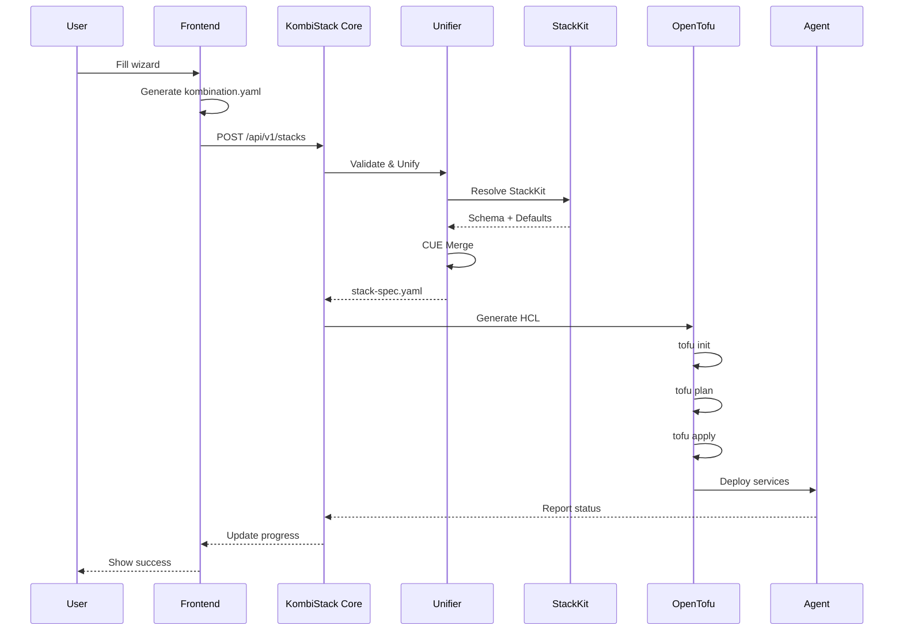
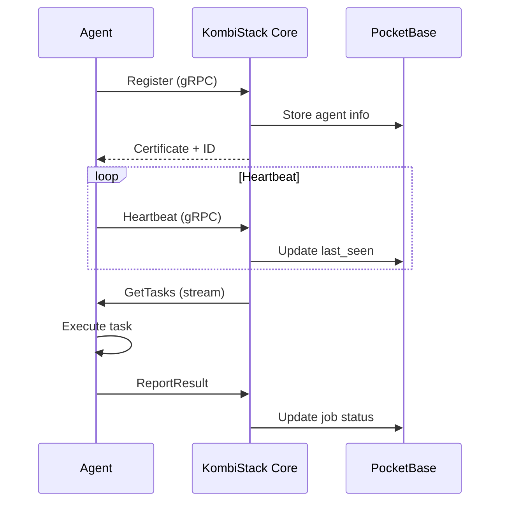

# Architecture

KombiStack follows a **spec-driven architecture** with a clear separation between user intent, validation, and execution.

## System overview

```
┌─────────────────────────────────────────────────────────────────────────────┐
│                           KOMBISTACK SYSTEM                                  │
├─────────────────────────────────────────────────────────────────────────────┤
│                                                                              │
│  ┌──────────────────────────────────────────────────────────────────────┐   │
│  │                        FRONTEND LAYER                                 │   │
│  │  ┌────────────────┐  ┌────────────────┐  ┌────────────────┐         │   │
│  │  │  Easy Wizard   │  │  Expert Wizard │  │   Dashboard    │         │   │
│  │  │  (Guided UI)   │  │  (Full Control)│  │   (Monitor)    │         │   │
│  │  └────────┬───────┘  └────────┬───────┘  └────────┬───────┘         │   │
│  │           │                   │                   │                  │   │
│  │           └───────────────────┴───────────────────┘                  │   │
│  │                              │                                       │   │
│  │                              ▼                                       │   │
│  │                    kombination.yaml (User Intent)                    │   │
│  └──────────────────────────────┬───────────────────────────────────────┘   │
│                                 │                                           │
│  ┌──────────────────────────────▼───────────────────────────────────────┐   │
│  │                        CORE LAYER (Go Binary)                        │   │
│  │                                                                      │   │
│  │  ┌────────────────────────────────────────────────────────────────┐ │   │
│  │  │                    UNIFIER ENGINE                              │ │   │
│  │  │  ┌──────────────┐  ┌──────────────┐  ┌──────────────┐        │ │   │
│  │  │  │ Pre-Validate │  │   Resolve    │  │   Unify      │        │ │   │
│  │  │  │   (Schema)   │  │  (StackKit)  │  │  (CUE Merge) │        │ │   │
│  │  │  └──────┬───────┘  └──────┬───────┘  └──────┬───────┘        │ │   │
│  │  │         │                 │                 │                 │ │   │
│  │  │         └─────────────────┴─────────────────┘                 │ │   │
│  │  │                          │                                    │ │   │
│  │  │                          ▼                                    │ │   │
│  │  │                  stack-spec.yaml (Unified)                    │ │   │
│  │  └────────────────────────────┬───────────────────────────────────┘ │   │
│  │                               │                                     │   │
│  │  ┌────────────────────────────▼───────────────────────────────────┐ │   │
│  │  │                    OPENTOFU ENGINE                             │ │   │
│  │  │  ┌──────────────┐  ┌──────────────┐  ┌──────────────┐        │ │   │
│  │  │  │  Template    │  │  tofu init   │  │  tofu apply  │        │ │   │
│  │  │  │  Generator   │  │  tofu plan   │  │  (Execute)   │        │ │   │
│  │  │  └──────┬───────┘  └──────┬───────┘  └──────┬───────┘        │ │   │
│  │  │         │                 │                 │                 │ │   │
│  │  │         └─────────────────┴─────────────────┘                 │ │   │
│  │  └────────────────────────────┬───────────────────────────────────┘ │   │
│  │                               │                                     │   │
│  │  ┌────────────────────────────▼───────────────────────────────────┐ │   │
│  │  │                    POCKETBASE (Embedded)                       │ │   │
│  │  │  • User Auth  • Stack State  • Job Queue  • Audit Logs        │ │   │
│  │  └────────────────────────────────────────────────────────────────┘ │   │
│  │                                                                      │   │
│  │  ┌──────────────────────────────────────────────────────────────┐   │   │
│  │  │                    GRPC SERVER (mTLS)                        │   │   │
│  │  │  • Agent Registration  • Command Dispatch  • Health Checks   │   │   │
│  │  └────────────────────────────┬─────────────────────────────────┘   │   │
│  └───────────────────────────────┼─────────────────────────────────────┘   │
│                                  │                                         │
│  ┌───────────────────────────────▼─────────────────────────────────────┐   │
│  │                        AGENT LAYER                                   │   │
│  │  ┌─────────────┐  ┌─────────────┐  ┌─────────────┐  ┌─────────────┐│   │
│  │  │  Agent 1    │  │  Agent 2    │  │  Agent 3    │  │  Agent N    ││   │
│  │  │  (Node 1)   │  │  (Node 2)   │  │  (Node 3)   │  │  (Node N)   ││   │
│  │  │  • SSH      │  │  • Docker   │  │  • Services │  │  • Monitor  ││   │
│  │  └─────────────┘  └─────────────┘  └─────────────┘  └─────────────┘│   │
│  └─────────────────────────────────────────────────────────────────────┘   │
│                                                                              │
└─────────────────────────────────────────────────────────────────────────────┘
```

## Core components

### 1. Frontend layer (SvelteKit)

**Technology:** SvelteKit 5 with Runes, Bun runtime

**Components:**
- **Easy Wizard:** Guided interface for beginners
- **Expert Wizard:** Full control for advanced users
- **Dashboard:** Real-time monitoring and management
- **Jobs View:** Track deployment progress
- **Wallet:** SSH key management

**Communication:**
- REST API calls to Core (port 5260)
- WebSocket for real-time updates
- Server-side rendering for SEO

### 2. Core layer (Go binary)

**Technology:** Go 1.24+, single binary with embedded PocketBase

#### Unifier engine

The heart of KombiStack - transforms user intent into executable infrastructure:

```go
// pkg/unifier/unifier.go
type UnifierEngine struct {
    validator  *Validator
    resolver   *StackKitResolver
    merger     *CUEMerger
}

func (u *UnifierEngine) Unify(kombination *Kombination) (*StackSpec, error) {
    // 1. Pre-validate YAML structure
    if err := u.validator.ValidateSchema(kombination); err != nil {
        return nil, err
    }
    
    // 2. Resolve StackKit
    stackKit, err := u.resolver.Resolve(kombination.Kit)
    if err != nil {
        return nil, err
    }
    
    // 3. Merge with CUE
    spec, err := u.merger.Merge(kombination, stackKit)
    if err != nil {
        return nil, err
    }
    
    return spec, nil
}
```

**Pipeline stages:**

<Steps>
  <Step title="Pre-validation">
    Schema validation ensures the `kombination.yaml` is syntactically correct:
    
    - Required fields present
    - Valid YAML structure
    - Type checking
    - Basic constraints
  </Step>

  <Step title="StackKit resolution">
    Determines which StackKit to use:
    
    **Explicit mode (Expert Wizard):**
    ```yaml
    kit: base-homelab
    variant: os/ubuntu-24
    ```
    
    **Auto-select mode (Easy Wizard):**
    - Analyzes node count
    - Checks selected services
    - Evaluates infrastructure requirements
    - Selects best-fit StackKit
  </Step>

  <Step title="Unification">
    Merges user intent with StackKit defaults using CUE:
    
    ```cue
    // User intent
    #UserIntent: {
        nodes: [{name: "server-1"}]
        services: [{name: "traefik"}]
    }
    
    // StackKit defaults
    #StackKitDefaults: {
        nodes: [{
            ssh: {port: 22}
            resources: {cpu: 2, memory: "4GB"}
        }]
        services: [{
            version: "3.0"
            config: {domain: "homelab.local"}
        }]
    }
    
    // Unified result
    #UnifiedSpec: #UserIntent & #StackKitDefaults
    ```
  </Step>

  <Step title="Output generation">
    Produces `stack-spec.yaml` - the standardized format consumed by StackKits:
    
    ```yaml
    version: "1.0"
    stack:
      name: my-homelab
      kit: base-homelab
      variant: os/ubuntu-24
      mode: simple
    
    nodes:
      - name: server-1
        type: main
        provider: local
        ip: 192.168.1.100
        ssh:
          user: admin
          port: 22
          key_path: /app/pb_data/wallet/id_ed25519
    
    services:
      - name: traefik
        type: reverse-proxy
        version: "3.0"
        config:
          domain: homelab.local
    ```
  </Step>
</Steps>

#### OpenTofu engine

Executes infrastructure provisioning:

```go
// pkg/tofu/runner.go
type TofuRunner struct {
    workDir string
    binary  string
}

func (r *TofuRunner) Apply(spec *StackSpec) error {
    // 1. Generate HCL from spec
    hcl, err := r.generateHCL(spec)
    if err != nil {
        return err
    }
    
    // 2. Write to disk
    if err := r.writeFiles(hcl); err != nil {
        return err
    }
    
    // 3. Execute tofu commands
    if err := r.exec("init"); err != nil {
        return err
    }
    
    if err := r.exec("plan", "-out=tfplan"); err != nil {
        return err
    }
    
    return r.exec("apply", "tfplan")
}
```

**Deployment modes:**

<Tabs>
  <Tab title="Simple mode">
    Single `main.tf` file, direct execution:
    
    ```hcl
    terraform {
      required_providers {
        docker = {
          source  = "kreuzwerker/docker"
          version = "~> 3.0"
        }
      }
    }
    
    resource "null_resource" "bootstrap" {
      provisioner "remote-exec" {
        connection {
          host = "192.168.1.100"
          user = "admin"
        }
        inline = [
          "apt-get update",
          "apt-get install -y docker.io"
        ]
      }
    }
    
    resource "docker_container" "traefik" {
      name  = "traefik"
      image = "traefik:3.0"
      # ...
    }
    ```
  </Tab>

  <Tab title="Advanced mode">
    Terramate-orchestrated stacks with drift detection:
    
    ```hcl
    # terramate.tm.hcl
    globals {
      stack_name = tm.stack.name
      environment = "production"
    }
    
    stack {
      name        = "network"
      description = "Network infrastructure"
      after       = []
    }
    
    stack {
      name        = "services"
      description = "Application services"
      after       = ["network"]
    }
    ```
    
    **Benefits:**
    - Parallel execution
    - Drift detection
    - Change sets
    - Rolling updates
  </Tab>
</Tabs>

#### PocketBase (embedded)

**Technology:** PocketBase (SQLite with WAL mode)

**Collections:**
- `users` - Authentication and authorization
- `stacks` - Stack configurations and state
- `workers` - Registered agents/nodes
- `jobs` - Background job queue
- `audit_logs` - Audit trail

**Why embedded?**
- Zero external dependencies
- Simple deployment
- ACID compliance
- Built-in admin UI
- Real-time subscriptions

#### gRPC server

**Technology:** gRPC with mTLS authentication

**Services:**
```protobuf
// api/proto/worker.proto
syntax = "proto3";

package kombistack;

service WorkerService {
  // Agent registration
  rpc Register(RegisterRequest) returns (RegisterResponse);
  
  // Heartbeat for health monitoring
  rpc Heartbeat(HeartbeatRequest) returns (HeartbeatResponse);
  
  // Get tasks to execute
  rpc GetTasks(GetTasksRequest) returns (stream Task);
  
  // Report task results
  rpc ReportResult(ResultRequest) returns (ResultResponse);
}
```

**Security:**
- mTLS certificate authentication
- Per-agent certificates
- Certificate rotation
- Encrypted communication

### 3. Agent layer

**Technology:** Go binary, runs on each managed node

**Responsibilities:**
- Register with Core via gRPC
- Execute commands from Core
- Report health status
- Deploy services via Docker
- Monitor resource usage

```go
// Agent lifecycle
func (a *Agent) Run() error {
    // 1. Register with Core
    if err := a.register(); err != nil {
        return err
    }
    
    // 2. Start heartbeat
    go a.heartbeat()
    
    // 3. Listen for tasks
    stream, err := a.client.GetTasks(context.Background())
    if err != nil {
        return err
    }
    
    for {
        task, err := stream.Recv()
        if err != nil {
            return err
        }
        
        // 4. Execute task
        result := a.execute(task)
        
        // 5. Report result
        a.client.ReportResult(context.Background(), result)
    }
}
```

## Data flow

### Stack creation flow



### Agent communication flow



## Philosophy: 1 KombiStack = 1 Homelab

<Warning>
  A single KombiStack instance manages **exactly one homelab**. This is a fundamental design principle.
</Warning>

**Design rationale:**

<CardGroup cols={2}>
  <Card title="Simplicity" icon="lightbulb">
    No complex multi-tenant logic, namespace isolation, or resource quotas
  </Card>
  <Card title="Consistency" icon="check">
    Clear ownership model - one instance, one configuration, one state
  </Card>
  <Card title="Security" icon="lock">
    Isolated credentials, secrets, and SSH keys per instance
  </Card>
  <Card title="Performance" icon="gauge">
    Optimized for typical homelab sizes (1-20 nodes)
  </Card>
</CardGroup>

**What this means:**
- **1 KombiStack instance** = 1 homelab (the entire setup)
- **1 Stack** = The configuration of the homelab (only ONE stack per instance)
- **X Nodes** = Multiple servers/devices within the homelab (1-20 typical)
- **1 StackKit + Add-ons** = The chosen configuration template

**Multi-homelab scenarios:**
- Deploy multiple KombiStack instances (one per location/team)
- Use KombiSphere SaaS for centralized management

## Tech stack details

| Component | Technology | Version | Purpose |
|-----------|------------|---------|---------|
| **Backend** | Go | 1.24+ | Core services, performance |
| **Frontend** | SvelteKit | 5.x | Reactive UI with Runes |
| **Runtime** | Bun | 1.1+ | Fast JavaScript runtime |
| **Database** | SQLite (WAL) | 3.x | Embedded, ACID compliant |
| **ORM** | PocketBase | 0.22+ | Built-in auth + admin UI |
| **IaC** | OpenTofu | 1.6+ | Infrastructure provisioning |
| **Validation** | CUE | 0.9+ | Type-safe configuration |
| **Orchestration** | Terramate | 0.6+ | Multi-stack management |
| **RPC** | gRPC | 1.60+ | Agent communication |
| **VPN** | Headscale | 0.23+ | Self-hosted mesh network |

## Security architecture

### Authentication

<Tabs>
  <Tab title="Web UI">
    **Method:** PocketBase session-based auth
    
    - Argon2id password hashing
    - Session tokens (HTTP-only cookies)
    - CSRF protection
    - Rate limiting
  </Tab>

  <Tab title="API">
    **Method:** API keys or JWT tokens
    
    - API keys stored in PocketBase
    - JWT tokens for SSO (KombiSphere)
    - Per-key rate limits
    - Audit logging
  </Tab>

  <Tab title="Agents">
    **Method:** mTLS certificates
    
    - Per-agent X.509 certificates
    - Certificate rotation
    - Mutual authentication
    - Encrypted gRPC channels
  </Tab>
</Tabs>

### Network security

```
┌─────────────────────────────────────────────────────────┐
│                    Headscale VPN Mesh                    │
│  ┌─────────────┐  ┌─────────────┐  ┌─────────────┐     │
│  │  Core       │  │  Agent 1    │  │  Agent 2    │     │
│  │  100.64.0.1 │  │  100.64.0.2 │  │  100.64.0.3 │     │
│  └─────────────┘  └─────────────┘  └─────────────┘     │
│         │                │                │             │
│         └────────────────┴────────────────┘             │
│              WireGuard Encrypted Tunnels                │
└─────────────────────────────────────────────────────────┘
```

**Benefits:**
- Zero-trust networking
- NAT traversal
- Encrypted by default
- No exposed ports

## Performance considerations

### Scalability limits

| Metric | Limit | Rationale |
|--------|-------|-----------|
| **Nodes per stack** | 1-20 | Typical homelab size |
| **Concurrent jobs** | 5 | Prevent resource exhaustion |
| **API requests/min** | 300 | Rate limiting |
| **Database size** | 10GB | SQLite performance |

### Optimization strategies

<AccordionGroup>
  <Accordion title="Database optimization">
    - WAL mode for concurrent reads
    - Indexed queries
    - Periodic VACUUM
    - Connection pooling
  </Accordion>

  <Accordion title="API optimization">
    - Response caching
    - Pagination
    - Field filtering
    - Compression
  </Accordion>

  <Accordion title="Frontend optimization">
    - Server-side rendering
    - Code splitting
    - Asset optimization
    - Service worker caching
  </Accordion>
</AccordionGroup>

## Next steps

<CardGroup cols={2}>
  <Card
    title="Configuration reference"
    icon="gear"
    href="/tools/kombistack/configuration"
  >
    Configure KombiStack
  </Card>
  <Card
    title="API reference"
    icon="code"
    href="/api/kombistack/overview"
  >
    Explore the REST API
  </Card>
  <Card
    title="StackKits system"
    icon="boxes-stacked"
    href="/concepts/stackkits-system"
  >
    Understand infrastructure blueprints
  </Card>
  <Card
    title="Deployment guide"
    icon="rocket"
    href="/guides/deployment/production-checklist"
  >
    Production deployment
  </Card>
</CardGroup>
